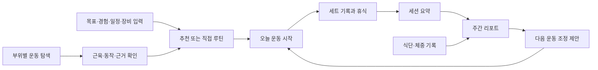

# 근거 기반 웨이트 트레이닝 앱 기획서

## 업데이트·REP/SCI 운영 반영 — 2026-10-08

업데이트 안내·주간 비교·검토 설명 소비를 main에 push하고 하네스 보완 **647dca5**의 GitHub37650233275 check/Chromium/WebKit 세 job success를 확인했다. 실제 수신한 정상 artifact는 **Chromium21/WebKit19=40** 통과·unexpected/flaky/skipped0이며, 의도적 실패 probe의 trace/PNG/console/execution/report 보존도 확인했다.

같은 source의 Pages `github:push` build/deploy가 success이고 운영 공개24파일 SHA256·보안 헤더가 검증 build와 일치한다. 첫37648213883 Chromium1실패는 이력에 보존하며 생성JSON 준비를 추가한 뒤의 결과와 구별한다. [불변 배포 확인](../../raw/research/2026-10-08-report-guide-git-release.json).122Vitest/Node10·build/types/format/artifact25 통과, 기존lint6경고는 유지한다.

실제 승인 설명0개·직접/간접 매핑·시각/권리·조건 티어·권장량, 앱 내부 리포트 보관함은 미완료다. 업데이트 제보의 당시 원인 미상/실기기와 iPhone 파일 저장, 실제 Auth/다기기·과학 공개/운영 복구·4주 파일럿/P2 관문은 남는다. 새 서버/Auth/schema/의존성을 바꾸지 않았다. preview DB는 기존 빈 설정을 유지하고 새 preview branch 배포/asset 검사는 하지 않았다. 후속 문서는 앱 bundle을 바꾸지 않는다.

## HAR 깨끗한 CI 콘텐츠 생성 보완 — 2026-10-08

600c7b8의 GitHub37648213883에서 check/WebKit19는 success였지만 Chromium20통과/1실패를 확인했다. 실제 내려받은 trace/PNG/console은 offline 공개 JSON 누락을 가리켰다. 새 browser job은 Vite만 실행하여 gitignore된 생성 JSON이 없었다. 운영 build는 compiler를 실행했고 같은 source Pages Git 배포/공개24파일 hash·헤더는 일치했다. 이는 사용자의 idle 업데이트 비활성 원인으로 확정한 결과가 아니다.

E2E 서버가 v1/v2 전에 운영과 같은 공개 compiler를 실행하도록 보완했다. 빈 승인 생성 파일만 없는 상태를 준비한 뒤 원본 registry/개인 기록을 바꾸지 않고 동일 JSON 재생성과40browser를 통과했다.122Vitest/Node10·build/types/format/artifact25·의도적 실패 probe도 통과(기존6경고). 첫 CI 실패/로컬 이전 통과를 모두 보존하고 새 원격 CI/배포는 후속 확인한다. [불변 루프](../../raw/research/2026-10-08-fresh-content-harness-loop.json).

## 세 종목·동기화 보존 운영 반영 — 2026-10-07

세 종목 추가b44ebda와 늦은 응답 차단fba60bb를 main에 push했다. GitHub37629327092 세 job success·실제 내려받은 Chromium19/WebKit17=36 결과와 최초 실패 probe 증거를 확인했다. 같은 fba60bb source의 Pages Git build/deploy가 성공했고 운영 공개24파일 SHA256·보안 헤더가 검증 빌드와 일치한다. [불변 배포 확인](../../raw/research/2026-10-07-catalog-sync-git-release.json).

카탈로그37/기존 ID·중량 기준·112Vitest/Node10·36browser와 schema2/backup1을 유지한다. SYNC 합성 검사와 실제 Auth/기기 관문을 구별한다. 실제 운동/새 기기·만료/회수·iPhone/Watch·SCI·운영 복구/파일럿·식단/3D/P2는 남는다. 신규 preview branch 배포는 검증하지 않았고 기존 preview DB 환경은 비어 있다. 이 후속 문서는 앱 bundle을 바꾸지 않는다.

## SYNC 오래된 응답 차단 — 2026-10-07

세 종목 추가(b44ebda) 다음으로 [합성 두 기기의 응답 유실·충돌·삭제 복구](../../wiki/operations/local-sync-recovery.md)를 검증하고 오래된 서버 응답을 미리보기/적용 두 transaction에서 차단했다. 명시 교체 전 recovery와 같은 revision의 정상 적용은 보존한다. 최초2실패 재현→3integration 추가/112Vitest·Node10·전체36browser/build/types/format/artifact25 통과(기존6lint경고). schema2/backup1·서버/계정/Auth/RLS는 그대로다. SYNC03~05 전체는 in_progress이며 실제 새 기기/Auth/실기기·SCI/파일럿 관문이 남는다. 신규 push/CI/배포는 다음 확인 단위다.

## CONV0026 세 종목 추가 — 2026-10-07

스미스머신 스쿼트·덤벨 인클라인 벤치 프레스·딥스를 [기록용37종목](../../wiki/operations/catalog-expansion.md)에 추가했다. 머신 기준/한 손/맨몸 추가 중량을 분리하고 기존34개 ID/순서·snapshot·schema2/backup1을 유지한다. 딥스는0/빈칸 완료가 가능하고 체중을 추정해 볼륨에 합산하지 않는다.109Vitest·Node10/36browser·관련6반복·마지막2viewport를 확인했다. 기존6lint경고·실제 운동/iPhone·SCI/나머지 MVP 관문은 남는다. 다음 순차 증분은 SYNC03~05의 오래된 응답/삭제 복구 계약이다. 신규 push/CI/배포는 후속 확인한다.

> **버전 0.13.2 · 2026-10-08 · 브레인스토밍 초안**  
> 앱 이름은 미정. `lightweight`는 임시 프로젝트 식별자다.  
> 사용자 범위·iOS·PWA·기본 스택과 명시 기능은 **요구사항/합의**, 배포 제공자·상세 보안/동기화·출시 순서·수치 목표는 **기획 제안**으로 구분한다.

## 1. 제품의 목적

**무엇을 왜 해야 하는지 이해하고, 운동을 빠르게 기록하며, 다음 행동을 근거와 내 기록으로 결정하는 앱.**

부위별 운동과 관련 근육을 시각적으로 이해하고, 직접 루틴을 만들거나 추천받고, 수행 기록을 남기면 다음 운동에 도움이 되는 개인화 리포트를 받는다. 식단 기록은 운동 목표와 연결하여 열량·단백질·영양소 섭취를 함께 검토하는 방향으로 확장한다.

핵심 연결: **근거 있는 운동 정보 → 내 조건에 맞는 루틴 → 간편 기록 → 설명 가능한 피드백 → 다음 운동**.

## 2. 해결할 문제와 사용자 가설

| 문제 가설 | 제공 가치 | 확인 방법 |
|---|---|---|
| 영상만으로 대상 근육과 선택 이유를 이해하기 어렵다 | 근육 지도·동작 설명·근거 카드 | 운동 선택 과업·이해도 인터뷰 |
| 루틴이 일정·장비·경험에 맞지 않는다 | 조건별 추천·대체 운동 | 채택률·수정/대체 사유 |
| 세트 기록이 번거로워 중단한다 | 이전 기록 재사용·완료 탭 | 입력 시간·4주 기록 유지율 |
| 기록은 쌓이지만 개선 방향을 모르겠다 | 변화 요약·다음 행동 1~3개 | 이해도·제안 실행률 |
| 운동과 식단을 따로 관리한다 | 운동·섭취·체중 추세 연결 | 식단 수요·입력 지속성 |

**사용자 범위 확정:** 첫 사용자는 본인 1명이다. 추후 확장도 주변 지인에게 직접 제공하는 범위를 현재 가정한다. 모바일 사용을 우선하며 iPhone/iOS가 대상이다. [CONV-0002](../../wiki/conversations/2026-10-03-002.md).

**개인 조건 확인:** 사용자는 골격근량 증대·주3~4회·무분할~3분할 운동을 보고했다. 보고된 iPhone 16 Pro Max·iOS 27.0.1은 하나의 파일럿 표본이다(CONV-0005). CONV-0006에서 특정 기종에 한정하지 않는 반응형과 사용자별 설정을 요구했다. 개인 조건을 앱 전역 기본값으로 고정하지 않는다. 운동 경험·주요 종목·장비·회당 시간·불편감은 미결이다. 건강한 성인·초보~중급이라는 기존 가설은 아직 사용자 조건으로 확정하지 않는다.

### 2.1 모바일 설치와 제공 방식

**PWA 진행 확정:** 사용자가 PWA로 진행할 의사를 명시했다. iPhone 홈 화면 설치와 링크 제공을 기준으로 기획을 발전시킨다. [CONV-0003](../../wiki/conversations/2026-10-03-003.md) · [플랫폼 검토](../../wiki/product/platform-distribution.md). 건강 앱·Watch 요구가 달라지면 구현 범위를 다시 검토한다.

첫 구현은 한 손 입력·오프라인 기록·백업/복원·설명 가능한 리포트에 집중하는 제안이다. **TypeScript·React+Vite·IndexedDB/Dexie·Supabase PostgreSQL/Auth 구성은 사용자 동의로 방향을 채택했다.** Mantine UI는 CONV-0008에서 채택했다. CONV-0010에서 전체 화면 Mantine 적용·Geist·블루/다크·iOS 같은 UX·전 폭 하단 메뉴·빠른 접근을 요구하여 별도 branch로 재설계했다. 글꼴은 Spoqa에서 Geist/한글 시스템 fallback으로 변경했다. CONV-0011에서 [Mantine UI/Monokai 참고 톤](../../wiki/sources/SRC-040-charcoal-tone.md)으로 변경하도록 요청해 차콜 배경/노란 강조로 조정했다. 구체 팔레트는 구현 선택이며 기존 Mantine·Geist·하단 UX 기준을 이어간다.  현재 정확한 패키지/역할은 [기술 스택](../../wiki/product/technology-stack.md)을 따른다. Supabase 프로젝트 연결과 등록 이메일/비밀번호·계정 DB·수동 snapshot 증분은 구현했으며 로그인 수단 최종 선택·지원 OS·동기화 고도화·운영비는 남았다. [언어와 개인 데이터 저장](../../wiki/product/technology-data-storage.md).

### 2.2 배포와 개인 기록 보호

Cloudflare Pages에 PWA 화면을, Supabase에 계정/DB와 서버 기능을 배포하는 구성을 추천한다. CONV-0015에서 Cloudflare 공식 연결/후속 배포 작업을 요청했다. CONV-0016에서 main MCP OAuth 성공·계정 읽기 HTTP200을 확인했고 사용자가 cf 생략·기존 Wrangler 유지를 선택했다. 최초 Pages Direct Upload lightweight-training을 생성했고, CONV0022에서 사용자 Git 연결 뒤 현재 GitHub/main 자동 배포로 구성했다. 운영 origin은 https://lightweight-training.pages.dev 이다. Wrangler의 Pages 제한 인증은 후속에서 성공했다. 이메일 인증 완료 뒤 project 생성/운영 HTTPS·DB 연결 없는 preview·Auth 반환 URL 저장을 완료했다. 특화 MCP3개·실앱 Auth/기기 관문은 별도다. 공개 HTTPS 주소를 사용하되 본인·초대 지인 계정으로 개인 기록 접근을 제한하는 안이다. [배포·보안 상세](../../wiki/product/deployment-security.md).

개인 API는 화면을 우회한 직접 호출에서도 인증·소유자 권한을 검사한다. 공개 가입/익명 로그인 차단, 사용자별 RLS, 비밀키의 서버 보관, 동적 콘텐츠의 안전한 출력, preview/운영 데이터 분리와 접근 차단 시험을 제공 전 조건으로 제안한다. 사이트 전체 Cloudflare Access는 별도 선택이다. CONV-0008에서 제공한 프로젝트에 Auth/DB/RPC·허용 목록·권한을 적용했다. 공개 가입 차단은 사용자 명시 승인 후 저장하고 API로 확인했다. 외부 HTTPS 앱 배포/헤더·파일 검증을 완료했고 실제 Auth/iPhone/운영 복구 관문은 남는다. [현재 연결/계정 준비](../../wiki/product/supabase-integration.md).

**추천 범위 제안:** 재활·질환 치료·임신/수유·미성년자용 자동 처방은 별도 검토가 필요하다. 범위 밖 사용자의 직접 기록·일반 정보 열람은 별도로 설계한다.

## 3. 요구사항과 우선순위

**운동 기능을 먼저 완성하고 식단을 다음 출시로 둔다**는 순서는 사용자 선택으로 확정했다(CONV-0005). P0 세부 콘텐츠 범위와 구현 단계는 제안이며, 사용자 핵심 요구를 누락하지 않고 [작업 목록](../../wiki/product/implementation-backlog.md)에서 추적한다. 근거 운영은 모든 단계의 출시 조건이다.

| ID | 사용자 요구 | 단계 제안 | 상세 |
|---|---|---|---|
| FR-01 | 바벨/3대운동 확대·큰 부위 아래 세부 분류·검색/장비 필터 | P0 | [운동 정보](../../wiki/product/exercise-library.md) |
| FR-02 | 자극범위·대상 근육·시각적 설명 | P0 | [운동 정보](../../wiki/product/exercise-library.md) |
| FR-03 | 최신 연구 근거 기반 루틴 추천 | P0 | [추천](../../wiki/product/routine-engine.md) |
| FR-04 | 부위별 운동 티어 | P0, 검토 완료 범위부터 | [티어](../../wiki/product/tier-system.md) |
| FR-05 | 개인 루틴 작성·복사·편집·저장 | P0 | [기록](../../wiki/product/training-log.md) |
| FR-06 | 수행 운동·중량·횟수·세트의 간편 기록 | P0 | [기록](../../wiki/product/training-log.md) |
| FR-07 | 수행 기록 기반 개인화 리포트 | P0 | [리포트](../../wiki/product/reports.md) |
| FR-08 | 식단·식사량·섭취일 기록 | P1 | [영양](../../wiki/product/nutrition.md) |
| FR-09 | 부족 가능 영양소·추천 열량·식단 리포트 | P1 | [영양](../../wiki/product/nutrition.md) |
| FR-10 | 모바일 우선 반응형 PWA, 휴대폰·태블릿·데스크톱 확장 | P0 | [설치·배포](../../wiki/product/platform-distribution.md) |
| FR-11 | 사용자별 목표·운동 횟수·분할 등의 간편 입력/변경/보존 | P0 | [설정·로컬 계약](../../wiki/product/implementation-contracts.md) |
| FR-12 | 전체 Mantine UI·Geist·현재 스택/라이브러리 명시 | P0, 적용한 증분 | [스택](../../wiki/product/technology-stack.md) |
| FR-13 | 생성한 Supabase 연결·공개 가입 차단 | P0, 연결 증분/실계정 검증 잔여 | [클라우드](../../wiki/product/supabase-integration.md) |
| FR-14 | 운동별·일별 세트/반복/중량 볼륨과 그래프 추이 | P0, 관찰 지표부터 | [볼륨 MVP](../../wiki/product/volume-history-mvp.md) |
| FR-15 | 과거 데이터 기반 오늘의 운동/권장 볼륨 안내 | P0, 기록 참고→검토된 조정 단계 | [후보/조정](../../wiki/product/volume-history-mvp.md) |
| FR-16 | Monokai/Mantine 참고 차콜 톤·iOS 같은 UX·전 폭 하단 메뉴·클릭 수 감소/접근성·별도 branch 구현 | P0, UI 증분/실기기 잔여 | [디자인](../../wiki/product/design-system.md) · [감사](../../wiki/product/design-audit.md) |
| FR-17 | 운동별 3D 해부학 모델·관련 근육 강조/동작 애니메이션 | P2, 지금은 가능성 검토만·운동 MVP 안정화 후 | [3D 검토](../../wiki/product/anatomy-3d-feasibility.md) |
| FR-18 | 각 세트별 기본1분·즐겨찾기3~4개·항목 접기·스크롤 중 고정 타이머/즉시 조작 | P0, 운영 반영·실기기 잔여 | [휴식 계약](../../wiki/operations/catalog-rest-timer.md) · [접기/고정 계약](../../wiki/operations/workout-collapse-timer.md) |
| FR-19 | 휴식 완료 Watch 알림·잠금화면 Live Activity/실제 Dynamic Island 가능성 | 검토 완료·구현 선택은 P2 | [Web Push/네이티브 AlarmKit 검토](../../wiki/product/rest-alert-feasibility.md) |
| QA-01 | 현재 검증 하네스 문서화·단위/통합 검사·실패 재현/회귀의 반복 개선 | 지속 품질 요구; 상세 구현안 제안 | [하네스](../../wiki/operations/testing-harness.md) · [루프](../../wiki/operations/loop-engineering.md) |
| KM-01 | 루트 vault·Markdown·OKF·옵시디언 호환 | 이번 산출물 | [관리](../../wiki/operations/knowledge-workflow.md) |
| KM-02 | 대화에 따른 기획 수정과 이력·근거 축적 | 지속 관리 | [변경](../changes/index.md) |

## 4. 사용자 흐름과 정보 구조

내비게이션은 **오늘 / 운동 탐색 / 나의 루틴 / 리포트 / 설정**의 전 폭 하단 다섯 탭으로 구현한다(CONV-0010). 식단 출시 시 ‘오늘’에 식사 기록 진입점을 추가하고 리포트에 영양 탭을 둔다.

화면은 기종 이름 대신 폭과 입력 환경에 대응한다. 모든 폭에서 하단 메뉴를 유지하고 큰 화면은 본문 최대1080px·다중 열을 사용한다. 오늘 시작/재개·루틴 바로 시작, 운동 행 한 번 추가, 새 루틴 연속 선택과 운동 하단 dock으로 반복 조작을 줄인다. 모바일 확인/상세는 내용 높이 bottom sheet, 큰 화면은 Modal이다. Mantine theme과 Geist/한글 fallback·차콜/노란 강조로 통일한다. 선택/접기는 Mantine Select/Accordion으로 구성하고 본문·control·panel의 수평 여백과 중첩 표면을 페이지별 캡처로 검토한다. [현재 재감사](../../wiki/product/component-review.md). 구체 tokens/target/초점 기준은 [디자인 규칙](../../wiki/product/design-system.md)을 따르며 실제 iOS native 전환/실기기 검증 완료를 의미하지 않는다. 사용자별 목표·주당 횟수 범위·분할·시간·장비·단위·시간대를 설정하고 변경할 수 있다. 주당 횟수와 분할은 독립이다. 새 사용자의 목표·횟수·분할을 본인 조건으로 강제하지 않는다. 시작 당시 설정/루틴은 과거 기록에 보존한다. [구현 계약](../../wiki/product/implementation-contracts.md).

첫 사용에는 전체 프로필을 강제하기 전에 운동 탐색과 직접 기록을 허용한다. 추천 시 목표·경험·가능 횟수·시간·장비·제약을 단계적으로 받는다. 체중과 영양 계산 정보는 해당 기능에서 받는다.

운동 중에는 이전 중량·횟수 불러오기 → 수정 또는 완료 → 휴식 타이머 → 다음 세트를 이어준다. 기구 사용 중에는 대체 후보를 고른다. 추천 변경은 사용자 선택 후 적용하고 기존 계획을 남긴다.

## 5. 운동 정보와 자극범위

‘자극범위’는 다음을 분리하여 표현한다.

- 관련 근육: 주동근·협력근·안정화 역할과 이름.
- 동작 범위: 시작/끝 자세·관절 움직임·수행 조건.
- 근육 내 차이: 장기 훈련 연구가 측정한 부위에 한한 설명.
- 개인 느낌: 사용자가 느낀 자극의 선택 기록. 객관적 성장 지표와 구별.

운동 카드는 이름/별칭·장비·대상 근육·난이도·설정·수행법·흔한 오류·대체 운동·근거·검토일을 제공한다. 근육 그림의 색을 성장률이나 ‘자극 80%’로 표시하지 않는다. 급성 EMG만으로 장기 근비대 순위를 정하지 않는다.[^emg]

시각 자료는 검토된 2D 전면/후면 근육 지도와 짧은 동작 자료부터 시작하는 제안이다. CONV-0012에서 운동별 3D 해부학 모델의 자극부위/동작 애니메이션을 명시 요청했으며, 현재는 가능성 검토만 하고 후순위로 둔다(FR-17). PWA renderer는 후보가 있지만 자산의 근육 분리·rig/clip·권한/해부학 검토·실기기 성능 확인이 필요하다. 첫 운동 MVP 출시 선행 조건으로 넣지 않는다. [가능성/관문](../../wiki/product/anatomy-3d-feasibility.md)·VIS-3D-01~03. 카메라 자세 추적은 별도 미확정이다. 해부학·수행법은 전문가 검토와 권한 확인 후 공개한다.

## 6. 루틴 추천과 티어 원칙

추천은 목표·일정·장비·수행 이력·선호·불편감에 따른 설명 가능한 규칙으로 시작한다. AI는 검토된 규칙과 계산 결과를 쉽게 설명한다. 중량·세트·열량 계산을 자유 텍스트 생성에 맡기지 않는다.

티어에는 **목표·부위·숙련도·장비 조건·평가 이유·근거 확실성·갱신일**을 표시한다. S/A/B/C는 추천 적합도, 연구 근거는 별도 배지다. 직접 비교가 없으면 동등 후보나 평가 보류를 허용한다.

연구 일반 원칙과 앱의 시작값을 구분한다. 2026 ACSM 자료는 목표별 처방과 운동량을 다루지만 모든 개인의 최적 세트 수를 확정하지 않는다.[^acsm] 운동량·빈도 효과는 근비대와 근력 목표에 따라 검토한다.[^volume]

초기에는 한 부위 티어와 한 루틴을 전문가가 끝까지 검토하는 파일럿을 제안한다. 전 부위의 과학적 순위가 이미 확정된 것은 아니다.

## 7. 간편 기록과 개인화 리포트

필수 입력: **운동·중량 방식·중량·횟수·완료 여부**. 준비/본세트·좌우·RIR·휴식·불편감·메모는 맥락에 따라 선택한다. 덤벨 한 손 중량, 머신 번호, 보조 운동의 보조량을 구분한다.

리포트는 **관찰 → 해석 → 다음 행동 → 근거/불확실성**으로 구성한다.

| 리포트 | 정보 | 해석 제한 |
|---|---|---|
| 세션 | 완료 운동·본세트·시간·개인 기록 | 계획과 실제 수행 구분 |
| 주간 | 실행·직접/간접 부위 세트·누락 | 세트를 근성장량으로 환산하지 않음 |
| 추세 | 같은 운동/장비/조건의 중량·횟수·노력 변화 | 조건이 다르면 단순 비교 보류 |
| 다음 행동 | 유지·증량 후보·대체·운동량 검토 | 사용자 선택 후 적용 |
| 영양 확장 | 섭취·체중 추세·기준 대비 기록 | 누락·성분 결측 표시 |

기록만으로 ‘근육 12% 성장’, ‘회복 100%’를 단정하지 않는다. 기록에 없는 숫자나 출처를 AI가 만들면 표시를 차단한다. 부족한 데이터에서도 기록일 요약과 다음에 필요한 정보를 제공한다.

### 7.1 볼륨·추이·과거 기록 기반 오늘 안내

CONV-0009에서 운동별/일별 볼륨·그래프와 과거 기록을 통한 오늘 운동/권장량을 요청했다. 완료 본세트·반복·시간·조건별 기록 중량×반복을 계산하고 날짜 그래프/표와 비교 범위를 표시한다. kg/lb 정규화, 한 손/머신/맨몸·보조/좌우·조건 변경·0/N/A를 구분한다. 기록량을 성장/회복 점수로 바꾸지 않는다.

MVP는 과거 수행량과 현재 본인 루틴의 오늘 후보부터 제공한다. 기록 부족/오늘 수행/진행 운동/설정·장비 변경은 보류하고 적용은 사용자 선택이다. 충분성·노력/불편감·경험 입력과 전문 검토 이후 권장 운동량 조정을 연결한다. [계산/화면/후보 계약](../../wiki/product/volume-history-mvp.md)·REP-04~06/SCI-03B. 새 상세 정책은 초기 구현안이며 최적 처방 승인으로 표시하지 않는다.

## 8. 식단 확장

음식 검색·최근 식사 재사용·즐겨찾기·양 수정·직접 입력을 우선한다. 사진 인식은 음식과 양의 초안이며 사용자가 확정한다.

국내 일반 영양 기준과 운동 목표용 단백질 목표를 구분한다. 2025 KDRI와 정오표를 버전 관리한다.[^kdri] 식품 데이터는 출처·기준 중량·조리 상태·성분 누락을 보존한다.

‘철 결핍’ 진단 대신 ‘완료로 표시한 식사 기록의 철 섭취 추정량이 기준보다 낮습니다’처럼 표현한다. 영양소별 성분 커버리지를 표시한다. 열량은 검토한 공식·입력·체중 추세로 제안하며 운동 활동을 중복 가산하지 않는다. 감량/증량 조정 수치는 별도 검토 후 확정한다.

## 9. 출시 단계 제안

| 단계 | 범위 | 다음 단계 조건 |
|---|---|---|
| 0. 개인 파일럿 | 본인 루틴에 필요한 10종 내외 가설·한 부위 티어·루틴·iPhone 기록 시안 | 실제 운동 중 편의성·기록/복원·콘텐츠 검토 |
| 1. 운동 MVP | 루틴 작성/추천·세트 기록·주간 리포트·필요 종목 확장·지인 시험 제공 | 데이터 보존·계산 정확성·근거 추적·개인 기록 분리 |
| 2. 식단 | 한국 음식·열량/단백질·성분 커버리지별 리포트 | DB 권한·성분 품질·영양 검토 |
| 3. 고도화 | 개인 반응 조정·사진 보조·건강 앱/웨어러블 연동 | 충분한 데이터·실제 수요 |

기본 스택과 운동 우선 순서는 합의했고 첫 기기는 사용자 보고로 확인했다. 실제 기기 동작·콘텐츠 검토·계정/메일·호스팅/운영비를 구체화하고 단계별로 구현한다. [구현 작업계획](../../wiki/product/implementation-plan.md)과 [백로그](../../wiki/product/implementation-backlog.md)에 의존성·완료 기준·검증·초기 공수 가정을 적었다. 날짜 확정 전 실제 난도와 검토 대기를 재평가한다. 초기 제외 제안: 커뮤니티, 경쟁 순위, PT 중개, 의학적 재활, 카메라 자세 교정.

현재는 본인·지인 사용을 위한 도구로 기획한다. 구독·가격·공개 서비스 성장은 초기 검증의 우선순위에서 내리는 제안이다. 향후 상용화는 별도 논의하고, 지금은 호스팅·AI·계정 DB·메일 등 운영 부담을 비교한다.

### 9.1 실행 순서와 제공 관문

설계 계약 → 앱 기반 → 탐색/직접 루틴/로컬 기록/백업 → 계정/동기화/접근 제한 → 계산 리포트 → 검토된 추천/티어 → 실제 iPhone 검증/본인 제공 → 관찰/소수 지인 → 식단 순서다. 근거/시각 자료 검토는 설계부터 진행하며 해당 콘텐츠 공개의 선행 조건이다.

가짜 데이터의 한 세트 저장/재시작/복원을 먼저 리뷰한다. 실제 기록은 권한·동기화·복원 검증 후 쌓고, 운동 MVP 완료에는 FR-01~07·FR-10~11의 연결과 검토된 콘텐츠 범위가 필요하다. 외부 AI 설명은 선택 후속이며 초기 개인화는 결정적 계산·규칙과 템플릿으로 제공하는 구현안이다. CONV-0006의 로컬 우선 이후 CONV-0008에서 생성한 Supabase 연결과 순차 구현을 요청했다. app0.2.0에 반응형·설정·운동/루틴·기기 기록·기초 집계·백업/PWA·Mantine/글꼴·등록 Auth/계정 DB·수동 snapshot을 구현했고 서버 권한/충돌 계약을 검사했다. 실제 계정 로그인/다기기 전체 흐름·자동 sync/충돌 고도화·검토된 과학 시각/추천/티어·완전한 개인화·실기기/배포는 남았다. [실행 결과](../../wiki/product/implementation-progress.md). 운동 MVP 완성으로 표시하지 않는다.

## 10. 데이터·AI·운영 요구

[데이터 모델](../../wiki/product/data-model.md): 프로필, 운동/변형, 루틴/버전, 세션/세트, 연구/주장, 추천/계산 버전, 리포트, 음식/식사.

- PWA의 캐시·로컬 DB를 별도 구현하여 오프라인 기록·재시도 중복 방지를 실제 iPhone에서 검증한다. 로컬 저장 실패 시 완료 성공으로 표시하지 않는다.
- 내보내기와 새 저장소에 복원하는 기능을 첫 버전에 포함하는 제안이다. 웹 저장소만으로 영구 보존을 보장하지 않는다.
- 사용자 선택으로 로컬부터 구현한 뒤 제공받은 Supabase로 연결했다. 로컬 프로필은 인증이 아니며 같은 브라우저에서 전환 가능하다. 인증 계정별 DB/서버 허용 목록과 권한을 추가했고 JSON 이관·수동 snapshot 전송/명시 교체를 구현했다. 실제 로그인/다기기 복원과 자동 sync 고도화는 미완료다.
- 동기화는 전송 대기·서버 확인·중복 방지·편집 충돌 처리를 별도 구현한다. 기기 저장됨과 클라우드 반영 완료를 구분하고 미전송분은 서버 복구가 불가능함을 표시한다.
- 서버·지인 제공 시 사용자별 소유자와 접근 권한을 검증한다. Supabase Auth·필요 grants·RLS를 함께 구성하고 서버 비밀키를 브라우저에 넣지 않는다.
- 공개 가입 차단은 사용자 승인으로 적용했고 익명 가입 OFF를 유지했다. Auth와 별도 서버 허용 목록으로 기록 접근을 제한한다. 실제 초대/복구·메일과 preview 접근/데이터 분리의 운영 조건은 남았다. 이메일 코드/초대는 SMTP 수신 제한과 무료 메일 템플릿 조건을 확인한다.
- 배포 대상은 앱 산출물로 한정한다. vault·개인 기록·백업·서버 비밀은 공개 파일에 포함하지 않는다. AI 함수에는 인증·소유자 검사·사용량 제한을 둔다.
- 운동 메타데이터·계산 규칙 변경이 과거 기록의 의미를 바꾸지 않도록 버전을 보존한다.
- 추천/리포트는 사용 기간·포함 기록·규칙/근거 버전을 남긴다.
- 개인 정보는 목적에 맞게 최소 수집하고 내보내기·삭제를 지원한다.
- 사용자 건강 기록은 이 기획 vault에 저장하지 않는다.
- 초기 연구 갱신은 수동 검토이며 ‘최신’에 검색일·포함 범위·검토 상태를 동반한다.

## 11. 성공 지표와 수용 기준

아래 수치는 사용성 검증용 가설이며 기존 성과가 아니다.

| 지표/기준 | 정의 |
|---|---|
| 핵심 이용 | 본인의 실제 운동 대비 기록한 세션과 리포트에서 선택한 다음 행동 |
| 기록 편의성 | 이전 값이 있는 본세트 완료 중앙값 3초 이내 가설 |
| 첫 가치 | 추천/직접 루틴에서 첫 세션 저장 성공률·시간 |
| 재사용 | 본인 4주 사용 중 기록 지속·중단 이유; 지인 제공 후 개인별 사용 관찰 |
| 이해도 | 대상 근육·추천 이유·근거 한계를 설명할 수 있는 비율 |
| 추적성 | 공개 효과 주장마다 근거 또는 추론/미검증 라벨 존재 |
| 기록 보존 | 강제 종료·오프라인 복귀·버전 업데이트 후 보존, 중복 완료 0건, 백업 복원 성공 |
| 계산 정확성 | 단위·세트·누락 집계가 명시 계산 계약과 일치 |

첫 검증은 본인의 iPhone에서 설치·실제 운동 기록·백업 복원과 4주 사용 관찰을 제안한다. 편의성이 안정되면 소수 지인 과업으로 확장한다. 본인 한 명의 결과를 전체 사용자 효용으로 일반화하지 않는다. [검증 계획](../../wiki/product/validation-plan.md)을 따른다.

### 11.1 검증 하네스와 반복 개선

CONV-0014 요청으로 이전187c47c를 push했고 GitHub check/Chromium/WebKit 3job·실패 artifact 수신을 확인했다. HAR05 done이다. 새HAR04는 local에서 unit21/integration26/ui17의64개/14파일·lint/build/E2E typecheck/format, browser16개와 신규7개×3회21개·실패probe를 통과했다. [현재 하네스](../../wiki/operations/testing-harness.md) · [보존 검사](../../wiki/operations/storage-recovery-harness.md) · [실행](../../raw/research/2026-10-04-storage-recovery-verification.json) · [GitHub 원본](../../raw/research/2026-10-04-github-ci-37184261544.json).

백업 version1 내용/필드는 유지하되 compact JSON으로 출력하고, import/export 파일 모두 최대10MiB UTF-8 byte 한도를 적용한다. 초과 export는 다운로드 전에, import는 적용 전에 거부하며 원본을 잘라내거나 삭제하지 않는다. 이하의 이전 들여쓰기 파일은 호환한다. 원시 Store/cloud snapshot 한도는 변경하지 않는다. 이 수치는 기존 import 한도를 대칭으로 명확히 한 구현 정책이며 사용자 처방/새 기능 승인으로 표현하지 않는다. 후속 구현에서10MiB 초과 기록은gzip으로 출력/복원한다(output10MiB·expanded64MiB). 모든 원본 필드·기존JSONv1/작은 JSON 한도를 유지하고 손상/잘림/팽창/UTF-8/schema 오류는 DB 적용 전에 거부한다.64MiB 초과/분할은 미지원이다. [압축 복구 계약](../../wiki/operations/compressed-backup.md).

실제 큰 파일14,400세트 roundtrip·native schema1→2·quota 합성 오류/transaction rollback·Chromium 실제 waiting SW/진행운동 적용 차단→종료/업데이트→offline/DB 보존을 고정했다. 업데이트 안내의 종료 버튼 가림을 main 상단으로 수정했다. HAR04는 실제iPhone/physical quota/eviction·초과 백업/다기기 복구가 남아 in_progress다. 실제Auth·SCI 전문/자산검토·REL/HTTPS 배포 관문은 유지한다. 새HAR04 GitHub CI는 아직 실행하지 않았다.

독립 기대값→첫 실패 증거→작은 수정→동일 조건 재검증→회귀/이력의 루프를 유지한다. backup 한도/안내 가림은 제품 결함, 배열 순서/blur fault 경합/UI matcher는 test fixture 결함으로 구분했다. retries0·고유runID로 최초 실패를 보존했다. PRD0.7.2는 계약/현황 PATCH이며 운동 먼저·식단/3D 후순위·전체 FR은 유지한다. [루프](../../wiki/operations/loop-engineering.md).

## 12. 미결 사항

본인 경험·종목/장비/회당 시간, 호스팅/도메인·사이트 Access·계정/초대/메일·동기화/백업·운영 예산, 건강 앱/Watch 요구와 검토 역할은 [미결 사항](../../wiki/product/open-questions.md)에서 관리한다. [결정 기록](../../wiki/decisions/decision-register.md)에는 사용자 요구와 제안의 상태를 구분한다.

## 13. 근거와 이력

최신 톤 변경은 [CONV-0011](../../wiki/conversations/2026-10-04-011.md) · [CHG-0011](../changes/CHG-0011.md) · [차콜 감사/증거](../../wiki/product/design-audit.md)를 따른다. PRD0.6.1은 기능 범위 변화 없이 색상 방향을 수정한 PATCH다.

- [볼륨/추이/추천·지속 commit 요구](../../raw/conversations/2026-10-04-009.md) · [CHG-0009](../changes/CHG-0009.md) · [추가 읽기](../../wiki/sources/SRC-037-volume-history.md).

- [UI/클라우드/가입 차단 요청](../../raw/conversations/2026-10-04-008.md) · [CHG-0008](../changes/CHG-0008.md) · [기술 근거](../../wiki/sources/SRC-036-mantine-supabase.md) · [실제 검사](../../raw/research/2026-10-04-mantine-supabase-verification.json).

- [하네스/루프 요청](../../raw/conversations/2026-10-04-007.md) · [CHG-0007](../changes/CHG-0007.md) · [기술 근거](../../wiki/sources/SRC-035-testing-harness.md).

이번 조사는 **2026-10-03 초기 표적 탐색**이며 체계적 문헌고찰이나 전체 최신 문헌 포괄을 뜻하지 않는다. 일부 논문은 초록·서지 수준으로 확인했다. iOS 배포 비교는 같은 날 Apple/WebKit 공식 안내를 확인한 별도 기술 조사다. [주장-근거 지도](../../wiki/concepts/evidence-map.md)와 출처 노트에서 범위를 확인한다.

- [원 요청](../../raw/conversations/2026-10-03-001.md) · [CHG-0001](../changes/CHG-0001.md).
- [iOS·개인 사용 원문](../../raw/conversations/2026-10-03-002.md) · [CHG-0002](../changes/CHG-0002.md).
- [PWA 선택·저장 질문](../../raw/conversations/2026-10-03-003.md) · [CHG-0003](../changes/CHG-0003.md).
- [스택 동의·배포/보안 우려](../../raw/conversations/2026-10-03-004.md) · [CHG-0004](../changes/CHG-0004.md).
- [계획 요청·운동 우선 선택](../../raw/conversations/2026-10-03-005.md) · [CHG-0005](../changes/CHG-0005.md).
- [반응형·사용자별 설정·로컬 구현](../../raw/conversations/2026-10-03-006.md) · [CHG-0006](../changes/CHG-0006.md) · [버전 보관](index.md).

[^emg]: [Vigotsky 외 2022](../../wiki/sources/SRC-008-emg.md), [연구 안내](https://pubmed.ncbi.nlm.nih.gov/35006527/).
[^acsm]: [ACSM 2026](../../wiki/sources/SRC-003-acsm-2026.md), [학회 공식 설명](https://acsm.org/resistance-training-guidelines-update-2026/).
[^volume]: [Pelland 외](../../wiki/sources/SRC-004-volume-frequency.md), [출판사 초록](https://link.springer.com/article/10.1007/s40279-025-02344-w).
[^kdri]: [2025 KDRI](../../wiki/sources/SRC-011-kdri-2025.md), [공식 배포](https://kns.or.kr/fileroom/fileroom_view.asp?BoardID=Kdr&idx=167).

## CONV-0015 Cloudflare 연결과 순차 진행 — 2026-10-04

아래는 당시 상태다. main MCP 인증의 현재 상태는 CONV-0016의 성공 확인으로 갱신했다.

Cloudflare 공식 설정과 남은 구현의 commit/push를 사용자가 요청했다. 호스팅 제공자는 Cloudflare 방향으로 정했으며 Pages Direct Upload·lightweight-training 고정 project/main은 구현 선택이다. 공식 skills16/MCP5 등록과 Wrangler4.147.0/artifact gate를 준비했다. **새 OAuth 권한 승인·원격 배포는 pending**이며 기존 plugin account 조회 성공과 구별한다. 자동 검토의 broad OAuth Continue 거부를 우회하지 않고 full/Pages 제한 권한 선택을 요청했다. [운영](../../wiki/operations/cloudflare-setup.md).

a2b3f9f push 뒤 새 [GitHub CI3job](../../raw/research/2026-10-04-cloudflare-setup.json)이 모두 성공했다. 기존64개·lint/build/E2E typecheck와 실제 dist24파일 검사를 확인했다. main 반영·후속 배포는 현재 요청 범위에서 진행한다. 운동 MVP 전체는 미완료이며 실제 Auth/다기기·iPhone·SCI·콘텐츠/3D/식단의 관문은 유지한다. usage limit은 발생하지 않았고 실제 제공되는 기능 외 quota reset을 실행하지 않았다.

## 압축 백업 후속 증분 — 2026-10-04

CONV0015의 남은 순차 작업에서10MiB 초과 기록의 독립복구를 구현했다. 기존 JSONv1·DB schema2·cloud snapshot10MB는 유지하며 큰 파일은gzip output10MiB/expanded64MiB로 제한해 모든 필드를 보존한다. unsupported API/손상/잘림/과도팽창·schema 오류는 DB 적용 전에 거부한다. 공통 writer를 기기/교체 전 복구 export에 적용했다.

66개·lint/build/E2E typecheck/format/artifact24 통과. browser18(Chromium10/WebKit8)·새2×3회6회,24,000세트 실제 gzip download→새context restore/reload·CRC 손상 때5table 동일을 확인했다. 최초2 실패는 fixture의tables 오참조였으며 원본 증거를 보존했다. [계약](../../wiki/operations/compressed-backup.md)·[실행](../../raw/research/2026-10-04-compressed-backup-verification.json).

64MiB 초과/분할·actualiPhone/physical quota/eviction·실Auth/다기기 서버복구는 남아 HAR04/LOG06을 전체done으로 표시하지 않는다. 당시 Cloudflare 신규 OAuth는 응답 없이 만료했으며 승인 질문 pending/미배포였다.67ec882의 새CI3job success를 확인했다. 다음은 이전 값/운동 재사용·종목 대체·종료 기록 수정이다.

## CONV-0016 Cloudflare 공식 설정 재확인 — 2026-10-04

공식 prompt의 Codex 절차를 재실행해 스킬16개를 갱신하고 기존 MCP5개 등록을 확인했다. `codex mcp login cloudflare`는 성공했고 현재 main MCP의 계정 읽기 HTTP200·public docs 검색을 확인했다. 사용자는 선택적 beta cf를 생략하고 기존 Wrangler를 유지하도록 답했다. [원문](../../raw/conversations/2026-10-04-016.md) · [실행](../../raw/research/2026-10-04-cloudflare-setup-recheck.json) · [CHG-0017](../changes/CHG-0017.md).

PRD0.8.2는 인증 현황 PATCH다. 특화 MCP3개·Wrangler 인증은 각각 미검증이고 원격 HTTPS 배포/고정 origin·실제 앱 Auth/iPhone·SCI 관문은 유지한다. 이번 작업은 개발 환경 설정과 문서이며 앱 코드를 변경하거나 배포하지 않았다. 전체 등록 도구 갱신에는 agent 재시작을 안내한다.

## 기록 편의와 Pages 연결 후속 — 2026-10-04

이전 값의 빈 입력 채우기·종료 운동 다시 시작·미완료 종목 교체·종료 세트 명시 수정/CAS를 구현했다. 원본/완료 시각·ID/snapshot 보존, 현재 단위/시간대/설정, 수정 후 즉시 리포트 재계산을 확인했다.72개·browser20·새6회·lint/build/types/format/artifact24 통과. 최초 browser2개와 DOM selector 실패 증거를 보존했다. [계약](../../wiki/operations/record-reuse.md)·[실행](../../raw/research/2026-10-04-record-reuse-verification.json).

별도 대화의 CONV0016/CHG0017 문서는 유지했다. Wrangler OAuth의 실제 권한은 Pages write/account+user read/offline_access이며 intended account와 일치했다. 신규 프로젝트 생성은 CLI의 자동 Workers 전환 실패 후 직접 Pages 생성으로 바꿨으나, API8000077 이메일 인증 관문으로 거부됐다. 리소스/HTTPS는 미생성·미배포, 사용자 이메일 인증 답변 pending이다. [현재 확인](../../raw/research/2026-10-04-pages-scoped-auth.json). MCP 인증과 배포 CLI 인증을 구별한다.

LOG03/04의 정렬/메모/삭제 복구·장비 식별, 실Auth/동기화·SCI·실제 iPhone·운영 제공 관문은 남는다. 다음은 계정 준비 전 진행 가능한 리포트 관찰/충분성 및 공개 콘텐츠 gate다. 기존 운동 우선·식단/3D 후순위와 app0.2.0/schema2는 유지한다.

## 리포트 기록 점검 후속 — 2026-10-04

종료 운동 횟수/고유 기록일·주간 사용자 설정·선택 RIR 누락·같은 조건의 두 날짜 기록 여부를 설명한다. 진행 중/미완료 세션과 미설정 프로필을 바로 열 수 있으며 수정 즉시 갱신한다. 처방/효과/최적 볼륨이나 연구 승인으로 해석하지 않는다. [계약](../../wiki/operations/report-coverage.md)·[검사](../../raw/research/2026-10-04-report-coverage-verification.json).

78개/16파일·lint/build/types/format/artifact24·browser20 통과. record-coverage-v1/입력revision을 계산하되 저장 report는 없으며 REP02/03은 전체 in_progress다. 이전 af7937f GitHub CI3job success를 확인했다. 실제 Auth 계정은0개로 확인했고, security advisor lints=[]는 실제 login/RLS 통과와 구별한다. 다음은 Cloudflare HTTPS 배포·실Auth 계정 준비·공개 콘텐츠 gate다. 식단/3D 후순위와 전문/실기기 관문을 유지한다.

## 첫 HTTPS 배포 — 2026-10-04 현재

운영: [lightweight-training.pages.dev](https://lightweight-training.pages.dev). preview: [운영 DB 연결 없는 미리보기](https://preview.lightweight-training.pages.dev). 화면과 기기 기록을 바로 사용할 수 있다. 공개 페이지이며 계정 데이터 접근은 Supabase 허용 목록/RLS로 제한한다. site-wide Access는 미설정이다.

이메일 완료 답변 뒤 project 생성 성공, 검증된3bc6022를 main에 fast-forward/push했다. GitHub3job success 후 app/dist만 배포했다. 24파일 artifact gate, 실제 공개23파일(index/PWA/font/JS/CSS)의 SHA256 일치와 보안 헤더를 운영/preview에서 확인했다. 다섯 실제 HTTPS 화면을 캡처/직접 확인했다. [실행](../../raw/research/2026-10-04-pages-deployment.json).

Supabase Site URL과 정확한 root 반환 경로 하나를 저장했다. Auth settings200/signupDisabled=true, 비로그인 read/write RPC401을 재확인했다. Auth 계정0개: 본인 등록/비밀번호는 사용자가 직접 준비, 허용 UUID·실제 로그인/복원/A-B/만료는 다음 단계다. 비밀번호 복구 UI는 아직 없다.

78개 Vitest + 배포 계약3개·build/format/E2E타입 통과, lint exit0이지만 기존WorkoutView effect 경고6개는 남는다. pages:verify는 읽기 전용으로 실제 헤더/파일 hash를 검사하며 네트워크/불일치에 실패한다. 실제 iPhone/과학 검토/운영 복구 관문은 유지한다. 다음 독립 구현은 공개 콘텐츠 registry/검토 gate와 기록 편의의 남은 범위다. 아래 증분은 당시의 상태다.

## 검토 설명 공개 관문 — 2026-10-04

SCI02의 source registry→선택 공개 JSON 빌드를 추가했다. 초안/보류 제외, human 검토 선언과 payload hash·ID/full_review·한계·권리/asset 파일 hash를 검사하고 reviewer identity/초안을 공개하지 않는다. 승인 설명은0개이며 현재 종목 분류는 기록용 초안이다. 이 기계 검사는 실제 과학/권리·전문 검토를 증명하지 않는다. [계약](../../wiki/operations/content-publication.md)·[실행](../../raw/research/2026-10-04-content-publication-gate.json).

78개 Vitest + Node8계약·build/types/format/artifact25 통과(lint exit0/기존 경고6). UI/추천 엔진은 변경하지 않았고 SCI02는 in_progress다. 실제 주장/시각/추천 규칙·티어/근육 매핑·offline guide 제공은 검토 후 진행한다. 사용자 본인 계정 등록 진행 중이며 비밀번호를 수집하지 않는다. 기존 main1e1fd9d CI37200956750 success 확인, 새 콘텐츠 관문 CI/배포는 이 저장 당시 별도다.

## 최신 운영 상태 — 2026-10-04

운영/DB 연결 없는 preview에 검증한96bbb74를 배포했다. GitHub37201900937의3job success·78 Vitest/Node8·Chromium11/WebKit9, 실제 공개24파일 hash/헤더 일치를 확인했다. 과학 승인 설명은0개다. 후속 문서 commit은 앱 bundle을 바꾸지 않는다. [확인](../../raw/research/2026-10-04-release-account-gate.json).

사용자가 지정 계정의 SQL 등록을 명시 승인한 뒤 허용 목록에 적용했고 enabled=true·등록1/허용1을 확인했다. 사용자가 직접 로그인한 Chrome에서 빈 기본 프로필의 실제 전송 ACK→서버 revision1→조회/명시 기기 적용·대기0·교체 전 복구 수단을 확인했다. 같은 기기 빈 프로필 시험이며 실제 운동 기록/새 기기/A·B/만료/로그아웃/메일·iPhone 검증은 남는다. [최신 확인](../../raw/research/2026-10-04-auth-profile-roundtrip.json). 개인 식별자/비밀번호/token은 vault에 보관하지 않는다.

## 운동 중 순서 변경 — 2026-10-04

Mantine 순서 편집→명시 저장/취소와 active/소유자/permutation/revision 검사를 추가했다. 각 세트 입력/완료·ID·과거 계획/시각은 보존하고 session/outbox를 atomic 확정한다. 알림의 버튼 가림을 실제 캡처에서 발견→hit target 실패 재현→성공 안내 층 수정→회귀 통과했다. [계약](../../wiki/operations/workout-order.md)·[실행](../../raw/research/2026-10-04-workout-order-loop.json).

Vitest83개(27/33/23)·Node8·Chromium12/WebKit10/22개·build/types/format/artifact25 통과(lint exit0/기존경고6). 새 단위의 CI/Pages 배포는 저장 당시 별도다. schema2/backup1·과학 정책은 그대로며 LOG03/04는 메모/삭제 복구/장비 식별/입력 UX 후속으로 in_progress다. 실제 Chrome 빈 프로필 Auth와 가짜 운동의 로컬 browser 복원을 구분한다.

## 현재 운영 배포 — 2026-10-04

운동 순서/알림 가림 수정 e912f0c를 main에 commit/push하고 GitHub37203886001의3job success를 확인했다. [운영 앱](https://lightweight-training.pages.dev)·[DB 연결 없는 preview](https://preview.lightweight-training.pages.dev)에 배포했으며 각 공개24file hash/보안 헤더가 검증한 빌드와 일치한다. 83개 Vitest/Node8/Chromium12·WebKit10=22개, artifact25를 확인했다. [불변 배포](../../raw/research/2026-10-04-workout-order-release.json). 이 후속 문서 단위는 앱 bundle을 바꾸지 않는다.

등록1/허용1·실제 Chrome 빈 프로필 저장/조회/같은 기기 적용은 확인했다. 실제 운동/새 기기/A·B/만료/메일·iPhone·과학 검토/자산·운영 복구·파일럿은 남는다. 물리 iPhone 설치·실행·로그인 질문은 저장 당시 응답 대기다. LOG 메모/삭제 복구/장비 조건·리포트/검토 콘텐츠·P2는 이어갈 작업이며 전체 MVP 완료로 표시하지 않는다.

## 실제 iPhone 확인 — 사용자 보고, 2026-10-04

사용자가 운영 앱의 iPhone 홈 화면 설치·실행·로그인에 “홈 화면 실행·로그인 완료”라고 응답했다. [CONV0020](../../wiki/conversations/2026-10-04-020.md)·[확인 범위](../../raw/research/2026-10-04-iphone-install-user-report.json). 해당 세 과업은 사용자 보고로 확인했으며 에이전트의 직접 기기 관찰·OS 재측정은 아니다. 앞선 ‘응답 대기’ 문단은 당시 이력이다.

REL02는 부분 진행이다. 실제 운동/모바일 클라우드 왕복·새 기기 복원·키보드/VoiceOver/확대/가로/잠금·오프라인/업데이트/physical quota/eviction 검사는 남는다. 설치·로그인 확인을 G3 전체 통과로 확대하지 않는다. 운영 앱은 e912f0c이며 진행 중인 루틴 복구는 아직 배포하지 않았다.

## 삭제한 루틴 복구 — 2026-10-04

현재 프로필 삭제 목록→Mantine 확인/취소→same ID/계획/설정 보존 복구를 구현했다. owner/deleted/revision·atomic outbox·실패 rollback/재시도·중복 한 번 저장·과거 운동 snapshot/백업 보존을 검사했다. [계약](../../wiki/operations/routine-recovery.md)·[실행](../../raw/research/2026-10-04-routine-recovery-loop.json).

Vitest86(27/35/24)·Node8·전체 browser22 및 최종 목록 검사2·build/types/format/artifact25 통과(lint 기존6경고). 320/390px 펼친 목록/모달 PNG를 직접 확인했다. 최초 애니메이션 중간 캡처는 실제 panel 완료를 확인해 재캡처한 하네스 보정이다. 새 source CI/운영 배포는 저장 당시 별도다.

루틴 복구는 완료했으나 LOG03~06 전체·운동 기록 삭제/복구·메모·머신/ROM 비교·다기기/리포트/SCI/나머지 실기기·운영/파일럿/P2는 남는다. iPhone 홈 화면/로그인은 CONV0020 사용자 보고로 확인했으며 복구 과업의 실기기 통과로 표시하지 않는다.

## 현재 운영 배포 — 루틴 복구 86cc158

main push·GitHub37205447895 세 검사 success 뒤 [운영 앱](https://lightweight-training.pages.dev)과 [DB 없는 preview](https://preview.lightweight-training.pages.dev)에 배포했다. 각 공개24file hash/보안 헤더가 검증한 빌드와 일치한다.86 Vitest/Node8/전체browser22·최종목록2/build/types/format/artifact25·vault 검사 통과. [불변 배포](../../raw/research/2026-10-04-routine-recovery-release.json). 앞선 새 source CI/배포 대기는 당시 이력이며 현재 완료했다.

iPhone 홈 화면 설치/실행/로그인은 CONV0020의 사용자 보고로 확인했다. 실제 운동/새 저장소 클라우드 복원·A/B/만료/메일·나머지 기기 G3·SCI/운영/파일럿/P2는 남는다. 다음 로컬 단위는 종료 운동 기록 삭제/복구다. 이 후속 문서 commit은 앱 bundle을 바꾸지 않는다.

## 종료 기록 삭제·복구 — 2026-10-04

종료 상세의 삭제 확인/취소·리포트의 복구 목록/확인을 구현했다. complete/partial·endedAt·owner/deleted/revision·atomic outbox·실패/재시도/중복을 검사한다. 진행/취소 기록은 대상이 아니며 다른 active 운동을 보존한다. 세트/시각/ID/snapshot을 유지하고 집계1→0→1·reload/새 context 백업 동일을 확인했다. [계약](../../wiki/operations/ended-record-recovery.md)·[실행](../../raw/research/2026-10-04-ended-record-recovery-loop.json).

90 Vitest(27/38/25)/17파일·Node8·Chromium13/WebKit11=24개·build/types/format/artifact25 통과(lint기존6경고). 320/390px 삭제/목록/복구6PNG를 직접 확인했다. 새 source CI/배포는 저장 시점 별도다. 영구 삭제/자동 전송·병합·취소 active 복구는 포함하지 않는다. 메모/장비 조건·리포트/SCI/실제 운동 Auth/기기/운영/파일럿/P2 관문은 유지한다.

## 현재 운영 배포 — 종료 기록 1db637d

main push·GitHub37206666022 check/Chromium/WebKit 모두 success 뒤 [운영 앱](https://lightweight-training.pages.dev)·[DB 없는 preview](https://preview.lightweight-training.pages.dev)에 배포했다. 각 공개24file hash/보안 헤더가 검증한 빌드와 일치한다.90 Vitest/17파일·Node8·Chromium13/WebKit11=24·build/types/format/artifact25·vault 통과(lint기존6경고). [불변 배포](../../raw/research/2026-10-04-ended-record-release.json). 앞선 CI/배포 대기는 당시 이력이며 현재 완료했다.

iPhone 홈 화면 설치/실행/로그인은 사용자 보고 확인이다. 본인이 수행한 운동의 저장→재실행→수동 전송은 CONV0021의 “다음 운동 후 확인” 응답에 따라 다음 운동 후 확인 예정이며 실제 결과는 not_run이다. [실사용 체크리스트](../../wiki/operations/iphone-pilot-checklist.md)를 준비했다. 실제 운동/새 저장소 복원·A/B/만료/메일·나머지 G3/운영 복구·전문/전문가/자산·실제4주 파일럿·후순위 식단/3D는 유지한다. 다음 독립 기록 구현은 메모/장비 비교 조건이다. 이 문서 단위는 앱 bundle을 바꾸지 않는다.

## 다음 운동 후 실사용 확인 — CONV0021

사용자가 “다음 운동 후 확인”이라고 응답했다. 운동 기록 저장→재실행→수동 클라우드 전송은 다음 운동 이후 사용자 확인 예정이며, 실제 결과는 not_run이다. 구체 날짜는 정하지 않았다. [실사용 체크리스트](../../wiki/operations/iphone-pilot-checklist.md). 새 저장소 복원 등 나머지 관문과 메모/장비 등 독립 구현은 계속 관리한다. REL02/SYNC의 미완료 상태를 완료로 바꾸지 않는다.

## CONV0022 구현/검토 — 2026-10-04

34종목/바벨18·큰 부위 아래 세부 분류/장비·별칭 필터와 사용자 추가 선택을 적용했다. 기본1분·즐겨찾기3~4개·완료 자동 시작·pause/resume/stop·deadline 재실행·profile/outbox/백업 보존을 구현했다. 다섯 H1 outline을 제거하고 programmatic focus는 유지했다.98개/19파일·Node8·전체30browser/최종문구6·build/types/format/artifact25, lint기존6경고. 실제 좁은 화면에서 문구 잘림을 찾아 수정했다. [계약/실행](../../wiki/operations/catalog-rest-timer.md).

GitHub source=Jeongjibsa/lightweight·main·자동 배포 활성화를 읽었고 dependency 설치/Node24·승인된 production 공개 연결/빈 preview를 보완했다. 새 commit의 자동 Git 배포/원격 CI는 기록 시점 별도다. [배포 운영](../../wiki/operations/pages-git-integration.md). Google OAuth는 가능하며 현재providerOFF/callback없음·credential/동일UID 연결/가입 차단·실기기 복귀가 필요하다. [검토](../../wiki/product/google-oauth-review.md). 과학 승인 콘텐츠0개/실제 운동·새 기기/나머지 G3/메일·운영·파일럿/P2 관문과 다음 운동 후 사용자 확인 일정은 유지한다.

## 현재 운영 배포 — Git0f6381d

0f6381d main push의 GitHub37210829022 check/Chromium/WebKit 세 job이 모두 success다. Pages trigger=github:push·같은 source commit의 build/deploy success를 확인했고 [운영 앱](https://lightweight-training.pages.dev)의 공개24file hash/보안 헤더가 최종 build와 일치한다. 검토 시점 Git/CI 대기는 이 실행으로 해소됐다. [불변 확인](../../raw/research/2026-10-04-catalog-rest-git-release.json).

이번 확인은 production이다. preview 환경은 DB 설정 없이 유지했고 이번 작업에서 새 preview branch는 push하지 않았다.98개/Node8/전체30browser·마지막문구6·9PNG·build/types/format/artifact25(lint기존6경고)는 feature source의 검증이다. 이어지는 문서 commit은 앱 bundle을 바꾸지 않는다. Google provider/callback은 검토만이며 실제 iPhone 운동/잠금/클라우드·나머지 Auth/SCI/운영/파일럿/P2는 유지한다.

## CONV0023 로컬 기록 편의 — 2026-10-05

운동 메모·장비/가동범위 전체 또는 세트별 조건, owner/revision/atomic 보존·재시작/추가/교체·비교/이전값 분리를 구현했다.106개/Node10·32browser/신규반복6·build/types/format/artifact25·실제 가짜 PNG4개를 확인했다(lint기존6경고). [계약](../../wiki/operations/record-details.md)·[실행](../../raw/research/2026-10-05-record-details-loop.json).

서버 strict validator는 신규 필드를 거부함을 읽기 전용 가짜 자료로 확인했다. 준비한 optional-field migration은 자동 승인 검토가 명시 승인 부족으로 거부하여 **미적용/승인 대기**다. 이 단위는 local commit만 하며 push/Git 배포는 보류한다. 이전0f6381d 기능 배포는 그 당시 증거이며 새 선택 필드 클라우드 전송 보장으로 쓰지 않는다. 과학/실제 운동·다기기/기기/파일럿/후순위 관문은 유지한다.

사용량 초기화 뒤 조건부 일회 재개를03:00 KST로 예약했다. 실제 한도 중단이 없거나 완료/승인 대기만 있으면 작업하지 않는다. [예약](../../wiki/operations/usage-resumption.md).

## CONV0024 승인된 서버 변경 — 2026-10-05

인간 사용자의 명시 승인 후 준비된 `training_optional_record_fields` SQL을 같은 Supabase MCP 경로로 적용했다. 기존 함수 identity·owner·security invoker/빈 search_path·ACL, private 세 테이블의 RLS/force RLS·ACL·정책은 그대로다. 기존 형식 및 새 메모/장비·가동범위·휴식 즐겨찾기·세부 분류/별칭을 RPC 저장→조회와 idempotent retry로 확인했다. 잘못된 소유자·중복·길이/입력/시각을 포함한 **28개 서버 검사**가 통과했고 테스트 계정·기록·임시 권한은 모두 rollback했다. 실제 본인 운동 기록이나 실제 브라우저 Auth 왕복의 검증으로 확대하지 않는다.

자동 검토의 앞선 승인 대기/거부는 당시 이력이며 이 명시 승인과 적용으로 해소됐다. app0.2.0/IndexedDB2/backup1, 106 Vitest·Node10·build/types/format/artifact25(lint기존6경고)를 유지한다. 신규 서버 검증 뒤 main push/새 GitHub CI/Pages 배포 검증을 이어간다. 실제 iPhone/운동·다기기/다버전·과학 승인0개·운영복구/파일럿/P2 관문은 남는다.

[인간 승인](../../wiki/conversations/2026-10-05-024.md) · [불변 서버 확인](../../raw/research/2026-10-05-cloud-validator-approved.json).

## 현재 운영 배포 — 메모·비교 조건

인간 SQL 승인 뒤 dbddbda를 main에 push했다. GitHub37250900828의 check/Chromium/WebKit 세 job이 모두 success이며 artifact를 실제 수신해 **17+15=32 browser**와 의도적 최초 실패 probe의 증거 보존을 확인했다. Pages github:push의 동일 source build/deploy가 success이고 운영 공개24file SHA256/보안 헤더가 검증한 build와 일치한다. 서버 선택 필드 RPC/부정 입력·권한28개 rollback과 기존 ACL/RLS 보존도 완료했다.

메모/장비·가동범위·휴식 즐겨찾기/세부 분류·별칭의 서버 미지원 및 이 단위의 승인/push/배포 대기는 해소됐다. 106 Vitest·Node10·build/types/format/artifact25(lint기존6경고)이다. preview DB는 비어 있으며 이번에 새 preview branch/asset 검사를 하지 않았다. 후속 문서 commit은 앱 bundle을 바꾸지 않는다.

[운영 앱](https://lightweight-training.pages.dev) · [불변 배포 증거](../../raw/research/2026-10-05-record-details-git-release.json). 실제 본인 운동/iPhone 저장·재실행·수동 전송/새 저장소 복원·다기기/다버전 Auth·과학 승인 콘텐츠0개/운영 복구·4주 파일럿/P2 관문은 남는다.

## CONV0025 운동 기록 UX — 2026-10-07

[접기와 고정 휴식 타이머](../../wiki/operations/workout-collapse-timer.md)를 구현했다. 운동 제목/모두 접기·완료 수 요약, 위로 벗어난 타이머의 safe-area 캡슐·일시정지/재개/조작창을 제공한다. 입력 실패 초안/기존 저장 계약을 보존하고108Vitest/Node10·browser34/관련 반복12·최종10PNG를 확인했다. app0.2.0/schema2/backup1·서버/Auth 설정을 유지한다. 기존6effect경고는 별도다.

[Watch·Live Activity·AlarmKit 검토](../../wiki/product/rest-alert-feasibility.md)는 검토만 완료/P2다. Web Push 조건부 전달·native WidgetKit/ActivityKit·iOS26+ AlarmKit 후보를 확인했다. 사용자 구현 선택·실기기 관문은 남는다. 실제 iPhone/운동·다기기 Auth·SCI/운영/파일럿/식단·3D 관문을 유지한다. 이 단위의 main push·GitHub3job/34browser artifact·Pages Git 운영24파일 일치 확인을 완료했다.

## 운동 접기/고정 휴식 운영 반영 — 2026-10-07

48c0f44를 main에 push하고 GitHub37622605794 세 job success와 **Chromium18/WebKit16=34** artifact·의도적 최초 실패 probe를 실제 수신했다. 같은 source의 Pages `github:push` build/deploy가 성공했고 운영 공개24파일 SHA256·보안 헤더가 로컬 검증 빌드와 일치한다. [불변 배포 확인](../../raw/research/2026-10-07-workout-ux-git-release.json).

108Vitest/Node10·로컬browser34/관련12반복·최종10PNG/문서 검증(기존6lint경고)을 유지한다. 새 서버/Auth/스키마/의존성을 변경하지 않았다. preview DB 환경은 비어 있고 새 preview branch 배포/asset 검증은 하지 않았다. Watch/Web Push·native AlarmKit/Live Activity는 **검토만/P2**다. 실제 운동/iPhone/Watch·다기기 Auth·SCI/운영/파일럿 관문은 남는다. 후속 문서 commit은 앱 bundle을 바꾸지 않는다.

## CONV0027 업데이트 안내와 작업 우선순위 — 2026-10-08

사용자가 업데이트 안내의 비활성 버튼/재접속 뒤 소멸을 보고했고 당시 active 여부는 기억나지 않는다고 답했다. [버그리포트](../../wiki/operations/update-button-bug.md)를 작성했다. 기존 active 보류를 무조건 reload로 없애지 않고 진행 중 운동 직접 진입·저장 보류 안내·적용 실패 복구를 추가했다.114Vitest/Node10·실제 SW1 흐름 통과; 실기기와 active 없는 비활성 증상은 미확인이다.

**다음 작업은 남은 목록4 REP, 5 SCI를 우선한다.** 개인화 리포트의 계산/입력 보존·설명과 승인 운동 정보 소비 UI·논문 본문 검토를 진행하며 실제 전문가 승인·미검토 자극/티어 공개와 구별한다. [원문](../../raw/conversations/2026-10-08-027.md).

## REP-02 주간 비교/저장 시점 증분 — 2026-10-08

지난주 같은 요일까지 운동 횟수·완료 본세트·볼륨 부분합을 비교하고 계산 범위를 설명한다. 읽기용 HTML 다운로드에 당시 입력/시각/계산 버전을 보존하며 수정 후 현재 화면을 재계산한다. 과학 규칙/근육 매핑은 null, 근거 목록은 비어 있으며 승인 근거로 꾸미지 않는다. 앱 보관함/서버/복원 백업에는 새 필드를 추가하지 않았다. [계약과 화면](../../wiki/operations/weekly-report.md)·[실행](../../raw/research/2026-10-08-weekly-report-loop.json).

REP 새3unit/1UI/2browser와 함께 준비한 SCI UI 포함122Vitest/Node10/40browser·build/types/format/artifact25 통과(기존6경고). 첫 전체2실패는 중복 수치의 global 테스트 selector를 해당 volume 표로 제한해 해결했고 최초 증거를 보존했다. 실제 iPhone 파일 저장/전문 근육 매핑/근거 기반 다음 행동과 앱 내부 report archive는 남아 REP01~03 전체 완료로 표시하지 않는다. 다음5 SCI의 설명 소비·연구 검토를 이어간다.

## SCI 검토 설명 소비와 가슴 연구 패킷 — 2026-10-08

검토 설명 JSON을 운동 정보 창에서 읽고 주장 종류/한계/원문/버전을 함께 표시한다. 엄격한 형식/출처 연결·실패/재시도/종목 전환 보존과 공개 JSON의 실제 SW offline을 검증했다.122Vitest/Node10/40browser·build/types/format/artifact25 통과(기존6경고). [소비 계약/화면](../../wiki/operations/reviewed-guide-consumption.md).

[가슴 조건 검토 패킷](../../wiki/product/chest-evidence-review.md)과 [SRC054](../../wiki/sources/SRC-054-bench-angle-training.md)를 추가했다. 주 연구의 Methods/Results/Discussion을 에이전트가 읽었으며 장비/대상/측정 조건·비교 공백을 구분한다. 기존ACSM2026 전문 접근은 미완료로 남겼다. **실제 인간 승인 설명0개·근육 매핑/수행 시각/추천 규칙/조건 티어는 미완료**다. 합성 fixture를 실제승인으로 등록하지 않는다. 실기기/Auth·식단/3D/파일럿 관문은 유지하며 추가 논문/해부학·권리 검토와 인간 검토 결과가 다음 SCI 선행 조건이다.
