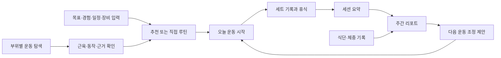

# 근거 기반 웨이트 트레이닝 앱 기획서

> **버전 0.6.1 · 2026-10-04 · 브레인스토밍 초안**  
> 앱 이름은 미정. `lightweight`는 임시 프로젝트 식별자다.  
> 사용자 범위·iOS·PWA·기본 스택과 명시 기능은 **요구사항/합의**, 배포 제공자·상세 보안/동기화·출시 순서·수치 목표는 **기획 제안**으로 구분한다.

## 1. 제품의 목적

**무엇을 왜 해야 하는지 이해하고, 운동을 빠르게 기록하며, 다음 행동을 근거와 내 기록으로 결정하는 앱.**

부위별 운동과 관련 근육을 시각적으로 이해하고, 직접 루틴을 만들거나 추천받고, 수행 기록을 남기면 다음 운동에 도움이 되는 개인화 리포트를 받는다. 식단 기록은 운동 목표와 연결하여 열량·단백질·영양소 섭취를 함께 검토하는 방향으로 확장한다.

핵심 연결: **근거 있는 운동 정보 → 내 조건에 맞는 루틴 → 간편 기록 → 설명 가능한 피드백 → 다음 운동**.

## 2. 해결할 문제와 사용자 가설

| 문제 가설 | 제공 가치 | 확인 방법 |
|---|---|---|
| 영상만으로 대상 근육과 선택 이유를 이해하기 어렵다 | 근육 지도·동작 설명·근거 카드 | 운동 선택 과업·이해도 인터뷰 |
| 루틴이 일정·장비·경험에 맞지 않는다 | 조건별 추천·대체 운동 | 채택률·수정/대체 사유 |
| 세트 기록이 번거로워 중단한다 | 이전 기록 재사용·완료 탭 | 입력 시간·4주 기록 유지율 |
| 기록은 쌓이지만 개선 방향을 모르겠다 | 변화 요약·다음 행동 1~3개 | 이해도·제안 실행률 |
| 운동과 식단을 따로 관리한다 | 운동·섭취·체중 추세 연결 | 식단 수요·입력 지속성 |

**사용자 범위 확정:** 첫 사용자는 본인 1명이다. 추후 확장도 주변 지인에게 직접 제공하는 범위를 현재 가정한다. 모바일 사용을 우선하며 iPhone/iOS가 대상이다. [CONV-0002](../../wiki/conversations/2026-10-03-002.md).

**개인 조건 확인:** 사용자는 골격근량 증대·주3~4회·무분할~3분할 운동을 보고했다. 보고된 iPhone 16 Pro Max·iOS 27.0.1은 하나의 파일럿 표본이다(CONV-0005). CONV-0006에서 특정 기종에 한정하지 않는 반응형과 사용자별 설정을 요구했다. 개인 조건을 앱 전역 기본값으로 고정하지 않는다. 운동 경험·주요 종목·장비·회당 시간·불편감은 미결이다. 건강한 성인·초보~중급이라는 기존 가설은 아직 사용자 조건으로 확정하지 않는다.

### 2.1 모바일 설치와 제공 방식

**PWA 진행 확정:** 사용자가 PWA로 진행할 의사를 명시했다. iPhone 홈 화면 설치와 링크 제공을 기준으로 기획을 발전시킨다. [CONV-0003](../../wiki/conversations/2026-10-03-003.md) · [플랫폼 검토](../../wiki/product/platform-distribution.md). 건강 앱·Watch 요구가 달라지면 구현 범위를 다시 검토한다.

첫 구현은 한 손 입력·오프라인 기록·백업/복원·설명 가능한 리포트에 집중하는 제안이다. **TypeScript·React+Vite·IndexedDB/Dexie·Supabase PostgreSQL/Auth 구성은 사용자 동의로 방향을 채택했다.** Mantine UI는 CONV-0008에서 채택했다. CONV-0010에서 전체 화면 Mantine 적용·Geist·블루/다크·iOS 같은 UX·전 폭 하단 메뉴·빠른 접근을 요구하여 별도 branch로 재설계했다. 글꼴은 Spoqa에서 Geist/한글 시스템 fallback으로 변경했다. CONV-0011에서 [Mantine UI/Monokai 참고 톤](../../wiki/sources/SRC-040-charcoal-tone.md)으로 변경하도록 요청해 차콜 배경/노란 강조로 조정했다. 구체 팔레트는 구현 선택이며 기존 Mantine·Geist·하단 UX 기준을 이어간다.  현재 정확한 패키지/역할은 [기술 스택](../../wiki/product/technology-stack.md)을 따른다. Supabase 프로젝트 연결과 등록 이메일/비밀번호·계정 DB·수동 snapshot 증분은 구현했으며 로그인 수단 최종 선택·지원 OS·동기화 고도화·운영비는 남았다. [언어와 개인 데이터 저장](../../wiki/product/technology-data-storage.md).

### 2.2 배포와 개인 기록 보호

Cloudflare Pages에 PWA 화면을, Supabase에 계정/DB와 서버 기능을 배포하는 구성을 추천한다. Pages와 운영 도메인 선택은 미확정이다. 공개 HTTPS 주소를 사용하되 본인·초대 지인 계정으로 개인 기록 접근을 제한하는 안이다. [배포·보안 상세](../../wiki/product/deployment-security.md).

개인 API는 화면을 우회한 직접 호출에서도 인증·소유자 권한을 검사한다. 공개 가입/익명 로그인 차단, 사용자별 RLS, 비밀키의 서버 보관, 동적 콘텐츠의 안전한 출력, preview/운영 데이터 분리와 접근 차단 시험을 제공 전 조건으로 제안한다. 사이트 전체 Cloudflare Access는 별도 선택이다. CONV-0008에서 제공한 프로젝트에 Auth/DB/RPC·허용 목록·권한을 적용했다. 공개 가입 차단은 사용자 명시 승인 후 저장하고 API로 확인했다. 외부 HTTPS 앱 배포는 아직 하지 않았다. [현재 연결/계정 준비](../../wiki/product/supabase-integration.md).

**추천 범위 제안:** 재활·질환 치료·임신/수유·미성년자용 자동 처방은 별도 검토가 필요하다. 범위 밖 사용자의 직접 기록·일반 정보 열람은 별도로 설계한다.

## 3. 요구사항과 우선순위

**운동 기능을 먼저 완성하고 식단을 다음 출시로 둔다**는 순서는 사용자 선택으로 확정했다(CONV-0005). P0 세부 콘텐츠 범위와 구현 단계는 제안이며, 사용자 핵심 요구를 누락하지 않고 [작업 목록](../../wiki/product/implementation-backlog.md)에서 추적한다. 근거 운영은 모든 단계의 출시 조건이다.

| ID | 사용자 요구 | 단계 제안 | 상세 |
|---|---|---|---|
| FR-01 | 부위별 운동 리스트·검색·필터 | P0 | [운동 정보](../../wiki/product/exercise-library.md) |
| FR-02 | 자극범위·대상 근육·시각적 설명 | P0 | [운동 정보](../../wiki/product/exercise-library.md) |
| FR-03 | 최신 연구 근거 기반 루틴 추천 | P0 | [추천](../../wiki/product/routine-engine.md) |
| FR-04 | 부위별 운동 티어 | P0, 검토 완료 범위부터 | [티어](../../wiki/product/tier-system.md) |
| FR-05 | 개인 루틴 작성·복사·편집·저장 | P0 | [기록](../../wiki/product/training-log.md) |
| FR-06 | 수행 운동·중량·횟수·세트의 간편 기록 | P0 | [기록](../../wiki/product/training-log.md) |
| FR-07 | 수행 기록 기반 개인화 리포트 | P0 | [리포트](../../wiki/product/reports.md) |
| FR-08 | 식단·식사량·섭취일 기록 | P1 | [영양](../../wiki/product/nutrition.md) |
| FR-09 | 부족 가능 영양소·추천 열량·식단 리포트 | P1 | [영양](../../wiki/product/nutrition.md) |
| FR-10 | 모바일 우선 반응형 PWA, 휴대폰·태블릿·데스크톱 확장 | P0 | [설치·배포](../../wiki/product/platform-distribution.md) |
| FR-11 | 사용자별 목표·운동 횟수·분할 등의 간편 입력/변경/보존 | P0 | [설정·로컬 계약](../../wiki/product/implementation-contracts.md) |
| FR-12 | 전체 Mantine UI·Geist·현재 스택/라이브러리 명시 | P0, 적용한 증분 | [스택](../../wiki/product/technology-stack.md) |
| FR-13 | 생성한 Supabase 연결·공개 가입 차단 | P0, 연결 증분/실계정 검증 잔여 | [클라우드](../../wiki/product/supabase-integration.md) |
| FR-14 | 운동별·일별 세트/반복/중량 볼륨과 그래프 추이 | P0, 관찰 지표부터 | [볼륨 MVP](../../wiki/product/volume-history-mvp.md) |
| FR-15 | 과거 데이터 기반 오늘의 운동/권장 볼륨 안내 | P0, 기록 참고→검토된 조정 단계 | [후보/조정](../../wiki/product/volume-history-mvp.md) |
| FR-16 | Monokai/Mantine 참고 차콜 톤·iOS 같은 UX·전 폭 하단 메뉴·클릭 수 감소/접근성·별도 branch 구현 | P0, UI 증분/실기기 잔여 | [디자인](../../wiki/product/design-system.md) · [감사](../../wiki/product/design-audit.md) |
| QA-01 | 현재 검증 하네스 문서화·단위/통합 검사·실패 재현/회귀의 반복 개선 | 지속 품질 요구; 상세 구현안 제안 | [하네스](../../wiki/operations/testing-harness.md) · [루프](../../wiki/operations/loop-engineering.md) |
| KM-01 | 루트 vault·Markdown·OKF·옵시디언 호환 | 이번 산출물 | [관리](../../wiki/operations/knowledge-workflow.md) |
| KM-02 | 대화에 따른 기획 수정과 이력·근거 축적 | 지속 관리 | [변경](../changes/index.md) |

## 4. 사용자 흐름과 정보 구조

내비게이션은 **오늘 / 운동 탐색 / 나의 루틴 / 리포트 / 설정**의 전 폭 하단 다섯 탭으로 구현한다(CONV-0010). 식단 출시 시 ‘오늘’에 식사 기록 진입점을 추가하고 리포트에 영양 탭을 둔다.

화면은 기종 이름 대신 폭과 입력 환경에 대응한다. 모든 폭에서 하단 메뉴를 유지하고 큰 화면은 본문 최대1080px·다중 열을 사용한다. 오늘 시작/재개·루틴 바로 시작, 운동 행 한 번 추가, 새 루틴 연속 선택과 운동 하단 dock으로 반복 조작을 줄인다. 모바일 확인/상세는 내용 높이 bottom sheet, 큰 화면은 Modal이다. Mantine theme과 Geist/한글 fallback·블루/다크로 통일한다. 구체 tokens/target/초점 기준은 [디자인 규칙](../../wiki/product/design-system.md)을 따르며 실제 iOS native 전환/실기기 검증 완료를 의미하지 않는다. 사용자별 목표·주당 횟수 범위·분할·시간·장비·단위·시간대를 설정하고 변경할 수 있다. 주당 횟수와 분할은 독립이다. 새 사용자의 목표·횟수·분할을 본인 조건으로 강제하지 않는다. 시작 당시 설정/루틴은 과거 기록에 보존한다. [구현 계약](../../wiki/product/implementation-contracts.md).

첫 사용에는 전체 프로필을 강제하기 전에 운동 탐색과 직접 기록을 허용한다. 추천 시 목표·경험·가능 횟수·시간·장비·제약을 단계적으로 받는다. 체중과 영양 계산 정보는 해당 기능에서 받는다.

운동 중에는 이전 중량·횟수 불러오기 → 수정 또는 완료 → 휴식 타이머 → 다음 세트를 이어준다. 기구 사용 중에는 대체 후보를 고른다. 추천 변경은 사용자 선택 후 적용하고 기존 계획을 남긴다.

## 5. 운동 정보와 자극범위

‘자극범위’는 다음을 분리하여 표현한다.

- 관련 근육: 주동근·협력근·안정화 역할과 이름.
- 동작 범위: 시작/끝 자세·관절 움직임·수행 조건.
- 근육 내 차이: 장기 훈련 연구가 측정한 부위에 한한 설명.
- 개인 느낌: 사용자가 느낀 자극의 선택 기록. 객관적 성장 지표와 구별.

운동 카드는 이름/별칭·장비·대상 근육·난이도·설정·수행법·흔한 오류·대체 운동·근거·검토일을 제공한다. 근육 그림의 색을 성장률이나 ‘자극 80%’로 표시하지 않는다. 급성 EMG만으로 장기 근비대 순위를 정하지 않는다.[^emg]

시각 자료는 2D 전면/후면 근육 지도와 짧은 동작 자료부터 시작하는 제안이다. 3D·카메라 자세 추적은 추후 검증한다. 해부학·수행법은 전문가 검토와 권한 확인 후 공개한다.

## 6. 루틴 추천과 티어 원칙

추천은 목표·일정·장비·수행 이력·선호·불편감에 따른 설명 가능한 규칙으로 시작한다. AI는 검토된 규칙과 계산 결과를 쉽게 설명한다. 중량·세트·열량 계산을 자유 텍스트 생성에 맡기지 않는다.

티어에는 **목표·부위·숙련도·장비 조건·평가 이유·근거 확실성·갱신일**을 표시한다. S/A/B/C는 추천 적합도, 연구 근거는 별도 배지다. 직접 비교가 없으면 동등 후보나 평가 보류를 허용한다.

연구 일반 원칙과 앱의 시작값을 구분한다. 2026 ACSM 자료는 목표별 처방과 운동량을 다루지만 모든 개인의 최적 세트 수를 확정하지 않는다.[^acsm] 운동량·빈도 효과는 근비대와 근력 목표에 따라 검토한다.[^volume]

초기에는 한 부위 티어와 한 루틴을 전문가가 끝까지 검토하는 파일럿을 제안한다. 전 부위의 과학적 순위가 이미 확정된 것은 아니다.

## 7. 간편 기록과 개인화 리포트

필수 입력: **운동·중량 방식·중량·횟수·완료 여부**. 준비/본세트·좌우·RIR·휴식·불편감·메모는 맥락에 따라 선택한다. 덤벨 한 손 중량, 머신 번호, 보조 운동의 보조량을 구분한다.

리포트는 **관찰 → 해석 → 다음 행동 → 근거/불확실성**으로 구성한다.

| 리포트 | 정보 | 해석 제한 |
|---|---|---|
| 세션 | 완료 운동·본세트·시간·개인 기록 | 계획과 실제 수행 구분 |
| 주간 | 실행·직접/간접 부위 세트·누락 | 세트를 근성장량으로 환산하지 않음 |
| 추세 | 같은 운동/장비/조건의 중량·횟수·노력 변화 | 조건이 다르면 단순 비교 보류 |
| 다음 행동 | 유지·증량 후보·대체·운동량 검토 | 사용자 선택 후 적용 |
| 영양 확장 | 섭취·체중 추세·기준 대비 기록 | 누락·성분 결측 표시 |

기록만으로 ‘근육 12% 성장’, ‘회복 100%’를 단정하지 않는다. 기록에 없는 숫자나 출처를 AI가 만들면 표시를 차단한다. 부족한 데이터에서도 기록일 요약과 다음에 필요한 정보를 제공한다.

### 7.1 볼륨·추이·과거 기록 기반 오늘 안내

CONV-0009에서 운동별/일별 볼륨·그래프와 과거 기록을 통한 오늘 운동/권장량을 요청했다. 완료 본세트·반복·시간·조건별 기록 중량×반복을 계산하고 날짜 그래프/표와 비교 범위를 표시한다. kg/lb 정규화, 한 손/머신/맨몸·보조/좌우·조건 변경·0/N/A를 구분한다. 기록량을 성장/회복 점수로 바꾸지 않는다.

MVP는 과거 수행량과 현재 본인 루틴의 오늘 후보부터 제공한다. 기록 부족/오늘 수행/진행 운동/설정·장비 변경은 보류하고 적용은 사용자 선택이다. 충분성·노력/불편감·경험 입력과 전문 검토 이후 권장 운동량 조정을 연결한다. [계산/화면/후보 계약](../../wiki/product/volume-history-mvp.md)·REP-04~06/SCI-03B. 새 상세 정책은 초기 구현안이며 최적 처방 승인으로 표시하지 않는다.

## 8. 식단 확장

음식 검색·최근 식사 재사용·즐겨찾기·양 수정·직접 입력을 우선한다. 사진 인식은 음식과 양의 초안이며 사용자가 확정한다.

국내 일반 영양 기준과 운동 목표용 단백질 목표를 구분한다. 2025 KDRI와 정오표를 버전 관리한다.[^kdri] 식품 데이터는 출처·기준 중량·조리 상태·성분 누락을 보존한다.

‘철 결핍’ 진단 대신 ‘완료로 표시한 식사 기록의 철 섭취 추정량이 기준보다 낮습니다’처럼 표현한다. 영양소별 성분 커버리지를 표시한다. 열량은 검토한 공식·입력·체중 추세로 제안하며 운동 활동을 중복 가산하지 않는다. 감량/증량 조정 수치는 별도 검토 후 확정한다.

## 9. 출시 단계 제안

| 단계 | 범위 | 다음 단계 조건 |
|---|---|---|
| 0. 개인 파일럿 | 본인 루틴에 필요한 10종 내외 가설·한 부위 티어·루틴·iPhone 기록 시안 | 실제 운동 중 편의성·기록/복원·콘텐츠 검토 |
| 1. 운동 MVP | 루틴 작성/추천·세트 기록·주간 리포트·필요 종목 확장·지인 시험 제공 | 데이터 보존·계산 정확성·근거 추적·개인 기록 분리 |
| 2. 식단 | 한국 음식·열량/단백질·성분 커버리지별 리포트 | DB 권한·성분 품질·영양 검토 |
| 3. 고도화 | 개인 반응 조정·사진 보조·건강 앱/웨어러블 연동 | 충분한 데이터·실제 수요 |

기본 스택과 운동 우선 순서는 합의했고 첫 기기는 사용자 보고로 확인했다. 실제 기기 동작·콘텐츠 검토·계정/메일·호스팅/운영비를 구체화하고 단계별로 구현한다. [구현 작업계획](../../wiki/product/implementation-plan.md)과 [백로그](../../wiki/product/implementation-backlog.md)에 의존성·완료 기준·검증·초기 공수 가정을 적었다. 날짜 확정 전 실제 난도와 검토 대기를 재평가한다. 초기 제외 제안: 커뮤니티, 경쟁 순위, PT 중개, 의학적 재활, 카메라 자세 교정.

현재는 본인·지인 사용을 위한 도구로 기획한다. 구독·가격·공개 서비스 성장은 초기 검증의 우선순위에서 내리는 제안이다. 향후 상용화는 별도 논의하고, 지금은 호스팅·AI·계정 DB·메일 등 운영 부담을 비교한다.

### 9.1 실행 순서와 제공 관문

설계 계약 → 앱 기반 → 탐색/직접 루틴/로컬 기록/백업 → 계정/동기화/접근 제한 → 계산 리포트 → 검토된 추천/티어 → 실제 iPhone 검증/본인 제공 → 관찰/소수 지인 → 식단 순서다. 근거/시각 자료 검토는 설계부터 진행하며 해당 콘텐츠 공개의 선행 조건이다.

가짜 데이터의 한 세트 저장/재시작/복원을 먼저 리뷰한다. 실제 기록은 권한·동기화·복원 검증 후 쌓고, 운동 MVP 완료에는 FR-01~07·FR-10~11의 연결과 검토된 콘텐츠 범위가 필요하다. 외부 AI 설명은 선택 후속이며 초기 개인화는 결정적 계산·규칙과 템플릿으로 제공하는 구현안이다. CONV-0006의 로컬 우선 이후 CONV-0008에서 생성한 Supabase 연결과 순차 구현을 요청했다. app0.2.0에 반응형·설정·운동/루틴·기기 기록·기초 집계·백업/PWA·Mantine/글꼴·등록 Auth/계정 DB·수동 snapshot을 구현했고 서버 권한/충돌 계약을 검사했다. 실제 계정 로그인/다기기 전체 흐름·자동 sync/충돌 고도화·검토된 과학 시각/추천/티어·완전한 개인화·실기기/배포는 남았다. [실행 결과](../../wiki/product/implementation-progress.md). 운동 MVP 완성으로 표시하지 않는다.

## 10. 데이터·AI·운영 요구

[데이터 모델](../../wiki/product/data-model.md): 프로필, 운동/변형, 루틴/버전, 세션/세트, 연구/주장, 추천/계산 버전, 리포트, 음식/식사.

- PWA의 캐시·로컬 DB를 별도 구현하여 오프라인 기록·재시도 중복 방지를 실제 iPhone에서 검증한다. 로컬 저장 실패 시 완료 성공으로 표시하지 않는다.
- 내보내기와 새 저장소에 복원하는 기능을 첫 버전에 포함하는 제안이다. 웹 저장소만으로 영구 보존을 보장하지 않는다.
- 사용자 선택으로 로컬부터 구현한 뒤 제공받은 Supabase로 연결했다. 로컬 프로필은 인증이 아니며 같은 브라우저에서 전환 가능하다. 인증 계정별 DB/서버 허용 목록과 권한을 추가했고 JSON 이관·수동 snapshot 전송/명시 교체를 구현했다. 실제 로그인/다기기 복원과 자동 sync 고도화는 미완료다.
- 동기화는 전송 대기·서버 확인·중복 방지·편집 충돌 처리를 별도 구현한다. 기기 저장됨과 클라우드 반영 완료를 구분하고 미전송분은 서버 복구가 불가능함을 표시한다.
- 서버·지인 제공 시 사용자별 소유자와 접근 권한을 검증한다. Supabase Auth·필요 grants·RLS를 함께 구성하고 서버 비밀키를 브라우저에 넣지 않는다.
- 공개 가입 차단은 사용자 승인으로 적용했고 익명 가입 OFF를 유지했다. Auth와 별도 서버 허용 목록으로 기록 접근을 제한한다. 실제 초대/복구·메일과 preview 접근/데이터 분리의 운영 조건은 남았다. 이메일 코드/초대는 SMTP 수신 제한과 무료 메일 템플릿 조건을 확인한다.
- 배포 대상은 앱 산출물로 한정한다. vault·개인 기록·백업·서버 비밀은 공개 파일에 포함하지 않는다. AI 함수에는 인증·소유자 검사·사용량 제한을 둔다.
- 운동 메타데이터·계산 규칙 변경이 과거 기록의 의미를 바꾸지 않도록 버전을 보존한다.
- 추천/리포트는 사용 기간·포함 기록·규칙/근거 버전을 남긴다.
- 개인 정보는 목적에 맞게 최소 수집하고 내보내기·삭제를 지원한다.
- 사용자 건강 기록은 이 기획 vault에 저장하지 않는다.
- 초기 연구 갱신은 수동 검토이며 ‘최신’에 검색일·포함 범위·검토 상태를 동반한다.

## 11. 성공 지표와 수용 기준

아래 수치는 사용성 검증용 가설이며 기존 성과가 아니다.

| 지표/기준 | 정의 |
|---|---|
| 핵심 이용 | 본인의 실제 운동 대비 기록한 세션과 리포트에서 선택한 다음 행동 |
| 기록 편의성 | 이전 값이 있는 본세트 완료 중앙값 3초 이내 가설 |
| 첫 가치 | 추천/직접 루틴에서 첫 세션 저장 성공률·시간 |
| 재사용 | 본인 4주 사용 중 기록 지속·중단 이유; 지인 제공 후 개인별 사용 관찰 |
| 이해도 | 대상 근육·추천 이유·근거 한계를 설명할 수 있는 비율 |
| 추적성 | 공개 효과 주장마다 근거 또는 추론/미검증 라벨 존재 |
| 기록 보존 | 강제 종료·오프라인 복귀·버전 업데이트 후 보존, 중복 완료 0건, 백업 복원 성공 |
| 계산 정확성 | 단위·세트·누락 집계가 명시 계산 계약과 일치 |

첫 검증은 본인의 iPhone에서 설치·실제 운동 기록·백업 복원과 4주 사용 관찰을 제안한다. 편의성이 안정되면 소수 지인 과업으로 확장한다. 본인 한 명의 결과를 전체 사용자 효용으로 일반화하지 않는다. [검증 계획](../../wiki/product/validation-plan.md)을 따른다.

### 11.1 검증 하네스와 반복 개선

CONV-0007에서 남은 작업과 현재 하네스 설명/문서화, 루프 엔지니어링을 통한 완성도 개선을 요청했다. 현재 자동 검사는 Vitest v4 unit19/integration25/ui11의55개/12파일·공통 check(lint/test/strict build)·vault 구조 검사다. 별도 수동 원격 SQL16과 비로그인 HTTP401/TLS를 확인했다. SQL role/JWT 표본은 실제 Auth 전체 흐름이 아니다. Chromium UI/오프라인/백업/업데이트 관찰은 수행했으나 저장소의 E2E/CI 회귀로 고정하지 않았다. [현재 구조](../../wiki/operations/testing-harness.md).

실패 표본과 독립 기대값→작은 수정→같은 조건 재검증→회귀/이력을 남기는 루프를 제안한다. 단위/통합 분리·DOM/실제 browser 흐름·실패 주입/업데이트·CI 증거를 HAR-01~06으로 추적한다. [남은 작업](../../wiki/product/remaining-work.md)과 [운영 절차](../../wiki/operations/loop-engineering.md)의 상세 기준은 제안이며, 자동 검사 성공이 실기기/근거 검토를 대신하지 않는다. HAR-01을 구현했고 HAR-04 migration/HAR-06 원격 계약 일부를 추가했다. 자동 DOM의 주요 과업은 추가했으며 실제 browser E2E·CI 실패 증거·실제 기기 검증은 아직 남았다. 모달 초점 문제를 재현→수정→브라우저 재검증한 사례를 루프 문서에 기록했다.

## 12. 미결 사항

본인 경험·종목/장비/회당 시간, 호스팅/도메인·사이트 Access·계정/초대/메일·동기화/백업·운영 예산, 건강 앱/Watch 요구와 검토 역할은 [미결 사항](../../wiki/product/open-questions.md)에서 관리한다. [결정 기록](../../wiki/decisions/decision-register.md)에는 사용자 요구와 제안의 상태를 구분한다.

## 13. 근거와 이력

최신 톤 변경은 [CONV-0011](../../wiki/conversations/2026-10-04-011.md) · [CHG-0011](../changes/CHG-0011.md) · [차콜 감사/증거](../../wiki/product/design-audit.md)를 따른다. PRD0.6.1은 기능 범위 변화 없이 색상 방향을 수정한 PATCH다.

- [볼륨/추이/추천·지속 commit 요구](../../raw/conversations/2026-10-04-009.md) · [CHG-0009](../changes/CHG-0009.md) · [추가 읽기](../../wiki/sources/SRC-037-volume-history.md).

- [UI/클라우드/가입 차단 요청](../../raw/conversations/2026-10-04-008.md) · [CHG-0008](../changes/CHG-0008.md) · [기술 근거](../../wiki/sources/SRC-036-mantine-supabase.md) · [실제 검사](../../raw/research/2026-10-04-mantine-supabase-verification.json).

- [하네스/루프 요청](../../raw/conversations/2026-10-04-007.md) · [CHG-0007](../changes/CHG-0007.md) · [기술 근거](../../wiki/sources/SRC-035-testing-harness.md).

이번 조사는 **2026-10-03 초기 표적 탐색**이며 체계적 문헌고찰이나 전체 최신 문헌 포괄을 뜻하지 않는다. 일부 논문은 초록·서지 수준으로 확인했다. iOS 배포 비교는 같은 날 Apple/WebKit 공식 안내를 확인한 별도 기술 조사다. [주장-근거 지도](../../wiki/concepts/evidence-map.md)와 출처 노트에서 범위를 확인한다.

- [원 요청](../../raw/conversations/2026-10-03-001.md) · [CHG-0001](../changes/CHG-0001.md).
- [iOS·개인 사용 원문](../../raw/conversations/2026-10-03-002.md) · [CHG-0002](../changes/CHG-0002.md).
- [PWA 선택·저장 질문](../../raw/conversations/2026-10-03-003.md) · [CHG-0003](../changes/CHG-0003.md).
- [스택 동의·배포/보안 우려](../../raw/conversations/2026-10-03-004.md) · [CHG-0004](../changes/CHG-0004.md).
- [계획 요청·운동 우선 선택](../../raw/conversations/2026-10-03-005.md) · [CHG-0005](../changes/CHG-0005.md).
- [반응형·사용자별 설정·로컬 구현](../../raw/conversations/2026-10-03-006.md) · [CHG-0006](../changes/CHG-0006.md) · [버전 보관](index.md).

[^emg]: [Vigotsky 외 2022](../../wiki/sources/SRC-008-emg.md), [연구 안내](https://pubmed.ncbi.nlm.nih.gov/35006527/).
[^acsm]: [ACSM 2026](../../wiki/sources/SRC-003-acsm-2026.md), [학회 공식 설명](https://acsm.org/resistance-training-guidelines-update-2026/).
[^volume]: [Pelland 외](../../wiki/sources/SRC-004-volume-frequency.md), [출판사 초록](https://link.springer.com/article/10.1007/s40279-025-02344-w).
[^kdri]: [2025 KDRI](../../wiki/sources/SRC-011-kdri-2025.md), [공식 배포](https://kns.or.kr/fileroom/fileroom_view.asp?BoardID=Kdr&idx=167).
