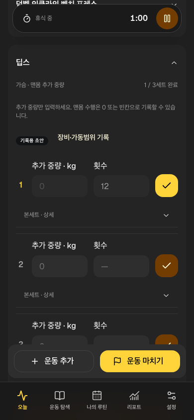

# 세 종목의 기록·중량 계약

CONV0026 / LOG01·FR01. 카탈로그34→37개, 바벨18개는 유지한다. 기존34개의 ID/배열 순서·과거 루틴/운동 snapshot은 바꾸지 않고 새 종목을 끝에 추가했다. 공통 picker의 부위/세부 부위/장비·별칭 검색으로 운동 탐색·루틴·오늘 추가에서 사용한다.

| 종목/ID | 검색 분류/장비 | 중량 기록 |
|---|---|---|
| 스미스머신 스쿼트 / smith-squat | 하체/허벅지 앞쪽·머신 | machine: 같은 머신의 중량 표기 기준. 장비·가동범위 입력으로 실제 머신/봉·원판 포함 기준을 남긴다. 바벨 종목과 자동 합산하지 않는다. |
| 덤벨 인클라인 벤치 프레스 / dumbbell-incline-bench | 가슴/상부·덤벨 | per_hand: 한 손 중량. 두 배로 환산하지 않는다. |
| 딥스 / dips | 가슴/하부·맨몸 | bodyweight: 추가 중량만. 맨몸은0/빈칸으로 완료 가능. 체중 추정·보조 머신 값 변환은 하지 않는다. |

검색 태그는 구현용 분류 초안이며 자극 부위의 독점성/과학적 효과·티어가 아니다. 세 종목 모두 catalog_draft이고 검토된 공개 설명은 여전히0개다. assisted 방식의 직접 종목 입력은 기존대로 별개이며 일반 딥스에 보조량을 넣지 않는다.

종목별 중량 볼륨은 머신70×10=700, 한 손25×10=250으로 기존 계약을 유지한다. 딥스는0/빈칸/추가10kg이어도 중량 볼륨N/A, 완료 본세트/반복으로 기록한다. 일별 중량 합계는 총 중량 방식만 포함한다.

109Vitest·Node10·전체36browser(19Chromium/17WebKit), 새 흐름6회/마지막 viewport2회 통과. 기존6lint경고는 유지. 실제 검색→세 종목3세트씩 추가→맨몸 중량 미입력 완료→재실행→백업9세트(완료3/미완료6) 보존을 검사했다. [불변 실행](../../raw/research/2026-10-07-catalog-expansion-loop.json). 공개 서버/Auth/RLS 변경은 없다. 신규 main push/CI/운영 배포는 후속 단위다.

## 실제 화면

## 세 종목·동기화 보존 운영 반영 — 2026-10-07

세 종목 추가b44ebda와 늦은 응답 차단fba60bb를 main에 push했다. GitHub37629327092 세 job success·실제 내려받은 Chromium19/WebKit17=36 결과와 최초 실패 probe 증거를 확인했다. 같은 fba60bb source의 Pages Git build/deploy가 성공했고 운영 공개24파일 SHA256·보안 헤더가 검증 빌드와 일치한다. [불변 배포 확인](../../raw/research/2026-10-07-catalog-sync-git-release.json).

카탈로그37/기존 ID·중량 기준·112Vitest/Node10·36browser와 schema2/backup1을 유지한다. SYNC 합성 검사와 실제 Auth/기기 관문을 구별한다. 실제 운동/새 기기·만료/회수·iPhone/Watch·SCI·운영 복구/파일럿·식단/3D/P2는 남는다. 신규 preview branch 배포는 검증하지 않았고 기존 preview DB 환경은 비어 있다. 이 후속 문서는 앱 bundle을 바꾸지 않는다.
