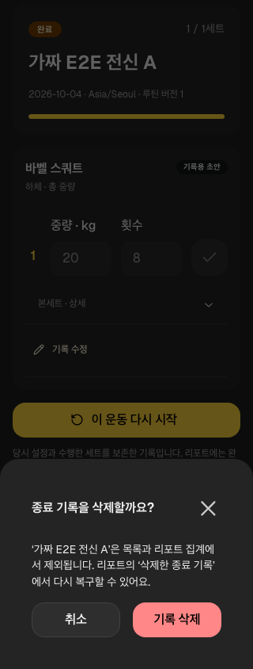
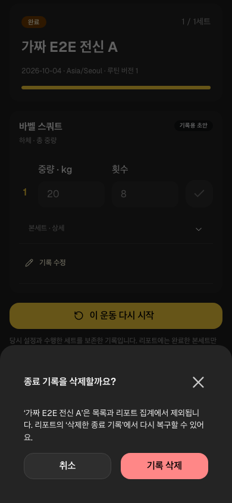
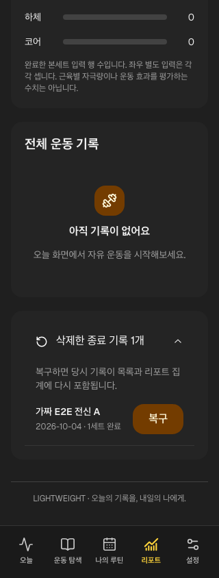
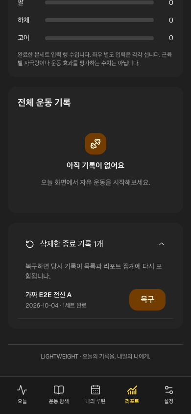
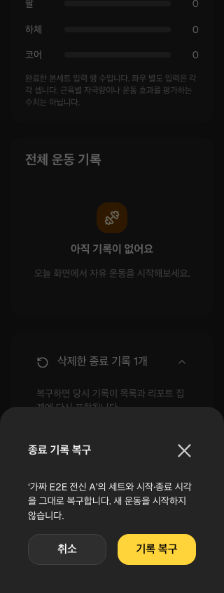
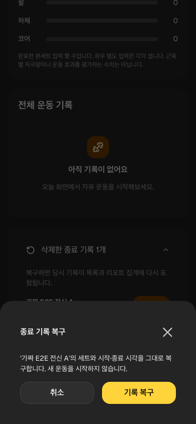

# 종료 기록 삭제·복구

종료한 운동 상세에서 ‘종료 기록 삭제’→확인/취소를 제공한다. 삭제하면 오늘/리포트 목록과 집계에서 제외하며 리포트 ‘삭제한 종료 기록 N개’→확인으로 복구한다. UI는 Mantine Paper/Accordion/Button/Drawer/Modal을 사용한다. 집계 카드는 이름 있는 group으로 묶어 label과 값을 함께 읽을 수 있다.

## 범위와 보존

complete/partial·endedAt이 있는 기록만 지원한다. 진행 중 운동의 기존 취소 흐름과 구분한다. 기존 취소로 숨긴 active 기록을 종료 기록처럼 복구하지 않으며 현재 운동이 중복되는 상황을 막는다. 복구는 원래 종료 기록을 되돌리고 새 운동을 시작하지 않는다.

owner/deleted 상태/expected revision을 확인하고 deletedAt/updatedAt/revision만 바꾼다. ID·모든 세트 입력/단위/좌우/종류/RIR/완료·루틴/설정 snapshot·시작/종료/현지 날짜를 보존한다. session/outbox는 같은 transaction이며 실패 rollback·오래된 창 거부·동시 중복 한 번 저장을 검사한다. 확인창 취소는 저장하지 않고 실패는 창을 유지하며 재시도할 수 있다. 백업은 삭제 표시도 보관한다. 영구 삭제나 다기기 자동 병합이 아니다.

## 검증과 개선 루프

90 Vitest(27unit/38integration/25UI)·Node8·lint exit0/기존6경고·build/types/format/artifact25를 통과했다. integration3/UI1·browser 각1을 추가해 Chromium13/WebKit11=24개다. 집계1→0→1·값/시각/CAS·다른 active 보존·reload/빈 context 파일 복원을 확인했다. 첫 DOM 검사의 즉시 조회 실패는 native panel이 준비될 때까지 findByRole로 기다린 fixture 보정이다. [불변 실행](../../raw/research/2026-10-04-ended-record-recovery-loop.json).

320/390px 삭제/펼친 목록/복구 확인6PNG를 직접 확인했다. 실제 region full-height·44px hit target·overflow0 계약을 유지한다. 캡처는 가짜 자료다.

schema2/backup1·원격 schema·과학 정책 변경은 없다. 실제 iPhone 설치/로그인 사용자 보고는 본 삭제/복구·실Auth 운동/다기기 보존 통과가 아니다. 메모/장비·SYNC/REP/SCI/나머지 기기/운영/파일럿/P2는 [남은 작업](../product/remaining-work.md)을 따른다.
