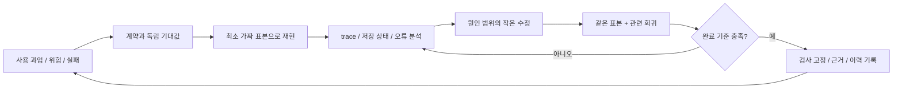

# 실패를 재현하고 회귀를 남기는 개선 루프

## 최신 종료 기록 보존 루프

[계약](ended-record-recovery.md)·[실행](../../raw/research/2026-10-04-ended-record-recovery-loop.json).90개(27unit/38integration/25UI)/17파일·Node8·Chromium13/WebKit11=24개. 집계1→0→1·종료 값/시각·다른 active 보존·실패/중복·reload/빈 context 파일 복원을 연결한다. native Accordion 준비 전 즉시 조회 실패를 async accessible query로 보정했고320/390px6PNG·44px hit target/overflow0을 확인했다. 실제 Auth/나머지 기기/SCI 검증 경계는 유지한다.

## 최신 루틴 복구 루프

[계약](routine-recovery.md)·[실행](../../raw/research/2026-10-04-routine-recovery-loop.json). Vitest86(27unit/35integration/24UI)·Node8·Chromium12/WebKit10=22, 최종 목록 추가2개. 실제 panel 확장 완료를 기다려 중간 프레임을 최종 PNG로 오인하지 않으며320/390px 여백/44px hit target·overflow를 확인했다. 취소/실패/중복/새 저장소 복원과 과거 운동 보존을 검사한다. 사용자 보고 iPhone 설치/로그인과 본 복구의 실제 기기 검사는 구분한다.

## 최신 순서/가림 루프

[계약](workout-order.md)·[불변 실행](../../raw/research/2026-10-04-workout-order-loop.json). Vitest83개(27unit/33integration/23UI)·Node8·Chromium12/WebKit10=22개. DOM/기록 검사를 통과해도 실제 알림이 버튼을 가렸다. PNG 직접 관찰→hit target 실패 고정→성공 안내의 층 수정→22개 재검사로 시각 문제를 회귀에 연결했다. 실제iPhone/운동 Auth·과학 검토 경계는 유지한다.

사용자는 루프 엔지니어링으로 완성도를 높일 방법을 찾고자 했다. 이 프로젝트에서는 **문제 선택 → 기대 결과 정의 → 재현 → 작은 수정 → 같은 조건 재검증 → 회귀 검사/지식 갱신**을 반복하는 작업 방식으로 구체화한다. 아래는 운영 제안이며, 상시 자율 에이전트나 자동 배포·자동 수정을 구축한 상태는 아니다.

## 한 루프에서 할 일

| 순서 | 구체적인 작업 | 남길 증거 |
|---|---|---|
| 1. 선택 | 데이터 유실/노출·계산·과학 주장부터, 다음 입력 불편/접근성/외형 | 문제ID, 영향, 관련 FR/백로그ID |
| 2. 기준 | 입력·수행 순서·기대 상태·허용 변화/오차를 수정 전에 정의 | 계약 링크와 독립 기대값 |
| 3. 재현 | 고정 날짜/시간대·A/B 가짜 프로필·기존 DB/캐시 조건 사용 | fixture ID/version, 명령/엔진/앱·schema 버전 |
| 4. 분류 | 제품 결함, 테스트 결함, 환경 실패, 미정 계약을 구분 | 최초 실패·DB 전후·trace/console, 재현 여부 |
| 5. 수정 | 원인에 필요한 최소 범위 수정; 요구가 바뀌면 PRD도 변경 | 변경 코드/계약, 영향 시나리오 |
| 6. 검증 | 원래 실패가 먼저 해소되고 같은 위험의 반례도 통과하는지 확인 | targeted 결과 + lint/test/build + 관련 browser 검사 |
| 7. 종료 | 검사나 실기기 절차를 고정하고 남은 제한을 명시 | 회귀 위치·결과·다음 작업·log/CHG |

현재 가능한 빠른 루프는 Vitest/코드 검사와 개발 브라우저 관찰이다. HAR03/05의 명령·CI설정을 추가해 browser 실패를 반복할 수 있다. 새 외부 CI 결과는 남았다. UI에는 role/label과 저장 후 사용자 결과를 보고, 저장소에는 transaction/owner/revision/outbox를 본다. 한 레이어의 성공만으로 전체 흐름을 닫지 않는다.

## 가장 먼저 적용할 세 묶음

**기록 보존 루프:** E2E-01/02/03 + Store 원자성. 먼저 현재 브라우저 관찰을 실행 가능한 spec으로 고정하고 입력 직후 완료·재시작·저장 실패·복원을 검증한다. 계정/동기화 구현 이후 동일 작업에 네트워크 지연·응답 유실·인증 만료·계정 전환을 추가한다.

**사용성 루프:** 한 세트 입력→완료→오류 수정 과업을 320~1440px/가로/키보드/확대로 확인한다. HAR-02/03의 결정적 검사는 기능의 성공을 확인하고 실제 운동 중 입력 시간·잘못 탭한 횟수·중단 이유는 따로 관찰한다. PRD의 3초는 미검증 가설이며 자동 테스트 시간이나 네트워크 속도로 달성했다고 주장하지 않는다.

**근거/개인화 루프:** 하나의 목표/일정/장비와 부족한 데이터 표본을 정하고, 계산과 조건 검사를 자동화한다. 전문 검토한 출처/정책/콘텐츠 ID·버전을 연결한다. 목표3↔4회/분할 변경/장비 없음/직접 비교 없음에서 추천 조건·보류·설명이 맞는지 평가한다. 미검토 항목은 공개 출력에서 제외한다. 테스트 통과는 운동 효과 검증과 다르다.

## 이번에 닫은 루프 — 모달 초점

2026-10-04 CUA의 가짜4174 화면에서 ‘루틴 만들기’→모달 내부 초점/ShiftTab→Escape 과업을 수행했다. 기대: 닫은 뒤 열었던 버튼으로 초점 복귀. 최초 결과: `document.activeElement`가 BODY로 바뀜. 조건부 unmount가 Mantine `opened=false` 전환을 거치지 않는 것이 원인이었다.

`app/src/components/shared.tsx`가 열기 시점 HTMLElement를 보관하고 unmount 시 연결된 opener로 focus를 되돌리게 수정했다. 동일 과업을 다시 실행해 BUTTON ‘루틴 만들기’ 복귀와 trap/Escape, console0을 확인했다. format/lint/30개/strict build 통과. 이는 브라우저 재검증이며 자동 UI regression spec은 아직 아니다. HAR-03의 E2E-06에 고정할 다음 사례다. [실행 증거](../../raw/research/2026-10-04-mantine-supabase-verification.json).

## 닫은 루프 — 복원 후 설정 입력 잔류

LOOP-SETTINGS-RESTORE-01, 2026-10-04. CUA 가짜4174에서 백업을 복원한 직후 header/DB는 새 프로필 설정인데 이름·목표·횟수·분할 입력은 이전 값으로 남았다. 그대로 저장하면 복원된 설정을 덮어쓸 수 있다. 원인은 owner만 key로 둔 ProfileForm이 기존 local input state를 유지하는 것이었다.

먼저 `app/tests/ui/settings.ui.test.tsx`에 실제 SettingsView+Mantine+Store/Dexie+upload/복원 dialog를 연결했다. jsdom File.text 부재라는 환경 실패를 먼저 구분했고, 테스트 setup에서 FileReader로 실제 업로드 bytes를 읽게 했다. 이후 기대 ‘복원된 가짜 설정’/실제 ‘저장하지 않은 이전 초안’으로 제품 실패를 재현했다. DB 복원 성공과 입력 잔류를 함께 확인했다.

ProfileForm을 실제 profile payload key로 다시 생성하도록 수정했다. owner/revision이 같아도 복원된 데이터가 다르면 초기 입력을 갱신한다. 같은 profile의 unrelated session 갱신은 draft를 유지한다. 회귀2개에서 복원→입력값/목표/분할/단위→재저장 후 복원 설정 보존과 미저장 초안 보존을 확인했다. targeted2와 전체unit19/integration25/ui8·52개/11파일·lint 경고0/strict build/format 통과. [불변 실행 기록](../../raw/research/2026-10-04-settings-restore-loop.json).

이 루프는 DOM·실제 저장소로 닫았다. 수정 뒤 실제 browser 파일 복원은 반복하지 않았으며 최종 PWA update/리포트·320/375/1440px/console0은 CUA로 확인했다. 실제 Auth/iPhone/CI/서비스워커 자동 회귀 성공으로 표현하지 않는다. HAR-02에는 Auth/프로필 전환 등의 과업이 남아 있다.

## 원격 보존/권한 루프의 현재 경계

같은 작업 retry·새 outbox 보존·CAS conflict·local preview 변경·schema migration은 fake DB와 서버 SQL 계약으로 고정했다. 원격 SQL의 임시 사용자/grants는 rollback했고 publishable-only HTTP는401이었다. 실제 Auth access token/계정 전환 UI까지 닫힌 루프로 표시하지 않는다. 승인 계정으로 동일 가짜 과업을 browser→Auth→RPC→DB→새 저장소 복원까지 연결하는 것이 다음 순서다. [현재 하네스](testing-harness.md).

## 확인된 사례와 새 확인 후보

확인된 기존 사례: ‘빈 중량+횟수만 입력한 완료는 거부, 0kg+10회는 허용’. Store 테스트는 실패 시 revision/outbox 수 유지까지 확인했다. 다음 루프는 같은 계약을 UI 입력 직후 완료·blur/click·반복 클릭에서도 확인하는 것이다. **UI 경합 버그가 발견됐다고 기록하지 않는다.**

새 확인 후보 **RISK-BACKUP-01**: 코드상 가져오기는 UTF-8 10MiB(10×1024×1024) 제한이지만 내보내기는 byte 제한 없이 schema 검증 후 다운로드한다. 큰 누적 기록으로 앱이 내보낸 파일을 스스로 가져오지 못할 가능성이 있다. 코드의 비대칭을 확인했으며 대용량 재현은 이번에 실행하지 않았다. HAR-04/LOG-06에 확인 후보로 등록한다.

제안 실험: 허용 schema 안에서 10MiB 직전/직후 가짜 기록을 생성 → UI와 Store 모두 export/import → 실제 bytes·기존 데이터·오류를 비교. 기대 정책은 ‘제공된 백업의 복원 가능성’으로 고정한다. 실제 실패를 재현하면 대용량 지원 또는 일관된 제한/명확한 안내를 설계하고 해당 회귀를 추가한다. 실패를 피하려 기록을 조용히 삭제·절삭하지 않는다.

## 실패를 숨기지 않는 규칙

- 가짜 표본/시계/시간대/환경을 고정하고 임의 sleep·테스트 간 공유 cache에 기대지 않는다. DB/name의 UUID는 격리용이고 날짜·기대값은 결정적으로 만든다.
- 최초 실패 결과를 보존한다. 재시도로 성공해도 첫 실패를 flaky 후보로 기록하고 원인을 확인한다. 초기 브라우저 retries0 + 실패 trace 보존을 제안한다.
- 같은 원인이 반복되면 관측 부족/fixture/계약부터 보완한다. 고정된 시간을 지나서 자동 성공 처리하거나 assertion을 약하게 바꿔 종료하지 않는다.
- 테스트용 전역 훅·실패 주입은 테스트 환경에 한정하고 운영 번들 노출을 검사한다. 실제 건강 기록·토큰은 재현 자료에 넣지 않는다.
- 원인이 계약 미정이면 독립 가능한 검증을 진행하고 미결을 남긴다. 과학적 적합성은 단위 테스트만으로 결정하지 않는다.

## 완료 기준과 측정

한 문제는 원래 재현 표본이 통과하고 관련 회귀가 통과하며, 재현/검사 위치와 남은 제한이 기록되어야 닫는다. 변경 전에도 통과하는 테스트를 추가한 경우에는 어떤 위험을 검증하는지 설명한다. 제품 변경 없이 외형만 바뀌는 작업에 구현과 같은 assertion을 늘리지 않는다.

| 지표 | 정의와 수집 방법 | 현재 |
|---|---|---|
| 핵심 과업 자동화 | 정의한 필수 scenario 중 CI 실행 가능한 수/전체 수 | 현재 browser9과업(Chromium5/WebKit4), 6ID중01~04완료·06부분·05미구현; CI실행은미확인 |
| 재현 시간 | 실패 접수부터 고정 표본/명령으로 실패 확인까지 | 아직 측정 없음 |
| 수정 검증 시간 | 수정 시작부터 원래 실패+영향 회귀 통과까지 | 아직 측정 없음 |
| 회귀 재발 | 닫았던 문제의 같은 원인이 재발한 횟수 | 기록 체계 제안, 측정 없음 |
| flaky | 동일 버전/fixture/환경에서 최초 실패→무수정 재실행 성공 | 아직 측정 없음; 단순 재시도 성공을 품질 통과로 숨기지 않음 |
| 사용자 과업 | 실제 세션 대비 기록 누락·저장 오류·입력 시간/중단 이유 | PIL-01 실사용 이후 관찰 |

코드 coverage는 보조 지표다. 먼저 보존/복원/권한/집계 경계를 검사하고 현황을 측정한 뒤 기준을 정한다. 임의의 전체100%나 테스트 개수로 완료를 대신하지 않는다. 첫 브라우저 회귀 묶음은 동일 환경에서 연속3회 안정 실행을 HAR-03 완료 후보로 제안하며, 이 숫자는 제품 효과나 출시 안정성을 증명하지 않는다.

## 저장과 반복 실행

[검사 기록 양식](../../templates/verification-record.md)으로 문제/실행ID·기대/실제·결과·회귀 위치를 남긴다. 가짜 재현 JSON과 작은 텍스트 결과는 `raw/research`에 새 파일로 보존하고, 일상적인 대용량 trace는 추적 제외 로컬 또는 제한된 CI artifact에 둔다. 실데이터로 얻은 관찰은 개인 기록을 제거한 요약만 vault에 남긴다. 최신 위키는 수정하되 과거 원본/CHG/스냅샷 해시는 보존한다.

현재 `npm run test` 등을 사람이 실행하고 CI가 push/PR에 검사한다. 이 문서 작성으로 예약 작업·자동 배포·자율 코딩 서비스가 추가되지는 않았다. 이후 구현은 [HAR 백로그](../product/implementation-backlog.md)와 [우선순위](../product/remaining-work.md)에 따라 작은 증분으로 진행한다.

[현재 하네스](testing-harness.md) · [도구 근거](../sources/SRC-035-testing-harness.md) · [지식 관리](knowledge-workflow.md)

## CONV-0010 디자인/하네스 루프

[감사](../product/design-audit.md) · [불변 실행](../../raw/research/2026-10-04-mantine-geist-design-verification.json). 기존 화면 관찰→토큰/컴포넌트 교체→같은 과업/가짜 자료→실패 수정→의미 있는 회귀→캡처/이력 순서로 진행했다.

- LOOP-UI-01: href 없는 NavLink가 키보드 선택 불가, flex filter 글자 잘림. 실제 button/명시 action label·max-content filter로 수정하고 Enter add1회/정보 분리/Escape focus를 자동 회귀로 남겼다.
- LOOP-UI-02: 내용이 짧아도 bottom Drawer90dvh. height auto/max90dvh·body scroll로 수정하고411.78/844px를 브라우저에서 재측정했다. 실제 iOS 키보드/VoiceOver는 후속이다.
- LOOP-UI-03: 완료 값 dim·stale timer120초 초과. 공통 input foreground·표시120초 cap. 기존 입력/복원 보존 검사는 유지했다.
- LOOP-HARNESS-UI-01: 도구에320 요청했어도 다른 tab의 실제 viewport390인 상태를 확인했다. 실패를 제품 overflow와 구별하고 dev iframe fixture를 추가했다. 다섯 실제폭×다섯화면 child width/scroll/target25조합으로 다시 검사했다. 요청값/초기 screenshot 파일명을 성공 증거로 재사용하지 않았다.

새3개 DOM 과업·기존52개 총55개 통과. 낮은 영향의 스타일을 복제하는 검사 대신 키보드/클릭 수/저장 결과를 고정했다. 검사 환경 export warning은 dev component export로 해결하고 lint 경고0을 재확인했다. 원본/캡처는 fake-only·해시 보존, PRD0.6.0/CHG0010에 제품 변경과 실제 검증 한계를 남겼다. 다음 루프는 HAR-03 결정적 browser/CI 증거와 실제 iPhone 입력/설치 과업이다.

## CONV-0012 후속 — 파일 재선택/프로필 비동기 경합

[실행 원본](../../raw/research/2026-10-04-profile-backup-dom-loop.json). 정상 과업 하나와 아래 세 최초 실패를 구분해 기록했다. Test locator의 여러 alert 선택 오류는 테스트 결함으로 먼저 수정했으며 제품 결함 증거에 포함하지 않았다.

| 문제 | 독립 기대값·최초 제품 실패 | 작은 수정·회귀 |
|---|---|---|
| LOOP-BACKUP-RETRY-01 | 실제 같은 File의 첫 읽기만 실패시킴→두 번째 업로드는 복원 가능; 실제는 change 이벤트가 없어서 미리보기 없음 | Mantine FileButton resetRef로 선택 직후 초기화; 두 번 읽기/오류시 DB 유지/복원 UI·DB 일치 |
| LOOP-PROFILE-PENDING-01 | A 저장을 gate로 지연→전환/생성 disabled; 실제 enabled | App pending guard·SettingsView busy; release 뒤 A만 저장/B 보존 |
| LOOP-PROFILE-WORKSPACE-01 | B 초기화 완료/조회 지연→A 입력 비노출; 실제 A input 재등장 | workspace.profile.ownerId 일치까지 로딩; release 뒤 B 설정 표시 |

무수정 기준 재현(첫 두 문제: UI14중2실패/12통과, workspace 추가: profile3중1실패/2통과)을 먼저 남겼다. 최종59개/13파일·lint/build/format:check 통과. A→B→A의 서로 다른 설정·루틴/원본 보존도 실제 App/Store 계약으로 추가했으나 이 정상 과업을 기존 제품 실패로 주장하지 않는다. 각 검사 UUID DB·mock/localStorage 정리, gate release, 실제 Store 실행으로 격리한다.

CUA 가짜4177의 invalid JSON 오류→동일 경로 정상 파일→미리보기·취소와 캡처를 확인했다.390px 버튼 label 잘림을 발견해 Mantine SimpleGrid의 작은 화면 단일 열로 수정하고 정확한 저장 캡처에서 전체 label을 재확인했다. DOM의 실제 복원과 browser의 미리보기 관찰을 구분한다. [오류](../../raw/design/2026-10-04-har02-invalid-file.png) · [복원 미리보기](../../raw/design/2026-10-04-har02-same-file-retry.png).

실제 Auth·RLS·서비스워커·레이아웃은 이 DOM 증분의 대체 hook/mock으로 검증되지 않는다. 실제 browser E2E/외부 CI·iPhone 과업은 HAR-03/05·REL-02에서 이어가며 HAR-02 전체는 in_progress다. 기능 요구는 그대로라 PRD0.7.0을 유지하고 실행 증거를 새 불변 원본으로 보존했다.

## HAR-03/05 루프 — 제품 실패와 하네스 실패 구분

[실행 원본](../../raw/research/2026-10-04-e2e-harness-verification.json). 최초9과업의2실패는 제품이 올바른 ISO .000Z를 내보내는데 test가 Z를 기대한 fixture 결함이었다. report의 실제 heading도 확인해 기대값을 수정했다. 제품 runtime은 수정하지 않았고 입력/파일/오프라인 등의 assertion은 유지했다. 재시도로 실패를 숨기지 않고 다른 runID에27회 성공을 기록했다.

반복 실행 종료에서 Vite의 정상 SIGTERM/exit143이 오류로 출력돼 lifecycle 결함으로 분류했다. 명시 종료 중에만 exit를 허용하고 build 취소 후 preview 시작을 막았다. 새9과업 통과/오류 출력 없음·서버 해제를 확인했다. 이어 의도적 실패 probe로 자식exit1·정확한 실패assertion/retry0·trace/화면/console/metadata/HTML·JSON 존재를 검증했다. probe 성공은 제품 실패를 pass 처리한 것이 아니며 정상spec에는 포함하지 않는다.

독립 9과업을 세 번 반복한27은 새27개 기능 계약이 아니다. same-environment 안정 관찰이며 Linux CI/iPhone/Auth/200%/quota/update 성공으로 일반화하지 않는다. WebKit SW 차단/Node color 경고는 환경 로그로 보존한다. CI설정과 로컬 증거 성공은 외부 GitHub 실행 성공과 구별한다.

## HAR04 보존 루프

[검사 계약](storage-recovery-harness.md)의 첫 Blob roundtrip/실제SW 운동종료 가림은 제품 결함으로 분류해 compact/대칭byte검사·main 안내 흐름으로 수정했다. 랜덤 배열 순서/blur전fault/UI matcher는 test fixture 결함이며 정확한경계/기대값을 고쳤다. 강제click·자동retry없이16개/새21회·64개/실패probe를 통과했다. [첫실패와실행](../../raw/research/2026-10-04-storage-recovery-verification.json). [GitHubCI](../../raw/research/2026-10-04-github-ci-37184261544.json)는187c47c 기준3job/9과업·실패증거 수신, 새HAR04local결과와 구별한다.
