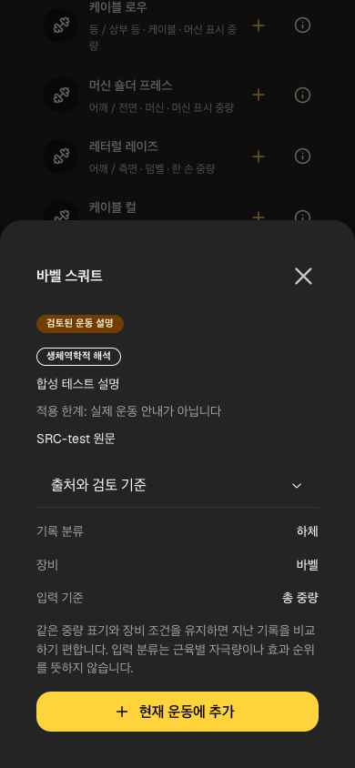
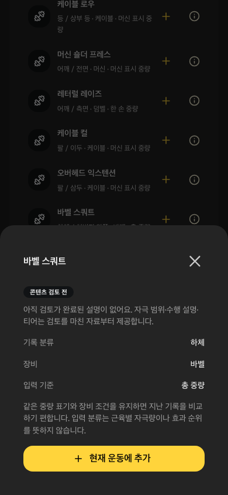

# 승인 설명 소비와 오프라인

SCI02의 compiler→공개 JSON을 운동 탐색 정보 창으로 연결했다. 주장 종류(연구 결과/생체역학적 해석/사용 조건)·적용 한계·주장별 원문 링크·설명/registry/review 버전을 함께 표시한다. 출처 세부는 Mantine Accordion, 모바일은 기존 Drawer를 사용한다. 시각 자산은 승인 경로/권리를 확인한 링크만 제공하며 2D/3D 렌더링 완료가 아니다.

## 신뢰 경계

compiler와 브라우저는 공통 Zod payload를 사용한다. 공개 bundle schema1/known exercise ID/중복/출처 연결/full_review 선언/HTTPS credential 없음/권리 미확인 거부를 검사한다. reviewer identity와 초안·private 필드는 읽는 계약에 없다. 이 검사는 선언/파일 구조 검사이며 실제 인간 검토를 독립 검증하거나 학술 결과를 참으로 판정하지 않는다.

공개 JSON만 same-origin/credentials omit으로 읽는다. 로딩/검토 전/불러오기 실패·다시 읽기를 구분하고 malformed 응답을 설명으로 표시하지 않는다. AbortController/종목 identity로 늦은 응답과 종목 변경 시 이전 설명을 막는다. 등록부 승인 항목은 **0개**다. 합성 설명은 테스트의 별도 응답 fixture이며 실제 registry/운영 bundle에 넣지 않았다.

## 오프라인/검증

SW precache에 정확히 content/exercise-guides.json을 추가했다. 임의 JSON·개인 백업·토큰/환경 파일을 cache 대상에 추가하지 않았다. 실제 Chromium v1→waiting v2→적용 후 offline 최초 정보 창에서 승인0 상태를 읽고 기존 native DB를 유지했다. unit1·UI3(출처/실패/재시도/종목 전환)·Chromium/WebKit2흐름을 추가했고 기존 출판 Node계약10과122Vitest/40browser·build/types/format/artifact25 통과(기존6경고). 최종 화면을 직접 확인했다.

실제 iPhone·과학/해부학·권리 승인·직접/간접 매핑·추천 규칙/티어·2D자산은 남는다. [실행](../../raw/research/2026-10-08-reviewed-guide-loop.json)·[연구 검토 패킷](../product/chest-evidence-review.md).

## HAR 깨끗한 CI 콘텐츠 생성 보완 — 2026-10-08

600c7b8의 GitHub37648213883에서 check/WebKit19는 success였지만 Chromium20통과/1실패를 확인했다. 실제 내려받은 trace/PNG/console은 offline 공개 JSON 누락을 가리켰다. 새 browser job은 Vite만 실행하여 gitignore된 생성 JSON이 없었다. 운영 build는 compiler를 실행했고 같은 source Pages Git 배포/공개24파일 hash·헤더는 일치했다. 이는 사용자의 idle 업데이트 비활성 원인으로 확정한 결과가 아니다.

E2E 서버가 v1/v2 전에 운영과 같은 공개 compiler를 실행하도록 보완했다. 빈 승인 생성 파일만 없는 상태를 준비한 뒤 원본 registry/개인 기록을 바꾸지 않고 동일 JSON 재생성과40browser를 통과했다.122Vitest/Node10·build/types/format/artifact25·의도적 실패 probe도 통과(기존6경고). 첫 CI 실패/로컬 이전 통과를 모두 보존하고 새 원격 CI/배포는 후속 확인한다. [불변 루프](../../raw/research/2026-10-08-fresh-content-harness-loop.json).
