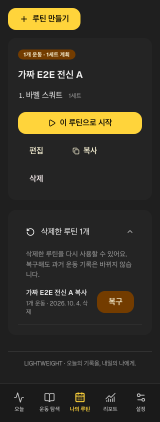
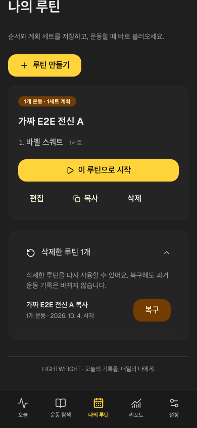
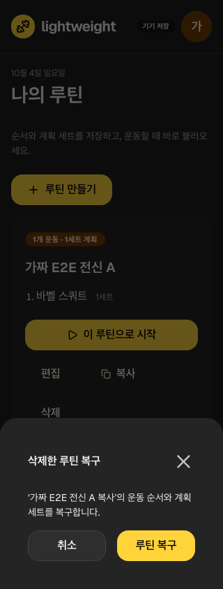
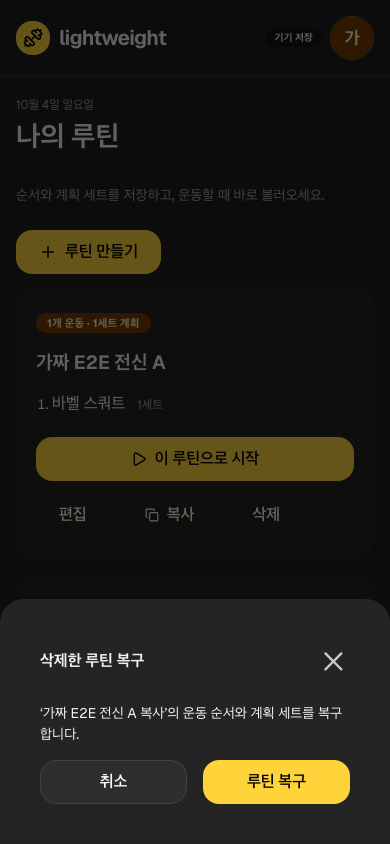

# 삭제한 루틴 복구

‘나의 루틴’의 Mantine Accordion ‘삭제한 루틴 N개’를 열어 복구를 선택하고 확인창에서 명시 확정한다. 목록은 현재 프로필의 삭제 루틴만 표시한다. 취소는 저장하지 않는다. 같은 ID/운동 순서/계획 세트/당시 설정을 다시 사용할 수 있고, 과거 운동의 루틴 snapshot은 변경하지 않는다.

## 저장·실패 계약

삭제 상태·소유자·열었을 때의 revision을 확인한 뒤 deletedAt을 해제하고 updatedAt/revision과 outbox를 한 transaction에서 저장한다. 다른 프로필·오래된 창·이미 복구된 루틴은 거부한다. enqueue 실패 시 삭제 상태와 outbox 모두 rollback한다. 동시 중복 요청은 한 번만 확정된다. 실패하면 확인창이 유지되며 재시도할 수 있다.

삭제한 운동 기록 복구/영구 삭제/클라우드 자동 전송·다기기 병합 기능은 이 계약에 포함하지 않는다. 로컬 복구 후 사용자가 수동 snapshot 전송하는 현재 방식과 서버 CAS는 유지한다.

## 하네스와 실제 화면

Vitest86(27unit/35integration/24UI)·Node8·lint exit0/기존6경고·build/format/types/artifact25를 통과했다. integration2/UI1을 추가했고 기존 E2E03의 빈 context 복원 뒤 삭제 루틴 취소/복구·과거 세션 동일·reload 계약을 확장했다. 전체 Chromium12/WebKit10=22 통과 뒤 추가 목록/터치 검사2개도 통과했다. [불변 실행](../../raw/research/2026-10-04-routine-recovery-loop.json).

첫 320px 목록 PNG는 펼침 애니메이션 중간 프레임을 담아 텍스트가 잘렸다. 실제 region이 완전히 펼쳐질 때까지 상태를 확인한 후 재캡처했다. 애니메이션을 없애거나 고정 sleep으로 숨기지 않았다. 최종320/390px에서 여백/전체 텍스트·확인/취소·44px 복구 버튼·가림 없음·overflow0을 확인했다. 가짜 자료만 캡처했다.

실제 iPhone 설치/로그인은 별도 [사용자 보고](../../raw/research/2026-10-04-iphone-install-user-report.json)이며 본 복구의 physical device/VoiceOver/클라우드 운동 왕복 검증은 아니다. [남은 작업](../product/remaining-work.md)·[하네스](testing-harness.md).
