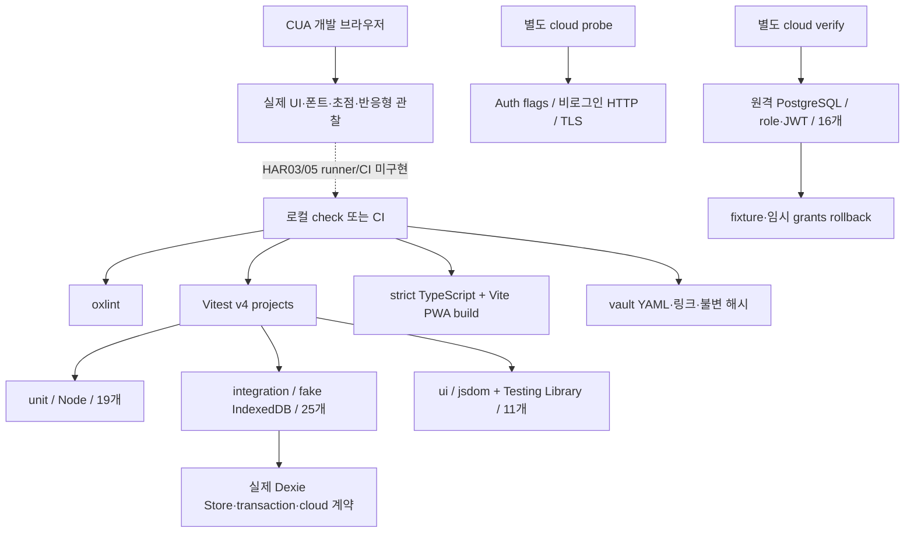

# 현재 테스트 하네스와 확장 설계

2026-10-04 / app0.2.0 / IndexedDB schema2 / PRD0.6.0. 하네스는 **실행 환경·가짜 데이터·준비/정리·과업·독립 기대값·실패 증거를 같은 조건으로 반복하는 장치**다. HAR-01을 구현했고 단위/저장소 통합은 자동 실행한다. 원격 SQL 계약 검사는 별도 수동 명령, 실제 브라우저 관찰은 아직 CI E2E가 아니다.



## 최신 UI 검증과 수동 반응형 하네스

현재 unit19/integration25/ui11·55개/12파일, lint 경고0/build/format. navigation.ui.test.tsx의3과업은 하단탭 keyboard/aria-current·운동 한 번 추가와 별도 info/Escape focus·초기 열린 루틴 picker/연속2종목 저장이다. 기존 설정 복원/입력 직후 완료/저장 실패·계산 계약을 함께 유지한다.

`npm --prefix app run dev -- --host 127.0.0.1 --port 4176` 실행 후 `http://127.0.0.1:4176/tests/harness/responsive.html`에서 폭/화면을 선택한다. iframe은 앱과 **같은 origin/저장소**를 사용하고 자동 seed/clear를 하지 않으므로 전용 origin의 가짜 프로필로 검사한다. 320/375/390/768/1440px·5개 화면을 실제 child html clientWidth/scrollWidth로 측정하고 screenshot/target 크기를 남긴다. 표 내부 overflow와 전체 page overflow를 구분한다. 개발 HTML은 production entry/public asset이 아니고 build/dist에는 포함되지 않는다.

이 fixture는 **수동 browser 검사**다. device emulator/Playwright Test runner/CI trace/실제 iPhone keyboard가 아니다. viewport 도구의 요청치만으로 통과하지 않고 실제 CSS viewport를 읽는다. [원본](../../raw/research/2026-10-04-mantine-geist-design-verification.json) · [디자인 감사](../product/design-audit.md). 아래30/33/50/52개는 이전 실행의 범위다.

## 실제 파일과 격리

| 층 | 현재 위치 | 범위 |
|---|---|---|
| unit | `app/tests/unit/models.unit.test.ts`, `cloud.unit.test.ts`, `volume.unit.test.ts`, `history.unit.test.ts` | DB setup 없이 설정/날짜/단위·공개 URL/키·계정 DB 이름·원격 owner/revision 검증과 볼륨/날짜/후보 정책, 합계19개 |
| integration | `app/src/data/local/store.test.ts`, `cloud.test.ts`, `volume.test.ts` | 기존 저장소14개+클라우드10개, fake-indexeddb와 실제 Dexie/Store/Zod, 볼륨 Store 편집/재개/복원1개, 합계25개 |
| ui | `app/tests/ui/*.ui.test.tsx`, `setup.ts` | 실제 WorkoutView/VolumeReport/HistorySuggestion/SettingsView·Mantine, 라벨/사용자 동작·오류/필터/명시 선택, 합계11개; fake DB/ResizeObserver no-layout stub, jsdom 파일 읽기는 FileReader로 보완 |
| 실행 설정 | `app/vitest.config.ts` | Node unit/integration + jsdom ui projects·경로 include 고정, PWA Vite config와 분리 |
| DB fixture | 위 integration 파일의 beforeEach/afterEach | 검사마다 UUID DB·A/B 가짜 자료, mock/DB 삭제; cloud 날짜는 Date만 고정 후 복원 |
| 원격 계약 | `app/scripts/verify-cloud.mjs` | 실제 DB transaction의16개 계약, 가짜 사용자/임시 grant/row를 finally rollback |
| HTTP/TLS probe | `app/scripts/supabase-probe.mjs`, `db-client.mjs` | Auth flags·publishable-only RPC401·Session pooler CA/hostname 확인 |
| CI | `.github/workflows/check.yml` | Node24/npm ci→공통 check→vault; 원격 자격 정보/DB mutation 명령은 CI에 추가하지 않음 |
| 별도 UI 관찰 | CUA + build preview | 가짜 새4174 origin, font·설정·초점·overflow; runner/config/spec/CI trace 미구현 |
| 수동 반응형 fixture | `app/tests/harness/responsive.html`, `responsive.jsx` | 실제 iframe 폭/화면 선택, fake origin; runner 아님 |
| 임시 산출물 | `output/playwright`, `output/design-audit`, `.playwright-cli` | 추적 제외 screenshot/가짜 자료; 안정된 CI 보존 정책 미구현 |
| 지식 검사 | `scripts/validate_vault.rb` | 구조/상대 링크/출처/불변SHA256; 과학 검토·앱/권한 통과와 별개 |

## 계약 검사가 확인하는 것

기존16개를 누락 없이 unit2/integration14로 옮겼다. 설정/분할 독립·날짜/단위·local owner 차단·중복 시작/완료·결측/0·기록/outbox 롤백·과거 스냅샷·DB close/open·백업 오류/새 DB 복원·준비/미완료/삭제 제외 집계를 유지한다. 이전 상세 매핑/감사는 [CHG-0007 당시 기록](../../raw/research/2026-10-04-harness-audit.json)과 [이전 PRD](../../history/versions/prd-v0.3.1.md)에 남겼다.

추가unit4: 공개 URL/키 경계, 설정 누락 로컬 동작, UUID account DB 이름, 잘못된 원격 owner/revision 거부. 추가integration10: 캡처 ACK 후 새 변경 보존·응답 유실 같은 작업 재시도·CAS 충돌/잘못된 ACK 보존·미리보기 이후 local 변경 거부·명시 교체/recovery·타인 owner·진행 운동 업로드 거부·교체 transaction 롤백·schema1→2 보존·물리적 계정 DB 분리.

원격16개: 빈 계정 읽기·자기 저장·idempotent retry/다른내용 거부·stale revision conflict·foreign owner·깨진 snapshot/설정·private ACL·B에서A 미노출·미등록/익명/authz 회수·anon RPC·임시 SELECT grant에서도 owner RLS. 실제 JWT access token을 발급하지 않고 SQL role/claim을 설정한 검사다. 별도로 **공개 키만 넣은 실제 HTTP read/write 요청이401/42501**인 것을 확인했다. 실제 로그인 계정A/B와 다른 기기 UI는 남았다.

## 실행과 실제 결과

프로젝트 루트에서:

```sh
npm --prefix app run test:unit
npm --prefix app run test:integration
npm --prefix app run test:ui
npm --prefix app run check
npm --prefix app run format:check
ruby scripts/validate_vault.rb
```

서버 검사 환경이 있는 로컬 `app`에서만 `npm run cloud:probe`, `npm run cloud:verify`를 실행한다. `.env`/DB URI/비밀번호/토큰은 기록하거나 CI artifact로 올리지 않는다. migration 자체는 별도 검토/적용이며 verify가 운영 자료를 만드는 도구가 아니다.

2026-10-04 01:49 KST 기준 format/lint/30개/strict build 통과, unit6/integration24 분리 명령도 통과. PWA precache23개/1623.05KiB. 원격 SQL16 통과·잔여0·Advisor 빈 배열. [이번 실행 수집](../../raw/research/2026-10-04-mantine-supabase-verification.json). 외부 CI 실행은 미확인, coverage 백분율은 측정하지 않았다.

CUA에서는 가짜 설정/reload/update·320/375/1440px 관찰·Spoqa 로딩·입력16px·모달 trap/ShiftTab/Escape/opener 복귀·console0을 확인했다. 실제 Safari/iPhone·설치·키보드·잠금·200% 확대·모든 화면·실저장 quota·클라우드 Auth 전체 흐름을 통과시킨 것은 아니다. 과거 Chromium offline/빈DB/업데이트와 전체 폭 검증 이력은 [진행 보고](../product/implementation-progress.md)에 범위를 보존한다.

## 2026-10-04 복원 입력 회귀

당시 unit19/integration25/ui8·52개/11파일, lint/build/format 통과. settings.ui.test.tsx는 실제 파일 선택/복원 dialog→same-owner/revision 입력값 갱신→재저장 보존과 unrelated session update의 draft 유지를 검사한다. 기존 key=owner에서 실패를 먼저 재현했다. File.text 부재는 test 환경으로 구분하고 FileReader 실제 byte 읽기를 보완했다. [루프 원본](../../raw/research/2026-10-04-settings-restore-loop.json). HAR-02는 Auth/프로필 전환 등 남은 과업으로 in_progress다.

## 2026-10-04 볼륨/후보 증분

unit19/integration25/ui6·50개/10파일, lint 경고0/build/format 통과. owner·조건/단위·N/A·날짜 간격·0 변화율/미래, 설정/장비/이력/partial/오늘/active 보류를 독립 기대값으로 확인한다. 실제Store의 편집/완료취소/재개/삭제/복원 재계산, 실제화면의 기간/조건/지표·표·명시 시작을 연결한다. jsdom 초기 ResizeObserver 누락을 환경 실패로 분류해 관찰 stub을 추가했다. 실제 layout은 별도CUA로 확인했다. [원본](../../raw/research/2026-10-04-volume-history-verification.json). 아래33개 표기는 앞선 초기 증분 이력이다.

## 2026-10-04 HAR-02 DOM 증분

`app/tests/ui/setup.ts`·`workout.ui.test.tsx`와 Vitest `ui`/jsdom project·`test:ui`를 추가했다. 실제 WorkoutView+Mantine+Dexie를 사용하고 사용자 라벨/동작과 저장 결과를 검사한다. 0kg/반복 입력 직후 완료/blur·재진입, transaction 실패와 UI 오류/기존 payload/outbox·재시도, 중량 결측→0 수정의3개 과업 통과. 기존unit6/integration24와 합계33개/5파일, lint/build/format 통과. [실행 원본](../../raw/research/2026-10-04-dom-harness-verification.json).

HAR-02는 in_progress다. DOM 과업 기반을 만들었지만 backup/Auth 전환·실제 layout/서비스워커/quota·Playwright E2E/CI trace는 남았다. jsdom은 실제 iPhone/브라우저가 아니다. 기존 ‘DOM 도구 없음’ 표기는 이 증분 이전 상태이며 현재 tooling은 [SRC-038](../sources/SRC-038-dom-harness.md)을 따른다.

## 다음 자동 회귀

- HAR-01 done: projects·기존 검사 분리·unit/integration/check 명령·결정적 cloud 날짜.
- HAR-02 in_progress: 입력 직후 완료·반복 클릭·저장 오류/복원·계정 전환의 DOM 과업. DOM 환경/입력·실패 과업3개는 추가했고 backup/계정 과업은 남았다.
- HAR-03 planned: 고정 Playwright Test runner·빌드 preview·새 context·Chromium PWA/WebKit UI 경계. 지금 CUA 관찰은 spec이 아니다.
- HAR-04 in_progress: schema1→2 저장소 계약 추가. 실제 브라우저 migration/update·quota·대용량 백업 정책은 남았다.
- HAR-05 planned: CI UI 회귀·실패 trace/console/실행ID 보존·외부 CI 실제 결과. 공통 check만 연결했다.
- HAR-06 in_progress: 원격 권한/충돌/보존의 SQL 계약 추가. 실제 Auth E2E·콘텐츠/추천 평가는 미완료.

## 자동 회귀로 고정할 우선 시나리오


| ID 제안 | 준비·동작 | 독립 기대 결과 | 층/작업 |
|---|---|---|---|
| E2E-01 | 빈 프로필→설정→루틴→세트 입력→즉시 완료→reload | 빈 값 오류,0kg 허용; 완료1·단일 session/set, 입력 보존 | UI+Chromium/WebKit, HAR-02/03 |
| E2E-02 | 온라인 SW/cache 준비→offline→reload→세트 추가/종료 | 네트워크 없이 앱 실행·추가 완료 보존, 복귀 후 중복0 | Chromium PWA, HAR-03/04 |
| E2E-03 | JSON 다운로드→새 context 빈 DB→미리보기→복원 | 정규화한 설정·루틴ID·세션ID·세트·삭제 상태 일치 | browser 실제 다운로드/upload, HAR-03 |
| E2E-04 | A 기록/설정→B 전환→B 변경→A 전환/reload | B에 A 비노출, A의 기존 내용 보존 | UI+Store, HAR-02/03 |
| E2E-05 | V1에서 진행 세션→V2 waiting→종료 후 적용 | 진행 중 적용 차단, 종료 뒤 새 버전·기존 기록 보존 | Chromium SW, HAR-04 |
| E2E-06 | 여러 폭/가로·키보드 탐색·200% 확대 과업 | 완료/오류/모달 조작 가능, 수평 넘침/초점 유실 없음 | browser+실기기, RESP-01/REL-02 |

백업 비교는 owner remap·복원 시각/revision 변화만 계약에 따라 제외하고, 실제 세트 값·ID·삭제 상태는 비교한다. 수평 넘침 한 가지로 E2E-06 전체를 통과시키지 않는다. 기기/엔진 미지원 검사는 `not_run`으로 남긴다.

[남은 작업](../product/remaining-work.md) · [루프 운영](loop-engineering.md) · [검증 계획](../product/validation-plan.md) · [검사 기록 양식](../../templates/verification-record.md)

최종 설명 검토: 이력 검토를 건너뛴 active/오늘/설정 보류에는 제외0개 대신 미검토를 표시한다. 최종50개/10파일·l int/build/format 통과, precache23개/1644.45KiB. [마지막 실행](../../raw/research/2026-10-04-volume-history-final-verification.json).
