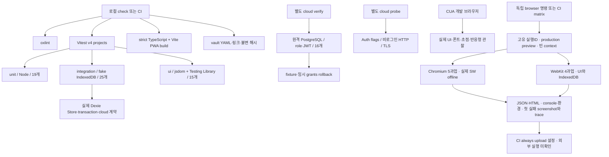

# 현재 테스트 하네스와 확장 설계

## 최신 종료 기록 보존 루프

[계약](ended-record-recovery.md)·[실행](../../raw/research/2026-10-04-ended-record-recovery-loop.json).90개(27unit/38integration/25UI)/17파일·Node8·Chromium13/WebKit11=24개. 집계1→0→1·종료 값/시각·다른 active 보존·실패/중복·reload/빈 context 파일 복원을 연결한다. native Accordion 준비 전 즉시 조회 실패를 async accessible query로 보정했고320/390px6PNG·44px hit target/overflow0을 확인했다. 실제 Auth/나머지 기기/SCI 검증 경계는 유지한다.


## 최신 루틴 복구 루프

[계약](routine-recovery.md)·[실행](../../raw/research/2026-10-04-routine-recovery-loop.json). Vitest86(27unit/35integration/24UI)·Node8·Chromium12/WebKit10=22, 최종 목록 추가2개. 실제 panel 확장 완료를 기다려 중간 프레임을 최종 PNG로 오인하지 않으며320/390px 여백/44px hit target·overflow를 확인했다. 취소/실패/중복/새 저장소 복원과 과거 운동 보존을 검사한다. 사용자 보고 iPhone 설치/로그인과 본 복구의 실제 기기 검사는 구분한다.


## 실제 iPhone 확인 — 사용자 보고, 2026-10-04

사용자가 운영 앱의 iPhone 홈 화면 설치·실행·로그인에 “홈 화면 실행·로그인 완료”라고 응답했다. [CONV0020](../conversations/2026-10-04-020.md)·[확인 범위](../../raw/research/2026-10-04-iphone-install-user-report.json). 해당 세 과업은 사용자 보고로 확인했으며 에이전트의 직접 기기 관찰·OS 재측정은 아니다. 앞선 ‘응답 대기’ 문단은 당시 이력이다.

REL02는 부분 진행이다. 실제 운동/모바일 클라우드 왕복·새 기기 복원·키보드/VoiceOver/확대/가로/잠금·오프라인/업데이트/physical quota/eviction 검사는 남는다. 설치·로그인 확인을 G3 전체 통과로 확대하지 않는다. 운영 앱은 e912f0c이며 진행 중인 루틴 복구는 아직 배포하지 않았다.


## 최신 순서/가림 루프

[계약](workout-order.md)·[불변 실행](../../raw/research/2026-10-04-workout-order-loop.json). Vitest83개(27unit/33integration/23UI)·Node8·Chromium12/WebKit10=22개. DOM/기록 검사를 통과해도 실제 알림이 버튼을 가렸다. PNG 직접 관찰→hit target 실패 고정→성공 안내의 층 수정→22개 재검사로 시각 문제를 회귀에 연결했다. 실제iPhone/운동 Auth·과학 검토 경계는 유지한다.


현재: unit21/integration26/ui17의64개/14파일, Chromium9/WebKit7의16과업과 신규7개×3회21회 통과. HAR05는187c47c의 GitHub3job/실패artifact 수신으로 done. HAR04는 실제iPhone/physical quota·초과 백업/기기복구가 남아 in_progress. [보존 하네스/최신 구조](storage-recovery-harness.md) · [최신 실행](../../raw/research/2026-10-04-storage-recovery-verification.json). 이전 single preview는 두 production build를 전환하는 loopback test server로 확장했다. 새코드의CI는 아직 실행하지 않았다.

## 이전 HAR03 생성 당시 구조/실행

2026-10-04 / app0.2.0 / IndexedDB schema2 / PRD0.7.1. 하네스는 **실행 환경·가짜 데이터·준비/정리·과업·독립 기대값·실패 증거를 같은 조건으로 반복하는 장치**다. HAR-01을 구현했고 단위/저장소 통합은 자동 실행한다. 원격 SQL 계약 검사는 별도 수동 명령이다. HAR03 runner의 로컬 실행을 완료했고 HAR05 CI설정/실패probe는 완료했으나 새 GitHub 실행은 미확인이다.



## 자동 browser runner와 실패 증거

[실행 증거](../../raw/research/2026-10-04-e2e-harness-verification.json) · [공식 도구 확인](../sources/SRC-043-playwright-runner-ci.md). @playwright/test1.63.0/브라우저 revision을 lockfile·설치 metadata로 고정한다. 한 번의 정상 실행은 Chromium5/WebKit4 합계9개다. 같은 조건에서 repeat-each3으로27개 통과, 서버 종료 수정 후9개와 실패 probe를 재확인했다. 자동 retries0을 유지해 첫 실패를 숨기지 않는다.

```sh
cd app
npx playwright install chromium webkit
npm run test:e2e
npm run test:e2e -- --repeat-each=3
npm run test:e2e:probe
```

Linux/CI는 `npx playwright install --with-deps chromium webkit`로 OS 의존성도 설치한다. 기존 Vitest/check는 브라우저 다운로드 없이 실행할 수 있으며 check는 E2E 타입 검사까지 한다. E2E는 별도 명령/CI job이다.

| 요소 | 실제 파일·동작 |
|---|---|
| 고유 실행 | `app/scripts/run-e2e.mjs`: 날짜+UUID runID·전용 폴더; 같은ID 재사용은 거부; environment.json에 base commit/dirty/code fingerprint·src/tests/scripts/선택 config SHA256 |
| 서버 | `app/scripts/e2e-server.mjs`: dist-e2e production build→127.0.0.1:4188 preview, strictPort/reuseExistingServer:false·명시 signal 종료; 사용자 preview/dist 재사용 없음 |
| 환경 | VITE Supabase URL/key 빈 override; 외부 HTTP(S) 요청을 실패 처리. clock은 ISO 고정·timer는 실제 동작; 기본390×844/ko-KR/Asia-Seoul |
| 격리 | Playwright test별 빈 context·UI seed/cleanup; 백업은 새context 실제 다운로드 파일로 복원. 실제 사용자 browser/profile에 접속하지 않음 |
| 기대값 | 독립 0kg/10회·20kg/8회·중복ID/삭제tombstone·snapshot·A/B 분리; 백업 비교는 owner remap/프로필 복원 revision·updatedAt만 제외 |
| 엔진 | Chromium UI/PWA; WebKit UI/IndexedDB는 SW block. WebKit offline 지원/실제 Safari/iPhone 통과로 표시하지 않음 |
| 증거 | `output/playwright/e2e/{runID}/`: JSON/HTML report, per-test execution.json/console.json, 실패 screenshot·trace.zip, 관찰 screenshot·반응형 값 |
| 실패 probe | 정상spec에서 제외한 evidence.probe.ts 하나를 의도적으로 실패→자식exit1/정확한assertion/retry0/실제files·metadata 검사→부모exit0. 다른 실패나 누락이면 부모도 실패 |
| CI | 기존 check+format/vault job, 독립 Ubuntu engine matrix/fail-fastfalse·공식 브라우저/OS 설치, Chromium 실패probe, always upload·7일보관·엔진/run/attempt별 이름 |

trace/report는 복사 없이 해당 로컬 폴더에서 `npx playwright show-trace <trace.zip>`/`show-report <report>`로 연다. 고유 runID 폴더는 자동 덮어쓰지 않으며 로컬 용량 정리는 검토 후 별도 수행한다. CI는 repo 정책의 보관 상한을 따르고 public repo artifact를 비공개로 가정하지 않는다. 업로드 대상은 가짜 검사 출력뿐이며 .env/실제 백업/토큰/개인 기록은 포함하지 않는다. 새 CI 실제 실행·업로드는 미확인이며 HAR05를 done으로 바꾸지 않는다.

최초 실행의 ISO 기대값 차이(2실패/7통과)는 test 결함으로 분류했다. 이후27통과 중 정상 SIGTERM→exit143의 서버 정리 오류를 분리해 수정하고9과업/probe를 재확인했다. browser console error/unhandled0·외부요청0을 확인했다. SW 차단 경고와 Node NO_COLOR/FORCE_COLOR 환경 경고는 성공 결과에서 숨기지 않는다.

## 최신 UI 검증과 수동 반응형 하네스

현재 unit19/integration25/ui15·59개/13파일, lint 경고0/build/format:check. 아래 navigation3개는 기존 검사이고 이번 profile/backup4개를 함께 유지한다. navigation.ui.test.tsx의3과업은 하단탭 keyboard/aria-current·운동 한 번 추가와 별도 info/Escape focus·초기 열린 루틴 picker/연속2종목 저장이다. 기존 설정 복원/입력 직후 완료/저장 실패·계산 계약을 함께 유지한다.

`npm --prefix app run dev -- --host 127.0.0.1 --port 4176` 실행 후 `http://127.0.0.1:4176/tests/harness/responsive.html`에서 폭/화면을 선택한다. iframe은 앱과 **같은 origin/저장소**를 사용하고 자동 seed/clear를 하지 않으므로 전용 origin의 가짜 프로필로 검사한다. 320/375/390/768/1440px·5개 화면을 실제 child html clientWidth/scrollWidth로 측정하고 screenshot/target 크기를 남긴다. 표 내부 overflow와 전체 page overflow를 구분한다. 개발 HTML은 production entry/public asset이 아니고 build/dist에는 포함되지 않는다.

이 fixture는 **수동 browser 검사**다. device emulator/Playwright Test runner/CI trace/실제 iPhone keyboard가 아니다. viewport 도구의 요청치만으로 통과하지 않고 실제 CSS viewport를 읽는다. [원본](../../raw/research/2026-10-04-mantine-geist-design-verification.json) · [디자인 감사](../product/design-audit.md). 아래30/33/50/52개는 이전 실행의 범위다.

## 이전 HAR-02 후속 — 로컬 프로필/파일 재시도 완료

CONV-0012의 순차 작업으로 실제 App/SettingsView·Mantine·Dexie/liveQuery를 연결했다. 백업 읽기 실패 후 같은 파일 재선택, A→B→A 설정/루틴 보존, 저장 중 프로필 전환/생성 차단, B 초기화 완료/조회 지연 중 A 입력 비노출의4개 DOM 계약을 추가했다. 세 제품 실패를 먼저 재현하고 FileButton resetRef·pending guard·workspace owner 확인으로 수정했다. [최초 실패/검사 원본](../../raw/research/2026-10-04-profile-backup-dom-loop.json).

현재 **unit19/integration25/ui15·59개/13파일**, lint 경고0/build/format:check 통과. 전용4177 가짜 화면에서 잘못된 파일의 한국어 오류→같은 경로의 정상 파일 재선택→복원 미리보기·취소를 확인했고,390px 복원 버튼 글자 잘림도 responsive SimpleGrid로 수정/재캡처했다. 실제 복원/DB 보존은 DOM 계약에서 확인했다. 본 후속 browser 실행에서는 미리보기에서 취소했다.

HAR-02의 **로컬 파일·프로필 DOM 부분**은 완료했으며 실제 Auth 전환은 남아 전체 상태를 in_progress로 유지한다. Auth client와 SW hook은 test-only 대체이며 실제 로그인/RLS/오프라인을 시험한 것이 아니다. 다음 순서는 HAR-03/05 자동 browser/CI 증거, 이어 HAR-04·실계정 SYNC·콘텐츠 SCI·실기기 REL 관문이다. PRD는0.7.0이고 기능 요구/데이터 schema/원격 설정 변경은 없다.

## 실제 파일과 격리

| 층 | 현재 위치 | 범위 |
|---|---|---|
| unit | `app/tests/unit/models.unit.test.ts`, `cloud.unit.test.ts`, `volume.unit.test.ts`, `history.unit.test.ts` | DB setup 없이 설정/날짜/단위·공개 URL/키·계정 DB 이름·원격 owner/revision 검증과 볼륨/날짜/후보 정책, 합계19개 |
| integration | `app/src/data/local/store.test.ts`, `cloud.test.ts`, `volume.test.ts` | 기존 저장소14개+클라우드10개, fake-indexeddb와 실제 Dexie/Store/Zod, 볼륨 Store 편집/재개/복원1개, 합계25개 |
| ui | `app/tests/ui/*.ui.test.tsx`, `setup.ts` | 실제 App/WorkoutView/VolumeReport/HistorySuggestion/SettingsView·Mantine, 라벨/사용자 동작·오류/필터/명시 선택, 합계15개; fake DB/ResizeObserver no-layout stub, jsdom 파일 읽기는 FileReader로 보완 |
| 실행 설정 | `app/vitest.config.ts` | Node unit/integration + jsdom ui projects·경로 include 고정, PWA Vite config와 분리; SW virtual hook은 test-only no-op alias |
| DB fixture | 위 integration 파일의 beforeEach/afterEach | 검사마다 UUID DB·A/B 가짜 자료, mock/DB 삭제; cloud 날짜는 Date만 고정 후 복원 |
| 원격 계약 | `app/scripts/verify-cloud.mjs` | 실제 DB transaction의16개 계약, 가짜 사용자/임시 grant/row를 finally rollback |
| HTTP/TLS probe | `app/scripts/supabase-probe.mjs`, `db-client.mjs` | Auth flags·publishable-only RPC401·Session pooler CA/hostname 확인 |
| CI | `.github/workflows/check.yml` | 공통 check/format/vault와 독립2엔진 browser+probe/artifact 설정; 외부 실행 미확인·원격비밀/DB mutation 없음 |
| 별도 UI 관찰 | CUA + build preview | 과거 수동font/초점/화면 관찰; 자동 E2E와 별도 |
| 자동 browser | `app/playwright.config.ts`, `tests/e2e/`, `scripts/*e2e*.mjs` | 9과업·실제SW/파일/IndexedDB·고유증거, HAR03 로컬완료 |
| 수동 반응형 fixture | `app/tests/harness/responsive.html`, `responsive.jsx` | 실제 iframe 폭/화면 선택, fake origin; runner 아님 |
| 임시 산출물 | `output/playwright`, `output/design-audit`, `.playwright-cli` | 추적 제외 가짜자료·고유ID첫실패; CI7일보관 설정/외부실행미확인 |
| 지식 검사 | `scripts/validate_vault.rb` | 구조/상대 링크/출처/불변SHA256; 과학 검토·앱/권한 통과와 별개 |

## 계약 검사가 확인하는 것

기존16개를 누락 없이 unit2/integration14로 옮겼다. 설정/분할 독립·날짜/단위·local owner 차단·중복 시작/완료·결측/0·기록/outbox 롤백·과거 스냅샷·DB close/open·백업 오류/새 DB 복원·준비/미완료/삭제 제외 집계를 유지한다. 이전 상세 매핑/감사는 [CHG-0007 당시 기록](../../raw/research/2026-10-04-harness-audit.json)과 [이전 PRD](../../history/versions/prd-v0.3.1.md)에 남겼다.

추가unit4: 공개 URL/키 경계, 설정 누락 로컬 동작, UUID account DB 이름, 잘못된 원격 owner/revision 거부. 추가integration10: 캡처 ACK 후 새 변경 보존·응답 유실 같은 작업 재시도·CAS 충돌/잘못된 ACK 보존·미리보기 이후 local 변경 거부·명시 교체/recovery·타인 owner·진행 운동 업로드 거부·교체 transaction 롤백·schema1→2 보존·물리적 계정 DB 분리.

원격16개: 빈 계정 읽기·자기 저장·idempotent retry/다른내용 거부·stale revision conflict·foreign owner·깨진 snapshot/설정·private ACL·B에서A 미노출·미등록/익명/authz 회수·anon RPC·임시 SELECT grant에서도 owner RLS. 실제 JWT access token을 발급하지 않고 SQL role/claim을 설정한 검사다. 별도로 **공개 키만 넣은 실제 HTTP read/write 요청이401/42501**인 것을 확인했다. 실제 로그인 계정A/B와 다른 기기 UI는 남았다.

## 실행과 실제 결과

프로젝트 루트에서:

```sh
npm --prefix app run test:unit
npm --prefix app run test:integration
npm --prefix app run test:ui
npm --prefix app run check
npm --prefix app run format:check
ruby scripts/validate_vault.rb
```

서버 검사 환경이 있는 로컬 `app`에서만 `npm run cloud:probe`, `npm run cloud:verify`를 실행한다. `.env`/DB URI/비밀번호/토큰은 기록하거나 CI artifact로 올리지 않는다. migration 자체는 별도 검토/적용이며 verify가 운영 자료를 만드는 도구가 아니다.

2026-10-04 01:49 KST 기준 format/lint/30개/strict build 통과, unit6/integration24 분리 명령도 통과. PWA precache23개/1623.05KiB. 원격 SQL16 통과·잔여0·Advisor 빈 배열. [이번 실행 수집](../../raw/research/2026-10-04-mantine-supabase-verification.json). 외부 CI 실행은 미확인, coverage 백분율은 측정하지 않았다.

CUA에서는 가짜 설정/reload/update·320/375/1440px 관찰·Spoqa 로딩·입력16px·모달 trap/ShiftTab/Escape/opener 복귀·console0을 확인했다. 실제 Safari/iPhone·설치·키보드·잠금·200% 확대·모든 화면·실저장 quota·클라우드 Auth 전체 흐름을 통과시킨 것은 아니다. 과거 Chromium offline/빈DB/업데이트와 전체 폭 검증 이력은 [진행 보고](../product/implementation-progress.md)에 범위를 보존한다.

## 2026-10-04 복원 입력 회귀

당시 unit19/integration25/ui8·52개/11파일, lint/build/format 통과. settings.ui.test.tsx는 실제 파일 선택/복원 dialog→same-owner/revision 입력값 갱신→재저장 보존과 unrelated session update의 draft 유지를 검사한다. 기존 key=owner에서 실패를 먼저 재현했다. File.text 부재는 test 환경으로 구분하고 FileReader 실제 byte 읽기를 보완했다. [루프 원본](../../raw/research/2026-10-04-settings-restore-loop.json). HAR-02는 Auth/프로필 전환 등 남은 과업으로 in_progress다.

## 2026-10-04 볼륨/후보 증분

unit19/integration25/ui6·50개/10파일, lint 경고0/build/format 통과. owner·조건/단위·N/A·날짜 간격·0 변화율/미래, 설정/장비/이력/partial/오늘/active 보류를 독립 기대값으로 확인한다. 실제Store의 편집/완료취소/재개/삭제/복원 재계산, 실제화면의 기간/조건/지표·표·명시 시작을 연결한다. jsdom 초기 ResizeObserver 누락을 환경 실패로 분류해 관찰 stub을 추가했다. 실제 layout은 별도CUA로 확인했다. [원본](../../raw/research/2026-10-04-volume-history-verification.json). 아래33개 표기는 앞선 초기 증분 이력이다.

## 이전 2026-10-04 HAR-02 초기 DOM 증분

`app/tests/ui/setup.ts`·`workout.ui.test.tsx`와 Vitest `ui`/jsdom project·`test:ui`를 추가했다. 실제 WorkoutView+Mantine+Dexie를 사용하고 사용자 라벨/동작과 저장 결과를 검사한다. 0kg/반복 입력 직후 완료/blur·재진입, transaction 실패와 UI 오류/기존 payload/outbox·재시도, 중량 결측→0 수정의3개 과업 통과. 기존unit6/integration24와 합계33개/5파일, lint/build/format 통과. [실행 원본](../../raw/research/2026-10-04-dom-harness-verification.json).

HAR-02는 in_progress다. DOM 과업 기반을 만들었지만 backup/Auth 전환·실제 layout/서비스워커/quota·Playwright E2E/CI trace는 남았다. jsdom은 실제 iPhone/브라우저가 아니다. 기존 ‘DOM 도구 없음’ 표기는 이 증분 이전 상태이며 현재 tooling은 [SRC-038](../sources/SRC-038-dom-harness.md)을 따른다.

## 다음 자동 회귀

- HAR-01 done: projects·기존 검사 분리·unit/integration/check 명령·결정적 cloud 날짜.
- HAR-02 in_progress: 입력·저장 오류/복원·로컬 프로필 전환 DOM 부분 완료. 같은 파일 재시도/A→B→A/pending/workspace 경합4개 추가. 로컬 browser는 HAR03에서 완료했으며 실제 Auth 전환은 남았다.
- HAR-03 done: 고정 runner·production preview·새context·Chromium5/WebKit4·27반복/최종9통과. 실제 iPhone/Auth는 범위 밖.
- HAR-04 in_progress: schema1→2 저장소 계약 추가. 실제 브라우저 migration/update·quota·대용량 백업 정책은 남았다.
- HAR-05 in_progress: engine CI·실패trace/console/실행ID/코드해시·7일보관·로컬실패probe 완료. 새 GitHub 실행/업로드 결과는 미확인.
- HAR-06 in_progress: 원격 권한/충돌/보존의 SQL 계약 추가. 실제 Auth E2E·콘텐츠/추천 평가는 미완료.

## 우선 시나리오와 현재 실행 범위


| ID | 준비·동작 | 독립 기대 결과 | 층/작업 |
|---|---|---|---|
| E2E-01 | 빈 프로필→설정→루틴→세트 입력→즉시 완료→reload | 빈 값 오류,0kg 허용; 완료1·단일 session/set, 입력 보존 | 자동 Chromium/WebKit 완료, HAR-02/03 |
| E2E-02 | 온라인 SW/cache 준비→offline→reload→세트 추가/종료 | 네트워크 없이 앱 실행·추가 완료 보존, 복귀 후 중복0 | 자동 Chromium PWA 완료, HAR-03/04 |
| E2E-03 | JSON 다운로드→새 context 빈 DB→미리보기→복원 | 정규화한 설정·루틴ID·세션ID·세트·삭제 상태 일치 | 자동 Chromium/WebKit 실제파일 완료, HAR-03 |
| E2E-04 | A 기록/설정→B 전환→B 변경→A 전환/reload | B에 A 비노출, A의 기존 내용 보존 | 자동 로컬A/B 완료·Auth별도, HAR-02/03 |
| E2E-05 | V1에서 진행 세션→V2 waiting→종료 후 적용 | 진행 중 적용 차단, 종료 뒤 새 버전·기존 기록 보존 | 미구현 Chromium SW, HAR-04 |
| E2E-06 | 여러 폭/가로·키보드 탐색·200% 확대 과업 | 완료/오류/모달 조작 가능, 수평 넘침/초점 유실 없음 | 5화면×4폭/정보창키보드만 자동; 나머지미시험, RESP-01/REL-02 |

백업 비교는 owner remap·복원 시각/revision 변화만 계약에 따라 제외하고, 실제 세트 값·ID·삭제 상태는 비교한다. 수평 넘침 한 가지로 E2E-06 전체를 통과시키지 않는다. 기기/엔진 미지원 검사는 `not_run`으로 남긴다.

[남은 작업](../product/remaining-work.md) · [루프 운영](loop-engineering.md) · [검증 계획](../product/validation-plan.md) · [검사 기록 양식](../../templates/verification-record.md)

최종 설명 검토: 이력 검토를 건너뛴 active/오늘/설정 보류에는 제외0개 대신 미검토를 표시한다. 최종50개/10파일·l int/build/format 통과, precache23개/1644.45KiB. [마지막 실행](../../raw/research/2026-10-04-volume-history-final-verification.json).

## 압축 백업 후속

[새 gzip 복구 계약](compressed-backup.md)에서66개·browser18·새2×3회6회를 확인했다. 기존16과업에 새24,000세트 gzip 독립context 복구/CRC거부 두 엔진을 추가했다. 기존큰JSON검사는 유지한다. 첫 fixture.tables 오참조 실패와 이후 success는 각 runID로 보존한다. 실제 Auth/iPhone·physical quota는 별도다.

## 재사용/종료 수정 회귀

[새 기록 계약](record-reuse.md)에서72개·browser20·새6회를 확인했다. 실제 UI→다운로드/원본 비교→볼륨 재계산→repeat/reuse/replace/reload를 두 엔진에 고정했다. source/owner/동시 시작/stale revision/잘못된 완료 입력은 integration으로 검사한다. 최초 fixture/selector 실패를 고유 ID와 로그 hash로 보존한다. 실제 계정/iPhone은 별도다.

## 주간 기록 점검 회귀

[기록 점검](report-coverage.md)의 owner/시간대/기간/취소/삭제/active·같은 날/다른 조건·RIR0/누락·수정revision을4unit와2UI 계약으로 추가했다.78개/16파일·browser20 통과, 실제 WebKit390px 화면/여백을 확인했다. 설정/오늘/진행·미완료 바로가기와 수정 후 표시 갱신을 확인한다. 실제 계정/iPhone·과학적 충분성 검토를 대체하지 않는다.

## HTTPS 배포 계약

Node 기본 test runner의3개(test:deploy)를 npm run check에 추가했다. 실제 헤더 누락/오래된 SW hash/credential·HTTP URL 거부를 검사한다. pages:verify로 운영/preview23파일 hash와 헤더 일치를 확인했다. 78개 Vitest/browser20과 별도이며 실Auth/iPhone은 미통과다. lint는exit0·기존effect경고6개다. [배포 증거](../../raw/research/2026-10-04-pages-deployment.json).

## 공개 설명 계약 검사

content:compile을 일반 build에 연결하고 Node5계약을 추가했다(배포3과 총8). agent 승인/수정 문구·abstract/깨진 참조/unknown 권리·중복/unknown 종목·변경 파일/외부 symlink의 거부와 draft/reviewer 비출력을 확인한다.78 Vitest는 유지, UI 흐름/건강 주장은 추가하지 않았다. 실제 과학 검토·원격 CI는 별도다. [계약](content-publication.md).

## CONV0022 현재 증분

31unit/40integration/27UI=98개/19파일·Node8·전체Chromium16/WebKit14=30, 문구만 수정 후 마지막6과업·build/types/format/artifact25를 확인했다(lint기존6경고). unit은 deadline/pause와 설정 bounds·기존 schema/카탈로그, integration은 atomic profile/outbox/owner/backup, UI는 타이머 재진입·중복/실패/재시도, browser는 필터·휴식 clock/reload/설정 backup·H1 focus/outline·320/390px이다. 실제 캡처에서2문구 잘림을 발견해 짧은 표시와 원래 accessible 이름을 제공했다. [증거](../../raw/research/2026-10-04-catalog-rest-timer-loop.json)·[계약](catalog-rest-timer.md). 실제 Auth/Google/물리 iPhone/과학 검토는 별도다.
