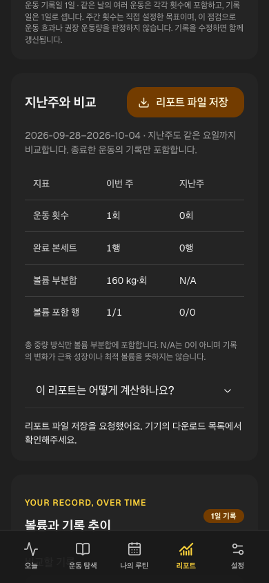
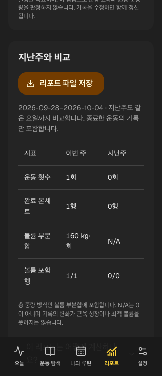
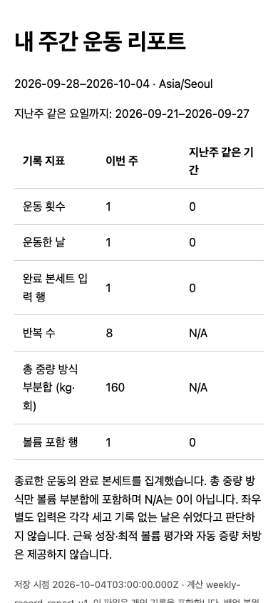

# 지난주 비교와 저장 시점 리포트

현재 REP-02 증분이다. 리포트에서 이번 주와 지난주 같은 요일까지 운동 횟수·완료 본세트·총 중량 방식 볼륨 부분합/포함 행을 비교한다. 월요일 시작/사용자 시간대이며 진행 중 기록과 미래 날짜를 포함하지 않는다. 기존 추이 그래프는 완료한 active 행도 관찰할 수 있으므로 두 영역의 범위를 각각 설명한다.

## 보존과 설명

리포트 파일 저장은 브라우저에서 읽는 HTML 다운로드다. 당시 프로필/두 비교 기간의 종료 기록을 복사하고 생성 시각·weekly-record-report-v1/record-volume-v2/record-coverage-v2·집계 결과를 보존한다. 나중 수정은 현재 화면만 재계산하고 이미 받은 파일을 바꾸지 않는다. scientificRule/muscleMapping은 null, evidence는 빈 배열이며 미검토 연구 ID를 승인 근거처럼 넣지 않는다.

이 파일은 개인 입력을 포함하며 명시 다운로드만 수행한다. 서버/outbox/백업/schema는 바꾸지 않았다. 앱 내부 리포트 보관함·클라우드 보고서·백업 복원 파일은 아직 없다. 단독 열기용으로 script/외부 자원 없이 HTML escape와 CSP를 적용한다. 10MiB를 넘으면 자르지 않고 거부한다. HTML 파일의 진위/개인 기록의 사실성을 인증하는 서명은 없다.

## 계산 계약

owner·deleted·complete/partial+endedAt·기간을 필터한다. 준비/미완료 행 제외, 좌우 별도 행은 각각 포함한다. kg/lb 변환과 본세트/반복은 기존 volume 함수를 사용한다. 일별 총 중량 합계에 덤벨 한 손/머신/맨몸/보조/시간은 섞지 않는다. 누락은 N/A, 실제 0kg는0이다. 비교 대상 없는 날을 휴식으로 해석하지 않으며 수치 변화로 성장·최적량·자동 증량을 판단하지 않는다.

## 루프와 화면

3unit은 날짜/owner/상태/중량·원본 복사/재계산 재현·HTML injection/한도를 검사하고 1UI는 수정 후 숫자/설명을 확인한다. Chromium/WebKit2흐름에서 파일 다운로드→실제 읽기용 페이지→원본 reload 유지·320/390px를 확인했다. 함께 준비한 SCI 소비 UI 포함122Vitest/Node10·40browser 통과(기존6lint경고). 첫 전체2실패는 global240 셀 locator가 두 표를 찾은 문제였으며, 기존 volume 영역에 한정하고 같은 수치를 유지했다. 첫 runID/실패 증거는 보존했다.

위 화면은 독립 origin/합성 입력/desktop WebKit이다. 실제 iPhone 다운로드/Files·공유·VoiceOver는 미검증이다. 근육 직접/간접 매핑·검토된 다음 행동/운동 처방은 남는다. [실행](../../raw/research/2026-10-08-weekly-report-loop.json).

## 업데이트·REP/SCI 운영 반영 — 2026-10-08

업데이트 안내·주간 비교·검토 설명 소비를 main에 push하고 하네스 보완 **647dca5**의 GitHub37650233275 check/Chromium/WebKit 세 job success를 확인했다. 실제 수신한 정상 artifact는 **Chromium21/WebKit19=40** 통과·unexpected/flaky/skipped0이며, 의도적 실패 probe의 trace/PNG/console/execution/report 보존도 확인했다.

같은 source의 Pages `github:push` build/deploy가 success이고 운영 공개24파일 SHA256·보안 헤더가 검증 build와 일치한다. 첫37648213883 Chromium1실패는 이력에 보존하며 생성JSON 준비를 추가한 뒤의 결과와 구별한다. [불변 배포 확인](../../raw/research/2026-10-08-report-guide-git-release.json).122Vitest/Node10·build/types/format/artifact25 통과, 기존lint6경고는 유지한다.

실제 승인 설명0개·직접/간접 매핑·시각/권리·조건 티어·권장량, 앱 내부 리포트 보관함은 미완료다. 업데이트 제보의 당시 원인 미상/실기기와 iPhone 파일 저장, 실제 Auth/다기기·과학 공개/운영 복구·4주 파일럿/P2 관문은 남는다. 새 서버/Auth/schema/의존성을 바꾸지 않았다. preview DB는 기존 빈 설정을 유지하고 새 preview branch 배포/asset 검사는 하지 않았다. 후속 문서는 앱 bundle을 바꾸지 않는다.
