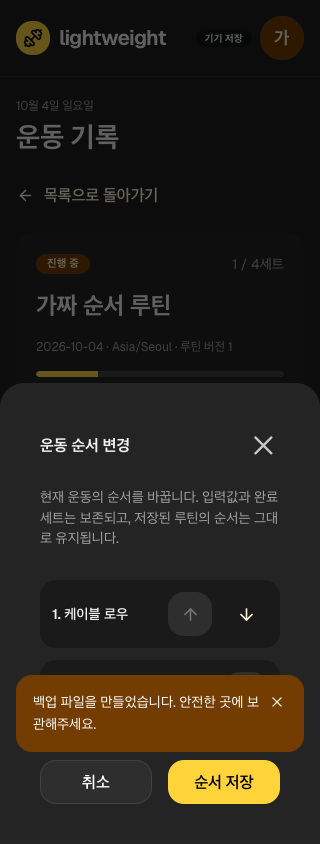
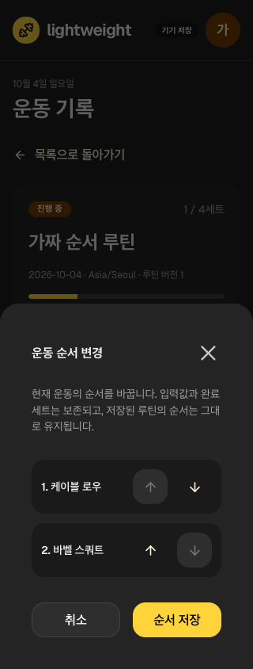
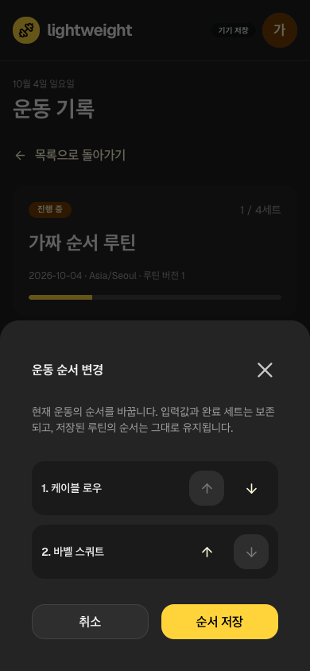

# 운동 중 종목 순서

현재 운동에 종목이2개 이상이면 ‘운동 순서 변경’에서 위/아래로 조정하고 명시 저장한다. 취소는 기록을 바꾸지 않는다. 완료 종목도 이동할 수 있고 기존 루틴의 계획 순서는 유지된다. 모든 UI는 Mantine Button/ActionIcon/Drawer/Paper/Stack을 쓴다.

## 보존과 경합

현재 사용자/active/nondeleted·전체 unique 종목 ID permutation·열었을 때의 session revision을 확인한다. 종목별 세트의 기존 상대 순서를 유지하며 sets 배열만 묶어 재배치한다. ID/중량/횟수/시간/단위/종류/좌우/RIR/완료·루틴/당시 설정·시작/종료/현지 날짜를 바꾸지 않는다. 세트의 order 필드와 화면 배열의 역할을 구별한다. 바뀐 session revision/outbox는 같은 transaction으로 저장한다.

종목 추가/기록 수정이 겹치면 오래된 순서 초안을 덮어쓰지 않고 다시 열도록 안내한다. 다른 소유자·누락/중복/새 ID·종료/삭제·stale revision은 거부한다. 실패한 enqueue는 순서도 rollback한다. 로컬 CAS는 다기기 서버 자동 병합을 의미하지 않는다.

## 실제 개선 루프

Vitest83개(27/33/23)·Node8·build/types/format/artifact25와 Chromium12/WebKit10 총22개를 통과했다. 새로운 integration3/UI2/browser 각1을 추가했다. 첫 fixture2개 실패는 제품 결함과 구분해 보존했다.

기존 전체 browser22개가 통과한 뒤 실제 PNG에서 백업 성공 알림이 두 번째 종목 버튼을 덮는 문제를 발견했다. elementFromPoint를 이용한 누름 지점 계약이 수정 전 실패했다. 성공 안내를 dialog 아래 층으로 이동하고 오류 안내는 위에 유지한 뒤 전체22개 재검사/실제320·390px 캡처를 확인했다. [불변 실행](../../raw/research/2026-10-04-workout-order-loop.json).

이는 가짜 기록/desktop browser 검사다. 실제iPhone·VoiceOver·인증된 운동 동기화나 LOG03/04 전체 완료가 아니다. 기존 effect lint 경고6개가 남는다. 메모/삭제 복구·장비 식별·입력 UX 등은 후속이다. [남은 작업](../product/remaining-work.md)·[현재 하네스](testing-harness.md).
