# Mantine 컴포넌트 재감사 — CONV-0012

**시각 일관성·여백 문제를 수정하고 가짜 데이터의 실제 화면으로 재검증했다.** 범위는 오늘/운동 탐색/루틴/리포트/설정 및 세트 상세·루틴 편집·직접 입력이다. 사람이 한 손으로 운동을 빠르게 기록하고 설명을 읽는 과업에 맞춘 감사다. 전체 WCAG/실기기 인증은 아니다.

## 확인 방식

공식 [Mantine UI FAQ simple](https://ui.mantine.dev/component/faq-simple/) 다크 화면을390×844에서 펼쳐 캡처/관찰했다. control/content 좌우16px를 확인했고 [Select/Accordion 문서](../sources/SRC-041-mantine-components.md)도 읽었다. 앱은 새4177 origin에 복원한 가짜 프로필/1개 루틴/2개 완료 기록이다. 실제 개인 기록·비밀번호·토큰을 캡처/보관하지 않았다.

모든 아래 앱 캡처는 현재 감사에서 저장한 정확한 파일을 이미지 도구로 열어 확인했다. fullPage stitching에서 fixed 하단 메뉴/sticky dock이 중간에 보이는 한계가 있어 펼친 목록·그래프·편집창·접기 영역의 viewport 캡처를 함께 검토했다. before 일부의 본문 skip link가 stitching에서 보이는 현상은 실제 포커스 상태와 구분했고, 포커스하지 않은 링크의 opacity도 보완했다. 과거 감사 캡처를 이번 실행의 증거로 재사용하지 않았다.

## 페이지별 결과

| 순서/화면 | 수정 전 문제 | 수정/재확인 | 현재 관찰 상태 |
|---|---|---|---|
| 1. 오늘 | 기록 참고 Accordion padding0·중첩 진한 박스·숫자/설명 붙음 | default Accordion·transparent item·좌우16px·Stack/SimpleGrid | 개선 확인; 과거 후보는 권장량 아님 |
| 2. 운동 탐색 | 직접 입력의 native popup·수동 label/과한 입력 outline | Mantine Select/label·filled 입력·목록 표면 간격 | 개선 확인; 검색/추가/정보 흐름 유지 |
| 3. 루틴 | 편집 이름/분류 글자 붙음·폼/버튼 간격·헤더 배경 패치 | Stack gap·설명 줄 분리·Drawer theme 한곳 관리 | 개선 확인; 저장/정렬 계약 유지 |
| 4. 리포트 | 조건 native select·다중 outline | 검색 가능한 Select·soft surface·실제 그래프/표 | 개선 확인; N/A/0·기간/조건 계약 통과 |
| 5. 설정 | 선택창 native 목록·겹겹이 둥근 outline | Select 필수값 유지·filled 입력·라디오/card 여백 | 개선 확인;320px reflow/저장·복원 계약 유지 |
| 추가. 운동 기록 | 본세트 상세 padding0·무거운 내부 박스 | default Accordion·16px inset·Select 종류/좌우 | 펼친 선택창 캡처로 개선 확인 |

확인한 강점은 전 폭 하단 다섯 탭·진짜 Mantine 선택/접기 semantics·수평 여백·검색과 단일 운동 추가/빠른 시작 유지다. 기존 SCI 초안/권장량 보류 표현도 유지했다. 이번 선택창 교체에서 필수 값의 해제를 막고 null을 처리했다.

## 수정 전/후 캡처

### 오늘

수정 전

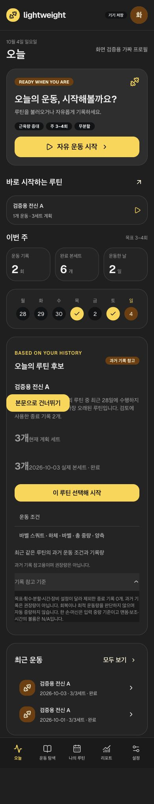

수정 후

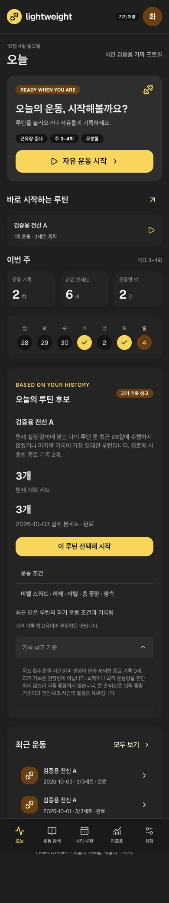

### 운동 탐색

수정 전

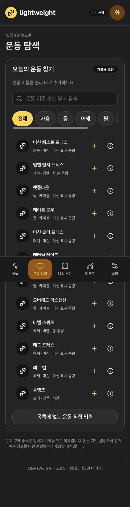

수정 후

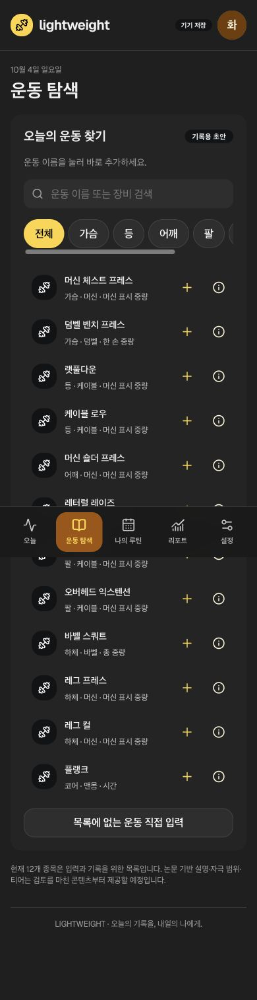

### 나의 루틴

수정 전

수정 후

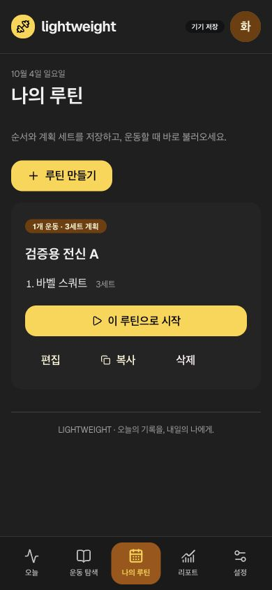

### 리포트

수정 전

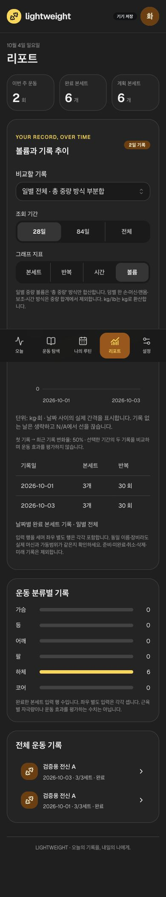

수정 후

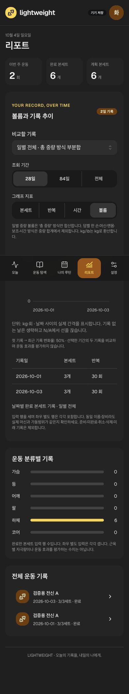

### 설정

수정 전

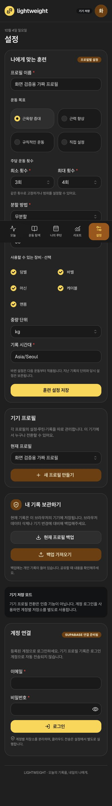

수정 후

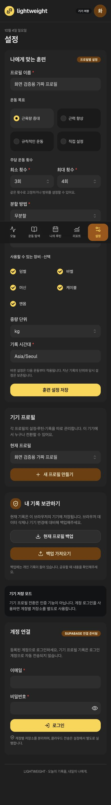

### 세트 상세

수정 전

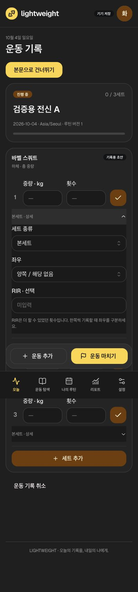

수정 후

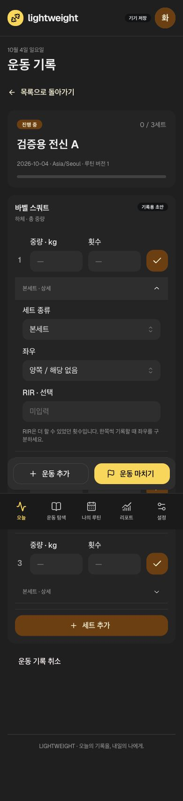

### 루틴 편집

수정 전

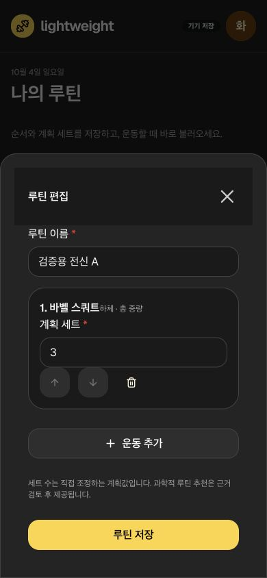

수정 후

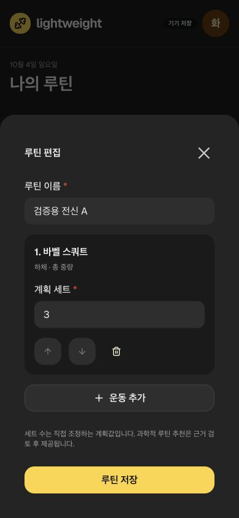

## 실제 viewport 상세 캡처

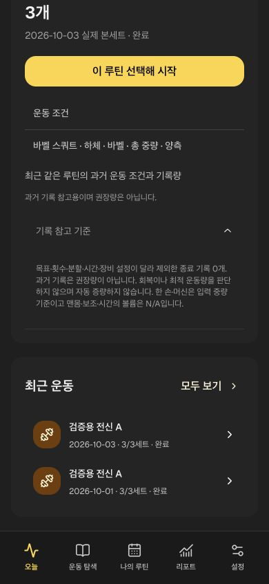

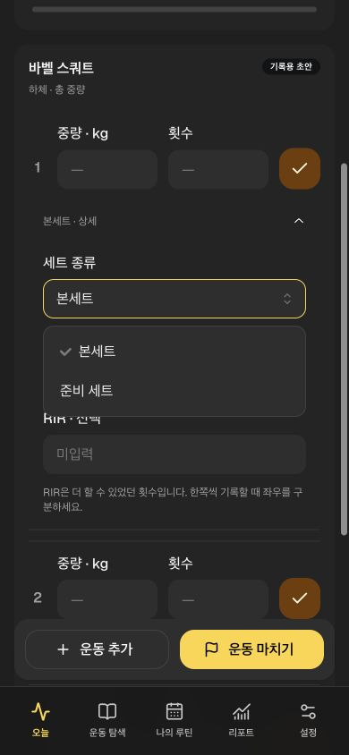

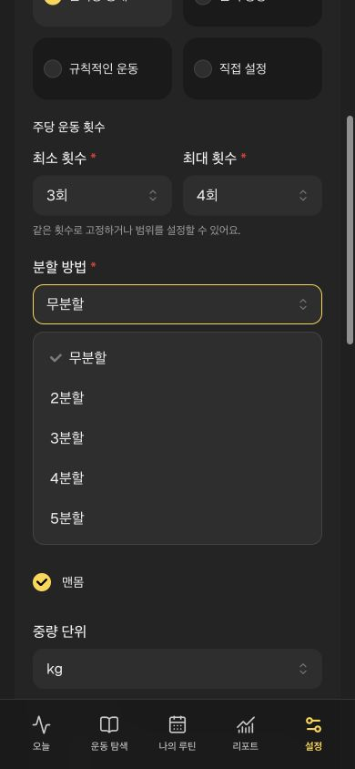

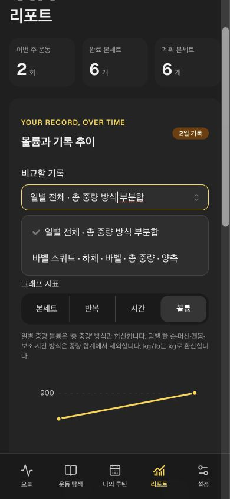

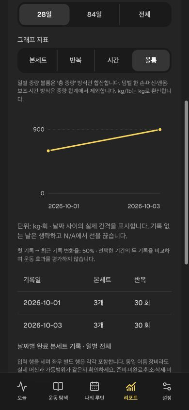

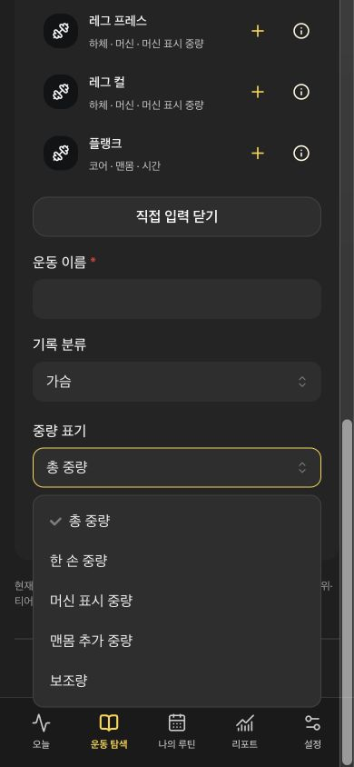

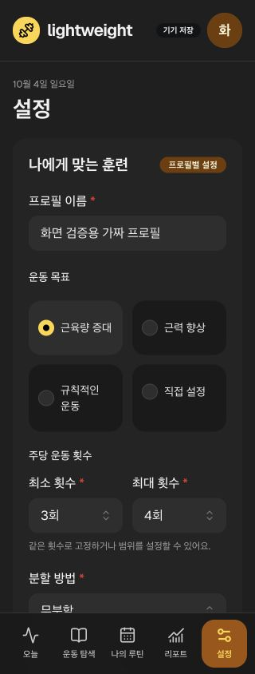

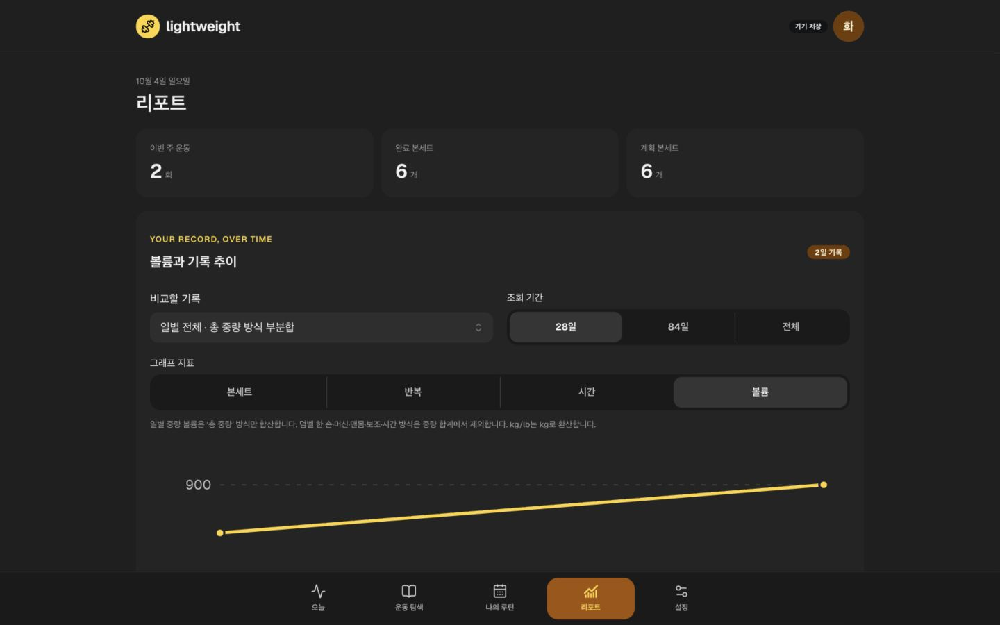

## 검증과 다음 관문

55개/12파일(19 unit·25 integration·11 DOM), lint/build/format 통과. jsdom에는 레이아웃/scrollIntoView가 없어 명시 shim만 추가했고 실제 스크롤/화면 크기의 증거로 사용하지 않았다. 320/390/768/1440px ×5페이지의 실제 document width와 scrollWidth가 같았다. 단순 색상/간격 구현을 복제하는 테스트는 추가하지 않았다. [수집/검증 원본](../../raw/research/2026-10-04-component-review.json).

남은 관문: 실제 iPhone/Safari·소프트 키보드/확대/가로/VoiceOver·전체 텍스트/상태별 대비, production offline/update·Auth/다기기·자동 E2E/외부 CI. 해당 작업은 RESP/REL/HAR/SYNC를 유지한다. 넓은 table은 내부 수평 스크롤이며 document overflow와 구분한다. 디자인은 이번 관찰에서 개선 확인 상태이며 사용자의 최종 승인이 아니다. 후속으로 HAR-02 파일 선택 재시도/프로필 전환 계약을 진행한다.
