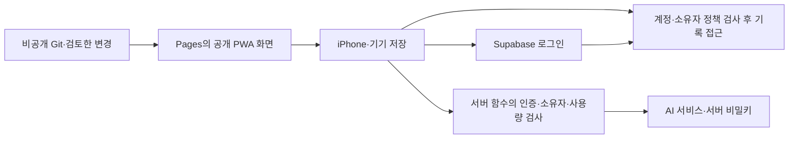

# PWA 배포와 개인 기록 접근 보안

## 첫 HTTPS 배포 — 2026-10-04 현재

운영: [lightweight-training.pages.dev](https://lightweight-training.pages.dev). preview: [운영 DB 연결 없는 미리보기](https://preview.lightweight-training.pages.dev). 화면과 기기 기록을 바로 사용할 수 있다. 공개 페이지이며 계정 데이터 접근은 Supabase 허용 목록/RLS로 제한한다. site-wide Access는 미설정이다.

이메일 완료 답변 뒤 project 생성 성공, 검증된3bc6022를 main에 fast-forward/push했다. GitHub3job success 후 app/dist만 배포했다. 24파일 artifact gate, 실제 공개23파일(index/PWA/font/JS/CSS)의 SHA256 일치와 보안 헤더를 운영/preview에서 확인했다. 다섯 실제 HTTPS 화면을 캡처/직접 확인했다. [실행](../../raw/research/2026-10-04-pages-deployment.json).

Supabase Site URL과 정확한 root 반환 경로 하나를 저장했다. Auth settings200/signupDisabled=true, 비로그인 read/write RPC401을 재확인했다. Auth 계정0개: 본인 등록/비밀번호는 사용자가 직접 준비, 허용 UUID·실제 로그인/복원/A-B/만료는 다음 단계다. 비밀번호 복구 UI는 아직 없다.

78개 Vitest + 배포 계약3개·build/format/E2E타입 통과, lint exit0이지만 기존WorkoutView effect 경고6개는 남는다. pages:verify는 읽기 전용으로 실제 헤더/파일 hash를 검사하며 네트워크/불일치에 실패한다. 실제 iPhone/과학 검토/운영 복구 관문은 유지한다. 다음 독립 구현은 공개 콘텐츠 registry/검토 gate와 기록 편의의 남은 범위다. 아래 증분은 당시의 상태다.

## CONV-0016 현재 개발 환경 연결 — 2026-10-04

공식 스킬16개 갱신/MCP5개 등록 확인과 `codex mcp login cloudflare` 성공을 완료했다. 현재 main MCP 계정 읽기 HTTP200·public docs 검색을 확인했다. 사용자는 cf 생략·기존 Wrangler 유지를 선택했다. 특화 MCP3개·Wrangler 인증은 미검증이며 원격 project/고정 origin·HTTPS/앱 Auth 관문은 남았다. [이번 실행](../../raw/research/2026-10-04-cloudflare-setup-recheck.json). 아래 CONV-0015는 당시 연결 준비 이력이다.

## CONV-0015 연결 준비 — 2026-10-04

사용자가 Cloudflare 공식 설정을 요청했다. skills16/MCP5 등록·Wrangler4.147.0/app/dist artifact gate를 준비했으며 OAuth 권한 선택과 실제 공개 배포는 pending이다. 기존 제안과 달리 제공자 방향은 Cloudflare로 좁혔다. [운영/실제 경계](../operations/cloudflare-setup.md).

## 이전 구현 상태 — 2026-10-04

Supabase 프로젝트에 비공개 기록/허용 목록·RPC/RLS/명시 grants/owner 검사를 적용했다. 공개 가입 OFF는 CONV-0008 사용자 승인 후 적용했다. 원격 SQL16·비로그인 HTTP401·Advisor 빈 배열 확인. 실제 Auth E2E/HTTPS 앱 배포/preview 프로젝트 분리/운영 헤더는 남았다. [현재 계약](supabase-integration.md). 아래 호스팅/운영 상세는 기존 제안이다.

> 2026-10-03. 사용자는 **TypeScript·React/Vite·Dexie·Supabase 구성에 동의**했다. **Cloudflare Pages와 구체적 초대/보안 설정은 이번 추천안**이다. 실제 배포·보안 설정·검증은 아직 수행하지 않았다.

## 의견과 배포 구성

공개 HTTPS 주소로 접속하는 PWA를 유지하며 개인 기록 접근을 계정과 DB 권한으로 제한하는 방향을 추천한다. 사용자 규모가 작으므로 관리형 정적 호스팅과 계정 DB를 사용하여 운영할 서버를 줄이고, 실제 사용자 간 접근 차단을 검증하는 데 집중한다. 어떤 호스팅 이름도 앱의 접근 정책을 대신 보장하지 않는다.

| 구성 | 담당 | 범위 |
|---|---|---|
| Git 저장소, 공개 상태 확인 | 앱 코드·기획 변경 관리 | 공개 코드에서도 비밀/개인 기록 제외; 앱 빌드 결과 dist만 배포 |
| **Cloudflare Pages 제안** | PWA HTML/CSS/JS·설치 파일·공개 콘텐츠 | 고정 HTTPS 주소·Git 빌드·미리보기·이전 화면 버전으로 복귀 |
| **Supabase 채택 방향** | Auth·PostgreSQL | 계정과 개인 기록·동기화 |
| Supabase Edge Functions 후보 | AI·제한된 서버 처리 | 인증·소유자 검사·서비스 키·사용량 제한 |
| IndexedDB/Dexie | 기기 안의 기록·전송 대기 | 오프라인 사용·계정별 로컬 구분 |

[Pages 배포 근거](../sources/SRC-028-cloudflare-pages.md) · [기존 저장 구조](technology-data-storage.md). 비공개 Git 저장소를 사용해도 브라우저에 배포한 JS와 공개 설정은 열람할 수 있다고 설계한다. Supabase 프로젝트 URL과 publishable key는 공개 사용용이며 사용자 세션과 RLS가 실제 데이터 권한을 결정한다. [키 종류](../sources/SRC-026-supabase-rls-keys.md).

## 현재 저장소와 구현 계획

이전에는 비공개 Git을 제안했다. 현재 origin과 vault log에는 `Jeongjibsa/lightweight` public 저장소 구성 이력이 있다. 외부 visibility는 확인하지 못했으며 구현 시작 때 확인한다. 저장소 공개 변경은 수행하지 않는다. 코드 공개 가능성을 전제로 비밀·개인 기록·백업·계정 정보의 커밋/로그 노출을 검사한다. [관찰 원본](../../raw/research/2026-10-03-implementation-planning-research.json).

[구현 계획](implementation-plan.md)의 SYNC/REL 작업에서 사용자 간 접근과 배포 산출물을 검증한다.

## 제공과 업데이트 흐름 제안

1. 기획 vault와 앱의 배포 파일을 분리한다. `vault/`, 사용자 원문, 백업, 개인 기록, `.env`, 서버 키는 정적 산출물에 넣지 않는다. `dist` 내용과 브라우저 번들을 검사한다.
2. 개발 변경은 별도 미리보기에서 시험한다. 미리보기 접근을 제한하고 개발 DB 또는 가짜 기록을 사용한다. 운영 DB/키를 preview 환경에 연결하지 않는다.
3. 검증한 변경을 운영 브랜치의 빌드로 배포한다. Git 연결 자동 배포를 사용하더라도 검사·운영 반영 시점이 통제되게 설정한다. DB 권한 변경과 마이그레이션은 별도 검토·검증한다.
4. 고정 HTTPS 운영 주소로 본인이 로그인·설치·운동·동기화·복원을 시험한다. 같은 주소로 지인에게 설치 안내와 개별 계정을 제공한다. 새 지인에게 개발자/DB 운영 계정을 주지 않는다.
5. 업데이트는 진행 중 운동 기록을 저장한 뒤 적용한다. 서비스 워커와 DB 버전 전환을 시험하며 화면 되돌리기가 DB 마이그레이션까지 되돌리는 것으로 가정하지 않는다.

실사용 시작부터 고정 origin을 유지하는 것이 좋다. pages.dev 주소도 후보이며 커스텀 도메인은 선택이다. 도메인을 나중에 바꾸면 기기 저장·로그인·홈 화면 설치를 새 주소로 옮기는 흐름과 미전송분 백업을 확인한다. 호스팅·도메인·메일·DB·AI 비용은 미정이다.

## 공개 환경에서 보호할 경계

| 대상 | 적용할 정책 제안 | 확인 방법 |
|---|---|---|
| 첫 사용/계정 | 본인·초대 지인 계정만, 일반 가입·익명 로그인 차단 | 낯선 이메일 가입/코드 요청과 계정 생성이 허용되지 않음 |
| 개인 기록 | 인증 + user_id 소유자 검사, 부모/자식 일치, 모든 필요한 CRUD 정책 | 사용자 A/B·비로그인으로 DB/API 직접 호출 |
| 공통 운동 정보 | 공개 배포할 콘텐츠만 정적 포함; 제한할 정보는 계정 API에서 제공 | dist와 캐시의 실제 포함 범위 확인 |
| AI/서버 함수 | 사용자 세션·활성 계정·기록 소유자 검증, 요청 횟수·입력 크기·비용 상한 | 미로그인/타인 ID/반복 호출 차단 |
| 비밀키 | secret/service_role·DB 비밀번호·AI 키는 서버 보관 | 배포 파일·JS·로그에 값이 포함되지 않음 |
| 동적 내용 | 메모·AI 설명·연구 Markdown의 안전한 출력, raw HTML 제한 | 악성 입력에서 스크립트가 실행되지 않음 |
| 로컬 데이터 | 사용자별 DB/큐, 로그아웃·계정 전환 처리 | 이전 계정 정보 노출·타 계정 전송 없음 |
| 파일/백업 확장 | 개인 파일 private 저장·소유자 정책, 사용자 백업과 전체 DB 백업 분리 | 파일 URL·다운로드·내보내기 직접 접근 차단 |

[가입/메일](../sources/SRC-030-supabase-invite-mail.md) · [API/함수/파일](../sources/SRC-031-supabase-api-deployment-security.md) · [XSS/환경 변수](../sources/SRC-032-web-xss-env.md).

RLS 적용 전에 스키마 노출과 필요한 grants를 확인하고 최소 권한을 둔다. 모든 노출 테이블에 실제 접근 모델에 맞는 RLS를 구성한다. 소유자 기록·공통 운동 정보·운영용 내부 데이터의 정책을 동일하게 복사하지 않는다. 사용자 ID를 바꾸거나 자식 기록의 부모를 타인 세션으로 지정해도 권한을 얻을 수 없어야 한다.

views와 RPC/서버 함수의 관리자 권한 경로도 검사한다. 불필요한 SECURITY DEFINER를 사용하지 않고 필요시 권한·소유자 검사를 별도로 한다. 운영 관리자가 쓸 secret/service_role key로 개인 요청을 처리할 때 RLS가 우회될 수 있음을 반영한다. 사용자 편집 가능한 user_metadata를 초대/역할 권한의 근거로 삼지 않는다.

Auth 가입 차단은 새 계정 생성을 줄이는 정책이다. 계정 회수는 기존 세션/JWT와 활성 회원 권한까지 고려한다. 엄격한 회수가 필요하면 서버의 활성 회원 상태를 DB/함수에서 확인하는 안을 설계한다. 이미 내려받은 기기 데이터의 원격 회수를 보장한다고 약속하지 않는다.

기본 SMTP는 지인 이메일 발송에 그대로 쓸 수 있다고 가정하지 않는다. 이메일 코드 로그인/초대를 채택하면 custom SMTP와 템플릿 설정을 확인한다. 2026-06-03 이후 새 무료 프로젝트의 기본 메일 템플릿 변경 제한도 검토한다. 지인을 프로젝트 운영팀으로 추가해 해결하는 방식은 사용하지 않는다. [확인된 조건](../sources/SRC-030-supabase-invite-mail.md).

기본 보안 헤더와 CSP를 적용하되 Supabase 연결·이미지·서비스 워커 동작과 함께 시험한다. API/함수 응답의 헤더는 해당 서버에서 설정한다. CORS·숨긴 URL·noindex는 계정 권한 검사를 대체하지 않는다. 프런트 `VITE_` 값에는 공개 키만 두고 서버 비밀을 넣지 않는다.

운영자 Git/Cloudflare/Supabase·메일 계정에는 MFA와 최소 운영 권한을 제안한다. 앱 사용자 인증 수단·메일 계정 복구·세션 보관 기간은 별도로 정한다. 기록·토큰을 오류 로그/분석 도구에 보내지 않으며 개인화 AI에는 필요한 집계만 보내는 방향이다. 로그·백업·브라우저 외부 스크립트 접근 범위를 점검한다.

## 사이트 자체도 제한하고 싶을 때

기본 추천은 공개 앱 화면과 초대 계정의 데이터 접근 제한이다. 미리보기는 접근을 제한한다. 사이트 화면조차 초대자만 열게 하려면 **운영 주소에도 Cloudflare Access를 추가**하는 선택이 있다. [Access 범위](../sources/SRC-029-cloudflare-access-headers.md).

preview 정책만 켜면 운영 pages.dev/커스텀 도메인은 보호되지 않는다. 모든 도메인·preview·우회 주소를 확인하고 별도 정책을 적용하거나 리다이렉트한다. Pages 앞단의 Access는 Supabase API 직접 접근을 제한하는 정책이 아니므로 DB/함수 인증과 권한을 그대로 유지한다.

Access 추가는 한 겹 더 로그인·세션을 관리하는 비용이 있다. iPhone 홈 화면 설치·메일 인증·앱 복귀·오프라인 캐시·세션 만료 흐름을 먼저 확인한 뒤 적용한다. 아직 운영 사이트 전체 Access 사용 여부는 미정이다.

## 지인 제공 전 검증 제안

- 서로 다른 테스트 사용자 A/B와 비로그인 요청으로 모든 개인 조회·수정·삭제·복원·리포트 API의 차단 확인.
- 새 가입·익명 로그인·초대 해제·세션 만료·메일 전달 시험. RLS/DB advisors에서 발견한 적용 가능한 문제 해결.
- 배포 산출물과 preview의 비밀·vault·백업·실제 기록 노출 여부 검사.
- 직접 Supabase/함수 호출에서도 접근 제한과 사용자별 AI 사용량 상한 검증.
- XSS 입력·보안 헤더·파일 권한·계정 전환·로그아웃·오프라인 복귀·업데이트 과업 확인.
- 운영/개발 환경 분리·고정 도메인·인증 리다이렉트·백업 복원 검증.

실제 앱과 DB가 없으므로 이번 검토는 **설계 수준**이다. Supabase 스킬의 Auth·키·RLS·views/RPC·Storage·의존성 항목을 계획에 반영했으며 해당 설정을 구현하면 advisors와 실제 요청을 실행해야 한다. 작은 사용 규모가 이 검증을 생략할 이유가 되지는 않는다.

## 남은 결정

Cloudflare Pages 채택·운영 도메인·사이트 전체 Access·로그인/SMTP·운영비·회수와 로컬 보관 기준은 미정이다. TypeScript·React/Vite·Dexie·Supabase 구성은 사용자 동의로 방향을 채택했다. 공개 배포나 실제 건강 기록 업로드가 이번 의견 요청에 포함된 것은 아니다.

[미결 사항](open-questions.md) · [기술·저장](technology-data-storage.md) · [검증 계획](validation-plan.md) · [CONV-0004](../conversations/2026-10-03-004.md) · [CHG-0004](../../history/changes/CHG-0004.md)

## CONV-0006 이후 현재 구현 경계

특정 iPhone 모델에 한정하지 않는 반응형과 각 사용자별 목표·주당 횟수·분할·시간·장비·단위·시간대 설정을 요구사항으로 추가했다. 본인의 조건은 하나의 시험 표본이다. Supabase 프로젝트가 없으므로 로컬부터 구현한다는 사용자 선택을 반영했다. [로컬 계약](implementation-contracts.md) · [실행 결과](implementation-progress.md).

로컬 프로필/기록·루틴 스냅샷·백업·사실 집계·PWA는 구현했으며 계정/RLS·서버 전송·실제 iOS·검토된 시각/설명·추천/티어·완전한 개인화·배포는 미완료다. 기존 실사용/지인 제공 관문은 유지한다. 로컬 프로필을 인증 계정으로, 개념도를 자극 범위로, 분류별 행 수를 근육 성장량으로 표시하지 않는다.

## CONV0022 구현/검토 — 2026-10-04

34종목/바벨18·큰 부위 아래 세부 분류/장비·별칭 필터와 사용자 추가 선택을 적용했다. 기본1분·즐겨찾기3~4개·완료 자동 시작·pause/resume/stop·deadline 재실행·profile/outbox/백업 보존을 구현했다. 다섯 H1 outline을 제거하고 programmatic focus는 유지했다.98개/19파일·Node8·전체30browser/최종문구6·build/types/format/artifact25, lint기존6경고. 실제 좁은 화면에서 문구 잘림을 찾아 수정했다. [계약/실행](../operations/catalog-rest-timer.md).

GitHub source=Jeongjibsa/lightweight·main·자동 배포 활성화를 읽었고 dependency 설치/Node24·승인된 production 공개 연결/빈 preview를 보완했다. 새 commit의 자동 Git 배포/원격 CI는 기록 시점 별도다. [배포 운영](../operations/pages-git-integration.md). Google OAuth는 가능하며 현재providerOFF/callback없음·credential/동일UID 연결/가입 차단·실기기 복귀가 필요하다. [검토](google-oauth-review.md). 과학 승인 콘텐츠0개/실제 운동·새 기기/나머지 G3/메일·운영·파일럿/P2 관문과 다음 운동 후 사용자 확인 일정은 유지한다.
