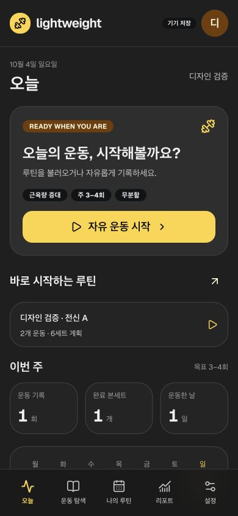
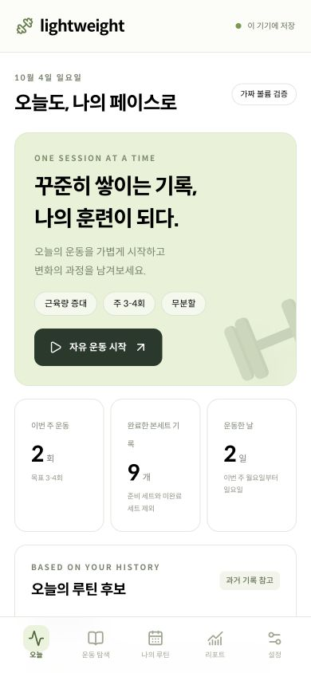
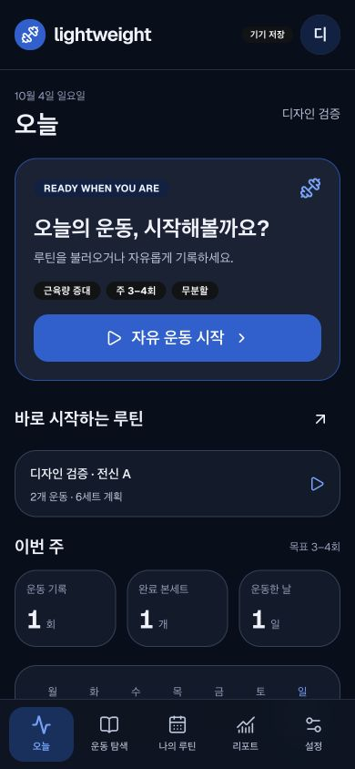

# 전체 화면 디자인 감사와 개선 결과

2026-10-04, Product Design audit·Geist·React best-practices 기준을 기존 app 코드/브라우저에 적용했다. 대상은 이미 존재하는 다섯 화면·운동 기록·확인/폼·Auth/클라우드 표시다. native 앱 전체를 새로 만들거나 인증/과학 내용을 검증한 감사가 아니다. [원문](../../raw/conversations/2026-10-04-010.md) · [디자인 규칙](design-system.md) · [관찰/환경 원본](../../raw/research/2026-10-04-mantine-geist-design-verification.json).

## 최신 감사 — CONV-0012

사용자 재지적으로 접기/선택/여백을 다시 열어 UI-03으로 수정했다. **현재 판정/캡처는 [페이지별 재감사](component-review.md)**를 따른다. 아래는 이전 증분 관찰 이력이다.

## 최신 톤 증분 — CONV-0011

사용자 요청으로 기존 블루/다크를 차콜·노란 강조색으로 대체했다. [Mantine UI 실제 다크 관찰](../sources/SRC-040-charcoal-tone.md)을 참고해 배경 `#1f1f1f`, 카드 `#242424`, 입력 `#1a1a1a`, primaryyellow4 `#ffd43b`. 주요 filled 버튼/브랜드 아이콘은 검은 글자/기호, 해당 버튼의 계산 대비 14.73:1이다. 전체 접근성 통과를 의미하지 않는다.

ThemeIcon의 기본 흰 전경 잔류를 DOM에서 발견→설치 구현의 varsResolver 분기 확인→default filled variant/autoContrast 명시→검은 전경 재확인했다. 새로운 스타일 snapshot 검사를 늘리지 않고 기존55개/12파일·lint/build/format으로 동작 계약을 재검증했다. 앱 진입97.06KB/30.42KB gzip, precache25개/1217.59KiB. fake4176 오늘/리포트390px·설정320px·오늘1440px overflow0, console error/warn0. 이번은 read-only 화면 탐색이며 운동 저장/복원/Auth 전체를 다시 통과했다고 표시하지 않는다.

[리포트390px](../../raw/design/2026-10-04-charcoal-reports-mobile.png) · [설정320px](../../raw/design/2026-10-04-charcoal-settings-320.png) · [오늘1440px](../../raw/design/2026-10-04-charcoal-today-desktop.png) · [불변 실행](../../raw/research/2026-10-04-charcoal-theme-verification.json).

아래는 CONV-0010의 이전 재설계 감사/파란 화면 이력이다. 원본 캡처는 덮어쓰지 않으며 현재 팔레트는 위 차콜 증거와 [디자인 시스템](design-system.md)을 따른다.

## 이전 출발점과 수정

기존 Mantine은 provider/theme·입력/모달 일부에 적용되어 있었다. custom CSS 1830줄과 UnstyledButton·큰 소개 영역·큰 화면 좌측 메뉴가 대부분 외관을 결정했다. 사용자는 화면 완성도와 접근성을 개선하도록 요청했다.

| 발견 | 사용자 영향 | 이번 수정/증거 |
|---|---|---|
| 부분 Mantine·녹색/소개 중심 | 컴포넌트 톤 불일치·운동 진입 지연 | shared dark/blue theme, 모든 주요 화면 Mantine·Geist, 본문 실행 먼저 |
| 큰 화면 좌측 메뉴 | 사용자 요구와 다른 탐색 위치 | 전 폭 하단5탭·현재 위치·60px target |
| 탐색 상세→추가 | 종목마다 두 동작 | 행 한 번 추가·정보 독립, keyboardEnter add1회 DOM 검사 |
| 새 루틴 매번 picker 열기 | 여러 운동 선택 시 반복 | 초기 열린 목록·연속 선택2종목/3세트 저장 검사 |
| href 없는 NavLink anchor | 키보드 선택 불가 | 선택 행을 semantic button으로 교체·label 명시 |
| 필터 flex shrink | 한글 부위 이름 잘림 | max-content Group/ScrollArea·320px 화면 관찰 |
| 모바일 sheet90dvh 고정 | 짧은 확인도 지나친 빈 공간 | height auto/max90dvh·info411.78/844px·초점 복귀 |
| 완료 숫자 dim 색 | 저장된 중량/횟수 판독 어려움 | shared input foreground token·완료40kg/10 screenshot |
| stale 타이머가120초 초과 | 설정2분과 표시 불일치 | 표시값120초 상한·기존 저장/시각 기준 유지 |
| 도구의 폭 요청과 실제 viewport 불일치 | 거짓 반응형 통과 위험 | dev iframe harness·child html 측정25표본으로 판정 |
| 작은 목표 카드 한글 중간 줄바꿈 | 설정 읽기 불편 | padding 조정·word-break keep-all·320px 재캡처 |

## 실제 과업과 관찰

fake4176 프로필에서 자유 운동→종목→40kg×10 완료→일부 완료 저장1/3→리포트400kg·회, 새 루틴 두 종목 연속 선택/저장, 목표·주3~4·무분할 저장→오늘 반영을 확인했다. 이 설정은 검증용 fake profile이며 실제 사용자/새 프로필의 앱 전역 기본값이 아니다. 사용자4173 자료는 조작하지 않았다. 페이지 console error/warn0을 확인했다.

320/375/390/768/1440px×오늘/탐색/루틴/리포트/설정의 실제 iframe `clientWidth`/`scrollWidth`를 읽었다. 25개 조합의 가로 넘침0, nav target 최소56.79×60px. 표/부위 필터 내부 스크롤은 허용하며 page 전체 넘침과 구분한다. 독립 테스트 runner 없이 CUA에서 UI 선택과 측정을 반복한 수동 검사다. 브라우저 viewport 도구의 적용 대상을 추측해 성공으로 기록하지 않았다.

자동55개/12파일, lint 경고0·strict build·format 통과. 기존52개는 입력/보존/권한/계산/복원 계약, 새3개는 하단 위치 상태·한 번 추가/상세/Escape focus·연속 루틴 저장 과업이다. 구현의 스타일을 복제한 snapshot 테스트를 늘리지 않았다. JS 진입97.06KB/30.48KB gzip, precache25개/1218.00KiB. 배포/오프라인 시험 결과와 구별한다.

## 캡처

390px 전후는 같은 크기의 화면이며 가짜 데이터의 상태가 다르므로 pixel-equality 평가로 사용하지 않는다. 색/요소 배치·실행 우선순위를 비교한다. 별도 원본은 해시 보존했다.

[넓은 화면1440px](../../raw/design/2026-10-04-after-today-desktop.png) · [설정320px](../../raw/design/2026-10-04-after-settings-320.png) · [운동 기록](../../raw/design/2026-10-04-after-workout-mobile.png) · [내용 높이 bottom sheet](../../raw/design/2026-10-04-after-info-sheet-mobile.png).

## 남은 검증/판단

- 실제 iPhone/Safari: 키보드가 dock/완료를 가리는지, home indicator·safe area·가로/확대·홈 화면 설치/잠금·offline/update.
- VoiceOver/동적 글꼴·전체 contrast: 이번 키보드/label/target 검사와 별도로 사용자 과업을 검증한다.
- HAR-03/05: 결정적 browser runner·새 context·실패 trace/CI 회귀. dev iframe은 이 runner가 아니다.
- actual Auth/클라우드·검토된 과학 콘텐츠: 기존 관문 유지. 새 DB/schema/원격 설정을 이번 UI 감사에서 변경하지 않았다.
- 완성된 톤의 사용자 만족도와 운동 중 손 조작성은 실제 파일럿에서 추가 관찰한다. 이번 결과를 사용자 최종 승인으로 기록하지 않는다.

[현재 하네스](../operations/testing-harness.md) · [개선 루프](../operations/loop-engineering.md) · [남은 작업](remaining-work.md).
