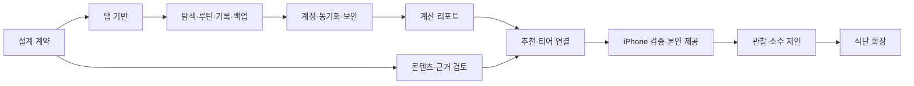

# 운동 PWA 구현 작업계획

> PRD 0.7.0 기준, 계획 v0.6.0. **운동 기능을 먼저 완성하고 식단을 다음 단계에 둔다**는 사용자 선택을 반영했다. 기본 스택은 합의했다. 아래 작업 순서·상세 설계·도구·공수는 구현안이다. CONV-0006에서 반응형·사용자별 설정을 반영한 순차 구현과 로컬 우선을 요청했다. 첫 로컬 증분을 구현/시험했고 상태는 [실행 결과](implementation-progress.md)에서 확인한다. 원격/검토 콘텐츠/실기기/배포 단계는 미완료다.

## 목표와 완료 범위

첫 완성품은 **다양한 휴대폰·태블릿·데스크톱의 반응형 환경**에서 **운동 탐색 → 직접/추천 루틴 → 오프라인 세트 기록 → 동기화 → 주간 리포트 → 다음 운동 선택**을 이어 쓸 수 있는 PWA다. 보고된 iPhone 16 Pro Max/iOS 27.0.1은 그중 실제 기기 파일럿 표본이며 REL-02에서 확인한다. 검토 완료 범위의 조건별 티어와 시각 설명을 포함한다. FR-01~07·FR-10~11을 운동 MVP에서 추적하며 식단 FR-08~09는 다음 출시로 둔다.

개인 목표는 **골격근량 증대**, 주당 **3~4회**, 현재 운동은 **무분할~3분할**이다. 본인의 테스트 표본으로 이를 활용하고, 새 사용자에게 강제하지 않는다. 목표·주당 횟수·분할·시간·장비·단위·시간대를 프로필별로 입력/수정/보존한다. 이를 바탕으로 가능한 일정·분할을 바꾸는 과업을 검증한다. 앱은 수행 추세를 관찰하며 운동 기록만으로 골격근량 변화 자체를 측정했다고 표현하지 않는다. 경험·종목·장비·회당 시간·불편감은 미결이다.

첫 콘텐츠는 본인 루틴에 필요한 약 10종을 목표로 좁히는 가설이다. 전 부위 탐색의 분류/데이터 구조를 만들되 미등록 부위를 완성됐다고 표시하지 않는다. 한 부위 티어·한 추천 루틴부터 근거/콘텐츠 검토를 완료하고 확장한다. 아직 종목·장비·추천 수치가 확정되지는 않았다.

초기 리포트는 결정적 계산과 고정 문구로 제공한다. 외부 AI 설명은 운동 MVP 후 선택 작업이며 추천·티어·개인화 리포트 자체는 첫 운동 MVP 범위에 남는다. 3D·자세 인식·사진 식단·건강 앱/Watch·상용 결제는 이번 실행 순서에서 후속 수요 검토로 둔다.

## 합의, 임시 구현안, 결정 시점

| 항목 | 상태/기본안 | 필요한 시점 |
|---|---|---|
| iPhone PWA·TypeScript·React/Vite·Dexie·Supabase | 합의 방향 | 모든 단계 |
| 운동 우선, 식단 다음 출시 | 사용자 선택 확정 CONV-0005; 식단 요구 유지 | 출시 범위 |
| 화면 | 오늘 / 운동 찾기 / 루틴 / 리포트 / 설정 | PRE-02에서 입력 시안 검증 |
| 호스트 | Cloudflare Pages 제안, 초기에는 고정 HTTPS 주소 | REL-01 전 선택; 초기 코딩 진행 가능 |
| 계정 | 초대 계정·가입/익명 차단, 이메일 코드 후보 | SYNC-02 전 실제 로그인/SMTP 경로 선택 |
| 개인 기록 | 실사용 전 로그인, 한 사용자의 한 기기 쓰기 우선 제안 | SYNC-02; 오프라인 입력은 계정별 저장 |
| 여러 기기 | 조회/복구 지원, 충돌은 보존·명시 해결; 자동 병합은 초기 제외 제안 | PRE-01/SYNC-04 |
| 기록 단위 | kg 기본 가설, 원값/단위·부하 방식·좌우·시간대 보존 | PRE-01; lb 전환/혼합 검증 포함 |
| 시각 자료 | 2D 지도·텍스트·권한 확인된 시작/끝 그림 | LOG-02/SCI-02 |
| 과학 검토 | 공개 주장·추천 수치·등급마다 검토 상태와 근거 버전 | SCI-01~04, 공개 제공 전 |
| 기기·개인 목표/일정 | iPhone 16 Pro Max·iOS 27.0.1, 골격근량 증대·주3~4회·무분할~3분할 사용자 보고 | 본인 파일럿 표본, 앱 전체 기본값 아님; 실제 기기 검증은 REL-02 |
| 본인 종목/장비/시간/경험 | 아직 미응답; 후보/가짜 데이터로 개발 시작 가능 | PRE-03 선정·SCI-03 개인 루틴 제공 전 확인 |
| 운영 예산·사이트 전체 Access | 미결; 자동 유료 서비스 선택 없음 | 외부 운영 구성 확정 전 |

수치·등급을 데모 데이터로 보여줄 때는 검토 전 예시로 표시하고 운영 콘텐츠에서 제외한다. 제안의 무응답을 승인으로 기록하지 않는다. [미결 사항](open-questions.md).

## 단계와 공수 가정

개발 담당 1명이 하루 약 6시간 집중하고 피드백이 제때 오는 경우의 **초기 개발 공수 가설**이다. 기준일·마감은 정하지 않는다. 논문 전문 확보/검토·그림 권한/제작·계정/메일/DNS 대기·사용 관찰은 별도이며 개발 공수와 더해서 무조건 특정 날짜에 출시한다고 약속하지 않는다. BASE-02와 SYNC-05 완료 후 실측 난도로 다시 추정한다.

| 단계 | 공수 가설 | 작업/산출물 | 다음 단계 완료 기준 |
|---|---|---|---|
| M0 설계 계약 | 0.5~1.5일 | 화면 시안·단위/집계·동기화/복원·콘텐츠 계약, PRE-01~03 | 가짜 표본의 예상 결과·누락/충돌/권한 처리 정의 |
| M1 앱 기반 | 1~2일 | 앱 뼈대·PWA·입력 검증·핵심 검사/CI, BASE-01~02 | 빌드·타입 검사, 작은 화면·캐시 후 오프라인 앱 실행 |
| M2 탐색·직접 루틴·로컬 기록 | 3~5일 | 종목/2D 설명·루틴 버전·세트·재개·JSON 복원, LOG-01~06 | 비행기 모드·중복 탭·재시작·수정·빈 저장소 복원 통과 |
| M3 계정·동기화·접근 제한 | 4~7일 | Supabase 스키마·Auth/RLS·outbox·충돌 처리, SYNC-01~05 | A/B/비로그인 차단, 응답 유실 재시도 중복 0·삭제 재등장 없음 |
| M4 개인화 리포트 | 2~4일 | 세션/주간/비교 집계·충분성·행동 템플릿, REP-01~03 | 고정 표본 합계 일치·조건 차이 비교 보류·편집 후 갱신 |
| M5 근거 기반 추천·티어 | 3~5일 + 별도 검토 | 콘텐츠 빌드·조건 규칙·한 부위 티어·한 루틴, SCI-01~04 | 검토된 입력/근거만 사용·동일 입력 재현·이유/조건/일자 표시 |
| M6 본인 실사용 준비·배포 | 2~4일 | 보호된 preview·운영 설정·iPhone/복원/업데이트·운영 안내, REL-01~03 | 아래 G3 통과 후 본인 운동 MVP 제공 |
| M7 본인 관찰·지인 시험 | 관찰 4주 제안, 수정 공수 별도 | 실제 운동 불편/누락/동기화 실패 관찰·수정, PIL-01~02 | 안정된 핵심 과업과 G4 통과 후 지인 확대 |
| M8 식단 | 별도 재산정 | 음식 DB 품질/권한·식사 기록·검토 공식/영양 리포트, NUT-01~04 | 운동 안정화 + 식품/영양 검토 조건 통과 |

M0~M6 합계는 대략 **16~29 개발 작업일**의 가설이다. M5의 코드와 SCI-01의 근거 검토는 별개이며 SCI-01은 M0부터 착수해 M2~M4와 겹쳐 진행할 수 있다. 사람 검토 대기를 개발 완료로 기록하지 않는다.



개인 기록 없이 ‘한 운동→한 세트→앱 재시작→백업 복원’을 G1에서 먼저 보여준다. 이 중간 산출물은 첫 실사용 완성품과 구별한다. M3 전 실험에는 가짜 데이터만 사용하고 실제 기록 누적은 G2부터 허용하는 안이다.

## 앱·지식·개인 데이터의 경계

아래는 전체 목표 구조다. 현재 실제 구현은 `app/src/components`, `domain`, `data/local`, `content`와 PWA 파일이며 원격/승인 콘텐츠 폴더는 아직 만들지 않았다. [코드와 실행 상태](implementation-progress.md).

```text
app/                         # Vite 앱; 빌드 산출물 app/dist만 호스팅
  src/app/                   # 진입·화면 이동·공통 화면
  src/features/              # 운동·루틴·기록·리포트·설정
  src/domain/                # 순수 계산·규칙·단위·런타임 계약
  src/data/local/            # Dexie DB·트랜잭션·마이그레이션
  src/data/remote/            # 사용자 세션으로 Supabase 접근
  src/data/sync/              # outbox·재시도·충돌·삭제
  src/content/generated/     # 승인한 공개 콘텐츠의 버전별 출력
  public/                    # 설치 파일·승인한 공개 이미지
  tests/                     # 계산/데이터 시험·핵심 브라우저 흐름
content/approved/            # wiki와 연결한 공개 콘텐츠/규칙 등록부
supabase/migrations/         # 소유 관계·grants/RLS·동기화 계약
supabase/functions/          # 후속 AI 등 서버 기능이 필요할 때
scripts/                     # 기존 vault 검증 + 콘텐츠 내보내기
vault/                       # 사람이 읽는 기획·근거·대화·이력
```

`vault`는 원본/근거의 관리 기준이고 공개 콘텐츠 등록부에는 ID·적용 조건·공개 문구·검토/권한·버전만 둔다. 콘텐츠 빌드는 승인 목록만 JSON/이미지로 내보내고 미검토 주장·없는 근거 ID·권한 미확인 자료를 운영 빌드에서 거부한다. 논문 전문·사용자 원문·건강 기록은 프런트 번들에 넣지 않는다. 이미지 생성 결과도 해부학/권한 검토 없이 공개하지 않는다.

현재 origin은 `Jeongjibsa/lightweight`이고 log에 GitHub public 저장소 구성 이력이 있다. 외부 페이지 확인은 실패하여 실제 visibility는 PRE-03에서 재확인한다. 이전 비공개 Git 제안의 승인으로 해석하지 않는다. 공개 코드 저장소 가능성을 전제로 `.env`·개인 백업·실제 기록·메일 주소/토큰·테스트 계정 비밀을 추적에서 제외한다. 가짜 테스트 데이터만 커밋한다. 기존 공개 범위/저장소 설정을 바꾸는 작업은 이번 계획 작성에서 수행하지 않았다.

## 데이터 계약을 먼저 정의할 이유

- 기록과 outbox는 하나의 로컬 트랜잭션으로 저장한다. 완료 탭을 화면에 반영하기 전에 저장 성공을 확인한다. 실패는 재시도 가능한 상태로 남긴다.
- 서버 반영에는 안정 operation_id·소유자·base_revision을 사용한다. 응답 유실 재전송, 오래된 응답, 삭제 후 오프라인 재접속에서도 원기록이 손실/중복되지 않아야 한다.
- 서버가 확정한 변경 기준으로 내려받고 클라이언트 시계를 유일한 기준으로 쓰지 않는다. 커서/스냅샷 방식과 페이지 경계·동시 변경 처리 계약은 PRE-01에서 선택하고 SYNC-03에서 시험한다.
- 충돌 때 두 값을 보존하고 사용자 선택으로 확정한다. 서버 운영자가 모든 사용자 요청을 관리자 키로 처리하는 방식은 피하며 사용자 세션 권한을 검사한다.
- 루틴/운동 매핑/규칙의 새 버전이 과거 기록의 의미를 바꾸지 않는다. 리포트에는 입력 revision·기간·단위·계산/근거 버전·미전송분 포함 여부를 저장한다.
- JSON 복원은 형식/크기/소유 계정·중복/삭제·버전을 검증하고 미리보기 후 적용한다. 서버/다른 기기와 복원한 내용도 일치시킨다. 전체 DB 운영 백업과 개인 내보내기를 구분한다.

자세한 동작은 [기술·저장](technology-data-storage.md)과 [데이터 모델](data-model.md), 구현 항목은 [작업 목록](implementation-backlog.md)에서 추적한다.

## 검증 도구와 출시 조건

도구 제안: 입력/JSON은 Zod, 계산·단위·데이터 계약은 Vitest, 핵심 웹 흐름은 Playwright, DB 정책은 실제 Data API/RPC 요청으로 시험한다. [공식 도구와 한계](../sources/SRC-033-development-verification.md). 테스트 개수나 단순 화면 스냅샷보다 데이터 보존·재현·사용자 간 차단을 통과 조건으로 둔다. Playwright WebKit 통과와 실제 iPhone 시험을 따로 남긴다.

| 관문 | 필수 증거 | 적용 범위 |
|---|---|---|
| G0 설계→기반 | 버전/단위/집계·동기화/복원·공개 콘텐츠 계약과 가짜 예상 표본 | BASE-01 시작 조건 |
| G1 중간 시안 | 한 세트 오프라인 저장·재시작·내보내기/빈 저장소 복원 | 가짜 데이터의 기록 시안 |
| G2 실제 기록 허용 | 초대 계정·A/B 권한·동기화/재시도·삭제/복원·계정 전환 통과, 표시 콘텐츠 검토 | 제한된 본인 기록 파일럿; 운동 MVP 완료 아님 |
| G3 운동 MVP 제공 | FR-01~07/10~11의 제한된 콘텐츠 범위 완주, 계산·근거/시각 권한·실제 iPhone 설치/업데이트·백업 복원·보안 점검 통과 | 본인의 일상 사용 |
| G4 지인 시험 | G3 유지 + 새 계정 설치/메일/복원, API 직접 타인 읽기/쓰기/내보내기 차단, 운영 한도/복구 안내 | 소수 지인 제공 |
| G5 식단 제공 | 운동 안정화 + 음식 DB/성분 결측/공식 적용·영양 문구/권한 검토·재현 계산 | 다음 출시 |

배포 설정: Pages 빌드 root는 `app`, 배포 파일은 `dist` 제안. preview는 접근 제한 + 개발 데이터, 운영에는 고정 HTTPS origin·필요한 인증 redirect만 둔다. 공개 가입/익명 로그인 차단, DB grants/RLS·views/RPC/파일·서버 키·XSS·AI 비용을 [배포·보안](deployment-security.md) 기준으로 검사한다. 전체 운영 사이트 Access는 선택 사항으로 남긴다.

PWA 업데이트는 진행 기록을 저장하고 안전한 시점에 적용한다. 앱/로컬 DB/서버 스키마의 구버전 호환을 시험한다. Pages 이전 배포 복귀가 DB 데이터를 되돌리는 것으로 가정하지 않는다. 데이터 마이그레이션에는 백업·복원 또는 호환되는 수정 절차를 남긴다.

검증 결과에는 실행일·앱/스키마/콘텐츠 버전·기기/iOS·시나리오·통과/실패·재현 조건을 남긴다. 실패나 미시험을 통과로 표시하지 않는다. 개인 기록/토큰은 공개 결과 파일에 넣지 않는다. [검증 계획](validation-plan.md).

## 첫 작업 묶음과 현재 증분

1. PRE-01~03: 단위·기록/집계/권한·복원/충돌 표본, 반응형 5개 화면과 사용자별 설정, 주3~4회·무분할~3분할 조건과 파일럿 종목/검토 목록을 만든다.
2. BASE-01~02: `app` 기반과 입력 계약·검사·PWA 실행을 만든다. 가짜 데이터로 화면을 이어 본다.
3. LOG-04~06의 작은 범위: 종목 하나·세트 하나를 저장하고 앱 재시작/오프라인/JSON 복원을 보여준다. LOG-01~03의 전체 운동/루틴 기능은 다음 증분에서 확장한다.

이 묶음의 리뷰 대상은 여러 화면 폭의 사용자별 설정/기록 화면과 실제 저장/복원 결과다. 호스팅/메일·논문 검토 결정을 기다리는 동안에도 가능하다. 로컬 계약과 가짜 표본을 먼저 확인해 착수했다. 원격 계약은 M3에서 별도로 확정한다. 이후 SYNC 작업에서 정본/접근 권한을 확보한다.

## 반응형·설정 추가와 현재 상태

[계약](implementation-contracts.md)과 [실행 결과](implementation-progress.md)에 FR-10/11·PREF-01/RESP-01을 추적한다. 로컬 우선 증분 이후 CONV-0008에서 Supabase 프로젝트를 제공해 M3를 연결했다. Mantine/글꼴·Auth/계정 DB·수동 snapshot·원격 권한/충돌 계약을 구현했다. [현재 연결](supabase-integration.md). 실제 계정/다기기 전체 검증과 M3 상세 고도화는 남았다. G1은 로컬 중간 증분, G2~G5는 미통과다. 검토 전 종목/개념도를 검토된 근육 가이드로 표시하지 않는다.

## 검증 루프 보강과 다음 증분

2026-10-04에는 현행 하네스를 감사하고 기존 검사를 재실행했다. [남은 작업](remaining-work.md)의 HAR-01→HAR-02→HAR-03/05를 다음 증분으로 제안한다. 기존16개 분리·독립 fixture/기대값→입력/실패 DOM 검사→빌드 preview의 핵심 browser 회귀·CI 실패 증거를 고정한다. HAR-04로 대용량 복원/저장 실패/버전 변경을 확장하고 이후 로컬 편의/계정/개인화·검토 추천을 연결한다. SCI-01 검토는 현재부터 진행 가능하다. [루프 절차](../operations/loop-engineering.md).

기존 M0~M8/G0~G5는 유지한다. HAR-01은 구현했고 HAR-04 schema migration/HAR-06 원격 권한 일부를 추가했다. HAR-02/03/05와 실기기/근거 검토는 미완료다. 기존 초기 공수표에 이 추가 검증 공수가 모두 포함됐다고 가정하지 않고 첫 실행 후 갱신한다. 자동/실기기/콘텐츠 검토를 별도 증거로 관리한다.

## CONV-0008 연결 증분과 다음 실행

UI-01/HAR-01 완료. 실제 스택은 [기술 문서](technology-stack.md), 원격 데이터 계약은 [연결 문서](supabase-integration.md). 수동 전체 snapshot은 현재 구현자가 선택한 작은 증분이다. 원래 SYNC-03/04의 모든 레코드/충돌 요구가 완료된 것으로 간주하지 않는다. 다음은 승인 계정 준비→실제 Auth/복원과 자동 DOM/E2E/실패 증거→저장/대용량/충돌 고도화→입력/개인화/검토 콘텐츠·실기기다. 공개 가입 차단만 명시 승인으로 기록했고 비밀번호 로그인/수동 정책을 사용자 최종 선택으로 확대하지 않는다.

## CONV-0009 추가 MVP 실행

지속 local commit 지침을 추가했다. 다음은 HAR-02 DOM 기반/입력 저장 과업→REP-04 계산→REP-05 그래프/표→REP-06 오늘 기록 참고 후보다. 각 단위를 관련 검사/문서와 commit한다. 실제 Auth 계정 준비가 없어도 이 로컬 경로는 진행한다. 권장 세트/증량은 SCI-03B의 충분성/effort/불편감·전문 검토 후 연결한다. 기존 초기 공수에 새 기능이 모두 포함됐다고 가정하지 않고 첫 증분 뒤 재평가한다. [새 MVP](volume-history-mvp.md).

## CONV-0010 전체 UI 증분

UI-02를 별도 branch에서 완료했다. 전체 Mantine·Geist·blue-dark/iOS형·전 폭 하단 메뉴·빠른 시작/선택/운동 dock. [규칙](design-system.md)/[감사](design-audit.md). 55개 자동 검사·25폭/화면 가짜 browser 관찰. 다음은 HAR-03/05의 browser runner/CI·RESP-01/REL-02의 실제 Safari/키보드/설치·Auth와 검토 콘텐츠다. UI 변경은 schema/권한/계산을 바꾸지 않는다.

## CONV-0011 색상 방향 수정

UI-02의 색상 기준을 차콜/노란 강조로 수정했고 동일 branch에서 반영했다. [최신 디자인](design-system.md) · [차콜 실행](../../raw/research/2026-10-04-charcoal-theme-verification.json). 새 기능 단계·의존성은 늘리지 않는다.

## 관리와 다음 의사결정

개발 담당은 구현/검사를, 사용자는 개인 목표·실기기·사용성 피드백·운영 선택을 담당하는 제안이다. 근거·해부학·영양 검토는 별도 검토 역할이며 아직 검토자가 지정되지 않았다. 검토자/자료 접근이 미정이면 콘텐츠 공개 관문만 보류하고 가능한 개발을 계속한다.

작업 상태는 [백로그](implementation-backlog.md)의 ID로 관리한다. 시작 전 의존성, 종료 때 검증/산출물/미결을 기록하고 요구 변경은 PRD·CHG·전체 스냅샷으로 이어간다. 단순 진행 갱신은 백로그/log에 남기고 제품 결론이 바뀔 때 PRD 버전을 올린다. 이번 계획은 이후 구현 요청의 출발점이며 모든 작업이 완료됐다는 뜻이 아니다.

[PRD](prd.md) · [작업 목록](implementation-backlog.md) · [CONV-0005](../conversations/2026-10-03-005.md) · [CHG-0005](../../history/changes/CHG-0005.md)

## CONV-0012 순차 증분

UI-03의 실제 페이지 재감사/수정→VIS-3D-01 검토/후순위 계획→HAR-02 백업 재시도·프로필 DOM 보강→HAR-03/05 자동 browser/CI 기반을 이어간다. FR-17은 P2로 운동 MVP 안정화 이후 asset/검토/실기기 관문을 통과해 착수하며 현재 구현하지 않는다. [재감사](component-review.md)·[3D](anatomy-3d-feasibility.md).

HAR-02 후속: 파일 재선택/프로필 A→B→A·pending 저장·workspace owner 경합을 실제 App/Store DOM으로 보강하고59개 검사·lint/build/format:check를 통과했다. 로컬 부분은 완료, 실제 Auth/자동 browser는 미완료다. 다음 HAR-03/05를 진행한다. [실행](../../raw/research/2026-10-04-profile-backup-dom-loop.json). 요구/PRD0.7.0·schema는 유지한다.
