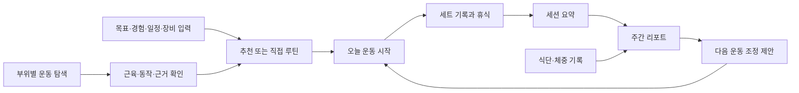

# 근거 기반 웨이트 트레이닝 앱 기획서

> **버전 0.1.0 · 2026-10-03 · 브레인스토밍 초안**  
> 앱 이름은 미정. `lightweight`는 임시 프로젝트 식별자다.  
> 사용자가 명시한 내용은 **요구사항**, 타깃·출시 순서·수치 목표는 **기획 제안**으로 구분한다.

## 1. 제품의 목적

**무엇을 왜 해야 하는지 이해하고, 운동을 빠르게 기록하며, 다음 행동을 근거와 내 기록으로 결정하는 앱.**

부위별 운동과 관련 근육을 시각적으로 이해하고, 직접 루틴을 만들거나 추천받고, 수행 기록을 남기면 다음 운동에 도움이 되는 개인화 리포트를 받는다. 식단 기록은 운동 목표와 연결하여 열량·단백질·영양소 섭취를 함께 검토하는 방향으로 확장한다.

핵심 연결: **근거 있는 운동 정보 → 내 조건에 맞는 루틴 → 간편 기록 → 설명 가능한 피드백 → 다음 운동**.

## 2. 해결할 문제와 사용자 가설

| 문제 가설 | 제공 가치 | 확인 방법 |
|---|---|---|
| 영상만으로 대상 근육과 선택 이유를 이해하기 어렵다 | 근육 지도·동작 설명·근거 카드 | 운동 선택 과업·이해도 인터뷰 |
| 루틴이 일정·장비·경험에 맞지 않는다 | 조건별 추천·대체 운동 | 채택률·수정/대체 사유 |
| 세트 기록이 번거로워 중단한다 | 이전 기록 재사용·완료 탭 | 입력 시간·4주 기록 유지율 |
| 기록은 쌓이지만 개선 방향을 모르겠다 | 변화 요약·다음 행동 1~3개 | 이해도·제안 실행률 |
| 운동과 식단을 따로 관리한다 | 운동·섭취·체중 추세 연결 | 식단 수요·입력 지속성 |

**우선 타깃 제안:** 한국어를 사용하는 건강한 성인 중 일반 헬스장에서 운동하는 초보~중급자. 주목표는 근비대, 근력 향상은 선택 목표로 제공한다. 타깃·시장·목표는 아직 사용자와 확정하지 않았다.

**추천 범위 제안:** 재활·질환 치료·임신/수유·미성년자용 자동 처방은 별도 검토가 필요하다. 범위 밖 사용자의 직접 기록·일반 정보 열람은 별도로 설계한다.

## 3. 요구사항과 우선순위

P0는 첫 출시, P1은 다음 출시 **제안**이다. 사용자 핵심 요구를 누락하지 않고 단계별로 추적한다. 근거 운영은 모든 단계의 출시 조건이다.

| ID | 사용자 요구 | 단계 제안 | 상세 |
|---|---|---|---|
| FR-01 | 부위별 운동 리스트·검색·필터 | P0 | [운동 정보](exercise-library.md) |
| FR-02 | 자극범위·대상 근육·시각적 설명 | P0 | [운동 정보](exercise-library.md) |
| FR-03 | 최신 연구 근거 기반 루틴 추천 | P0 | [추천](routine-engine.md) |
| FR-04 | 부위별 운동 티어 | P0, 검토 완료 범위부터 | [티어](tier-system.md) |
| FR-05 | 개인 루틴 작성·복사·편집·저장 | P0 | [기록](training-log.md) |
| FR-06 | 수행 운동·중량·횟수·세트의 간편 기록 | P0 | [기록](training-log.md) |
| FR-07 | 수행 기록 기반 개인화 리포트 | P0 | [리포트](reports.md) |
| FR-08 | 식단·식사량·섭취일 기록 | P1 | [영양](nutrition.md) |
| FR-09 | 부족 가능 영양소·추천 열량·식단 리포트 | P1 | [영양](nutrition.md) |
| KM-01 | 루트 vault·Markdown·OKF·옵시디언 호환 | 이번 산출물 | [관리](../operations/knowledge-workflow.md) |
| KM-02 | 대화에 따른 기획 수정과 이력·근거 축적 | 지속 관리 | [변경](../../history/changes/CHG-0001.md) |

## 4. 사용자 흐름과 정보 구조

내비게이션 제안: **오늘 / 운동 찾기 / 루틴 / 리포트 / 내 설정**. 식단 출시 시 ‘오늘’에 식사 기록 진입점을 추가하고 리포트에 영양 탭을 둔다.

첫 사용에는 전체 프로필을 강제하기 전에 운동 탐색과 직접 기록을 허용한다. 추천 시 목표·경험·가능 횟수·시간·장비·제약을 단계적으로 받는다. 체중과 영양 계산 정보는 해당 기능에서 받는다.

운동 중에는 이전 중량·횟수 불러오기 → 수정 또는 완료 → 휴식 타이머 → 다음 세트를 이어준다. 기구 사용 중에는 대체 후보를 고른다. 추천 변경은 사용자 선택 후 적용하고 기존 계획을 남긴다.

## 5. 운동 정보와 자극범위

‘자극범위’는 다음을 분리하여 표현한다.

- 관련 근육: 주동근·협력근·안정화 역할과 이름.
- 동작 범위: 시작/끝 자세·관절 움직임·수행 조건.
- 근육 내 차이: 장기 훈련 연구가 측정한 부위에 한한 설명.
- 개인 느낌: 사용자가 느낀 자극의 선택 기록. 객관적 성장 지표와 구별.

운동 카드는 이름/별칭·장비·대상 근육·난이도·설정·수행법·흔한 오류·대체 운동·근거·검토일을 제공한다. 근육 그림의 색을 성장률이나 ‘자극 80%’로 표시하지 않는다. 급성 EMG만으로 장기 근비대 순위를 정하지 않는다.[^emg]

시각 자료는 2D 전면/후면 근육 지도와 짧은 동작 자료부터 시작하는 제안이다. 3D·카메라 자세 추적은 추후 검증한다. 해부학·수행법은 전문가 검토와 권한 확인 후 공개한다.

## 6. 루틴 추천과 티어 원칙

추천은 목표·일정·장비·수행 이력·선호·불편감에 따른 설명 가능한 규칙으로 시작한다. AI는 검토된 규칙과 계산 결과를 쉽게 설명한다. 중량·세트·열량 계산을 자유 텍스트 생성에 맡기지 않는다.

티어에는 **목표·부위·숙련도·장비 조건·평가 이유·근거 확실성·갱신일**을 표시한다. S/A/B/C는 추천 적합도, 연구 근거는 별도 배지다. 직접 비교가 없으면 동등 후보나 평가 보류를 허용한다.

연구 일반 원칙과 앱의 시작값을 구분한다. 2026 ACSM 자료는 목표별 처방과 운동량을 다루지만 모든 개인의 최적 세트 수를 확정하지 않는다.[^acsm] 운동량·빈도 효과는 근비대와 근력 목표에 따라 검토한다.[^volume]

초기에는 한 부위 티어와 한 루틴을 전문가가 끝까지 검토하는 파일럿을 제안한다. 전 부위의 과학적 순위가 이미 확정된 것은 아니다.

## 7. 간편 기록과 개인화 리포트

필수 입력: **운동·중량 방식·중량·횟수·완료 여부**. 준비/본세트·좌우·RIR·휴식·불편감·메모는 맥락에 따라 선택한다. 덤벨 한 손 중량, 머신 번호, 보조 운동의 보조량을 구분한다.

리포트는 **관찰 → 해석 → 다음 행동 → 근거/불확실성**으로 구성한다.

| 리포트 | 정보 | 해석 제한 |
|---|---|---|
| 세션 | 완료 운동·본세트·시간·개인 기록 | 계획과 실제 수행 구분 |
| 주간 | 실행·직접/간접 부위 세트·누락 | 세트를 근성장량으로 환산하지 않음 |
| 추세 | 같은 운동/장비/조건의 중량·횟수·노력 변화 | 조건이 다르면 단순 비교 보류 |
| 다음 행동 | 유지·증량 후보·대체·운동량 검토 | 사용자 선택 후 적용 |
| 영양 확장 | 섭취·체중 추세·기준 대비 기록 | 누락·성분 결측 표시 |

기록만으로 ‘근육 12% 성장’, ‘회복 100%’를 단정하지 않는다. 기록에 없는 숫자나 출처를 AI가 만들면 표시를 차단한다. 부족한 데이터에서도 기록일 요약과 다음에 필요한 정보를 제공한다.

## 8. 식단 확장

음식 검색·최근 식사 재사용·즐겨찾기·양 수정·직접 입력을 우선한다. 사진 인식은 음식과 양의 초안이며 사용자가 확정한다.

국내 일반 영양 기준과 운동 목표용 단백질 목표를 구분한다. 2025 KDRI와 정오표를 버전 관리한다.[^kdri] 식품 데이터는 출처·기준 중량·조리 상태·성분 누락을 보존한다.

‘철 결핍’ 진단 대신 ‘완료로 표시한 식사 기록의 철 섭취 추정량이 기준보다 낮습니다’처럼 표현한다. 영양소별 성분 커버리지를 표시한다. 열량은 검토한 공식·입력·체중 추세로 제안하며 운동 활동을 중복 가산하지 않는다. 감량/증량 조정 수치는 별도 검토 후 확정한다.

## 9. 출시 단계 제안

| 단계 | 범위 | 다음 단계 조건 |
|---|---|---|
| 0. 파일럿 | 운동 10종 내외 콘텐츠·한 부위 티어·루틴 시안·기록 프로토타입 | 사용자 이해도·기록 편의성·전문가 검토 |
| 1. 운동 MVP | 검토된 30~50종 가설·루틴 작성/추천·세트 기록·주간 리포트 | 데이터 보존·계산 정확성·근거 추적 |
| 2. 식단 | 한국 음식·열량/단백질·성분 커버리지별 리포트 | DB 권한·성분 품질·영양 검토 |
| 3. 고도화 | 개인 반응 조정·사진 보조·건강 앱/웨어러블 연동 | 충분한 데이터·실제 수요 |

플랫폼·인력·검토 비용을 확인한 뒤 일정화한다. 초기 제외 제안: 커뮤니티, 경쟁 순위, PT 중개, 의학적 재활, 카메라 자세 교정.

사업 모델은 미정이다. 기본 기록·운동 정보 접근, 심화 분석/개인화 구독은 검증할 후보이며 가격은 조사 후 결정한다.

## 10. 데이터·AI·운영 요구

[데이터 모델](data-model.md): 프로필, 운동/변형, 루틴/버전, 세션/세트, 연구/주장, 추천/계산 버전, 리포트, 음식/식사.

- 기록은 오프라인에서 즉시 저장하고 재시도로 세트가 중복되지 않는다.
- 운동 메타데이터·계산 규칙 변경이 과거 기록의 의미를 바꾸지 않도록 버전을 보존한다.
- 추천/리포트는 사용 기간·포함 기록·규칙/근거 버전을 남긴다.
- 개인 정보는 목적에 맞게 최소 수집하고 내보내기·삭제를 지원한다.
- 사용자 건강 기록은 이 기획 vault에 저장하지 않는다.
- 초기 연구 갱신은 수동 검토이며 ‘최신’에 검색일·포함 범위·검토 상태를 동반한다.

## 11. 성공 지표와 수용 기준

아래 수치는 사용성 검증용 가설이며 기존 성과가 아니다.

| 지표/기준 | 정의 |
|---|---|
| 핵심 이용 | 주간 운동 기록을 확인하고 리포트의 다음 행동을 선택한 활성 사용자 수 |
| 기록 편의성 | 이전 값이 있는 본세트 완료 중앙값 3초 이내 가설 |
| 첫 가치 | 추천/직접 루틴에서 첫 세션 저장 성공률·시간 |
| 재사용 | 첫 주 기록 사용자의 4주차 기록 유지율 |
| 이해도 | 대상 근육·추천 이유·근거 한계를 설명할 수 있는 비율 |
| 추적성 | 공개 효과 주장마다 근거 또는 추론/미검증 라벨 존재 |
| 기록 보존 | 강제 종료·오프라인 복귀 후 보존, 중복 완료 0건 |
| 계산 정확성 | 단위·세트·누락 집계가 명시 계산 계약과 일치 |

첫 검증은 사용자 5~8명 인터뷰와 기록 과업을 제안한다. [검증 계획](validation-plan.md)을 따른다.

## 12. 미결 사항

첫 타깃, 근비대/근력 우선순위, 플랫폼, 식단 첫 출시 포함 여부, 전문가와 예산, 무료/구독, 동기화 방식은 [미결 사항](open-questions.md)에서 관리한다. [결정 기록](../decisions/decision-register.md)에는 사용자 요구와 제안의 상태를 구분한다.

## 13. 근거와 이력

이번 조사는 **2026-10-03 초기 표적 탐색**이며 체계적 문헌고찰이나 전체 최신 문헌 포괄을 뜻하지 않는다. 일부 논문은 초록·서지 수준으로 확인했다. [주장-근거 지도](../concepts/evidence-map.md)와 출처 노트에서 범위를 확인한다.

- [원 요청](../../raw/conversations/2026-10-03-001.md) · [CHG-0001](../../history/changes/CHG-0001.md) · [버전 보관](../../history/versions/index.md)

[^emg]: [Vigotsky 외 2022](../sources/SRC-008-emg.md), [연구 안내](https://pubmed.ncbi.nlm.nih.gov/35006527/).
[^acsm]: [ACSM 2026](../sources/SRC-003-acsm-2026.md), [학회 공식 설명](https://acsm.org/resistance-training-guidelines-update-2026/).
[^volume]: [Pelland 외](../sources/SRC-004-volume-frequency.md), [출판사 초록](https://link.springer.com/article/10.1007/s40279-025-02344-w).
[^kdri]: [2025 KDRI](../sources/SRC-011-kdri-2025.md), [공식 배포](https://kns.or.kr/fileroom/fileroom_view.asp?BoardID=Kdr&idx=167).
