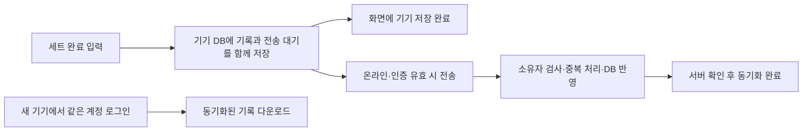

# PWA 개발 언어와 개인화 데이터 저장 구조

> 2026-10-03. **PWA 진행은 사용자 선택 확정**이다. **TypeScript·React/Vite·Dexie·Supabase와 계정 동기화는 추천안**이며 아직 채택되지 않았다. 구현·프로젝트 생성·외부 데이터 업로드는 수행하지 않았다.

## 언어와 구성 추천

주 언어는 **TypeScript**를 추천한다. 목표·중량 방식·세트·시간대·영양 성분·리포트의 구조를 타입으로 정의하고 화면·집계·서버 함수에서 일관되게 사용하는 방향이다. [공식 타입 소개](../sources/SRC-022-typescript.md). 외부 데이터에는 런타임 검증도 필요하며 kg/lb 변환이나 영양 계산의 정확성은 별도로 검증한다.

| 역할 | 추천 | 선택 이유 |
|---|---|---|
| 앱 코드·계산 | TypeScript | 복잡해지는 기록 구조와 계산 입력/결과를 명확히 정의 |
| 화면·빌드 | React + Vite | 입력이 많은 개인 PWA를 클라이언트 앱으로 구성 |
| 설치·화면 캐시 | manifest·서비스 워커, Vite PWA 플러그인 후보 | 앱 껍데기·선별 콘텐츠 캐시와 업데이트 관리 |
| 기기 데이터 | IndexedDB + Dexie | 루틴·기록·전송 대기 목록을 트랜잭션으로 관리 |
| 계정·클라우드 DB | Supabase Auth + PostgreSQL | 운영할 인증/DB 서버를 직접 구축하는 부담 축소 |
| DB 스키마·접근 규칙 | SQL | 관계·제약·소유자 정책과 마이그레이션 관리 |
| AI 호출 | 서버 함수, Supabase Edge Functions 후보 | 서비스 키 보관·인증 확인·요청 범위 통제 |

근거: [React/Vite/PWA](../sources/SRC-023-react-vite-pwa.md) · [Dexie](../sources/SRC-024-dexie.md) · [DB/Auth](../sources/SRC-025-supabase-database-auth.md) · [권한/키](../sources/SRC-026-supabase-rls-keys.md).

React 공식은 프레임워크 시작을 기본 권장한다. 이 앱에서는 모바일 입력·로컬 저장과 별도 관리형 백엔드에 집중하는 조건으로 Vite 구성을 제안한다. 라우팅·데이터 접근·PWA 설정은 직접 선택해야 하는 비용이다. 기술 버전과 호스팅 서비스는 구현 시 확인하며 지금 설치하지 않는다.

## 개인 기록의 저장 선택

| 방식 | 장점 | 관리할 점 | 권고 |
|---|---|---|---|
| 기기만 저장 + 파일 백업 | 계정 없이 시작, 오프라인·운영 단순 | 다른 기기에 수동 복원, 저장소 삭제·분실 시 마지막 백업 이후 손실 | 화면/입력 프로토타입 또는 클라우드 미사용 선택 |
| 클라우드 중심 | 로그인으로 다른 기기에서 기록 조회 | 오프라인 입력은 별도 저장 구조가 필요 | 단독 기본안으로는 운동 중 조건 부족 |
| **기기 우선 저장 + 계정 DB 동기화 + 파일 백업** | 빠른 입력·오프라인·동기화 완료 기록의 기기 변경 복구 | 전송·중복·충돌·계정·백업 구현 필요 | **실제 기록을 쌓는 첫 사용 버전 추천** |

이전 대화의 로그인 없는 한 기기 제안은 빠른 시험 경로로 남긴다. 개인화 기록이 누적되고 기기 변경에 대응하려면 **첫 실사용부터 계정 DB를 함께 두는 방향**을 이번에 더 우선 추천한다. 사용자가 클라우드 저장·유료 서비스를 선택한 것으로 해석하지 않는다.

## 저장과 동기화 흐름

‘기기 저장됨’과 ‘클라우드 동기화 완료’를 구분한다. 오프라인에도 세트 기록·루틴 열람·캐시된 운동 정보·기본 집계를 사용할 수 있게 설계한다. 처음 로그인과 새 기기 복구, 새 콘텐츠 다운로드, 외부 AI 생성은 온라인이 필요하다. 서비스 워커 캐시와 개인 기록 DB를 분리한다.

다음은 동기화의 구현 계약 제안이다. Dexie와 Supabase를 연결했다고 자동 제공되는 기능이 아니다.

1. 기록 변경과 SyncOutbox 생성은 하나의 로컬 DB 트랜잭션으로 확정한다. 저장 실패 시 완료 표시를 성공으로 바꾸지 않는다.
2. 사용자·기기·기록 ID와 안정적인 operation_id를 생성한다. 같은 변경을 재전송해도 서버에는 한 번만 반영한다. 새 편집은 새 operation_id를 가진다.
3. 앱 시작·화면 복귀·저장 직후·연결 복귀에 큐를 재시도한다. iOS에서 앱을 닫아도 항상 백그라운드 전송된다고 가정하지 않는다. 인증 만료·서버 중단 시 로컬 큐를 남긴다.
4. 서버는 권한·입력·base_revision을 검증하고 반영된 revision을 반환한다. 동일 변경의 재시도에는 동일 결과를 반환하는 API/DB 처리를 설계한다.
5. 서버 확인이 끝난 operation만 큐에서 완료한다. 이전 응답이 더 최신인 로컬 편집을 덮어쓰지 않도록 operation과 revision을 대응시킨다.
6. 변경 조회는 서버가 부여한 순서/커서로 관리한다. 기기 시계만으로 동기화 순서를 결정하지 않는다. 편집 충돌은 두 내용을 보존하고 사용자에게 선택하게 한다.
7. 삭제는 동기화용 삭제 표시를 전파하여 재등장하지 않게 한다. 영구 삭제·백업 보관 범위와 삭제 표시의 정리 시점은 별도로 확정한다.

첫 설계는 한 사용자의 한 기기 쓰기를 기준으로 좁혀 검증할 수 있다. 여러 기기의 동시 편집 지원 범위는 미정이다. 동기화 전에 기기 저장소가 사라지면 서버에서 미전송분을 복구할 수 없으므로 전송 대기 표시와 파일 백업을 유지한다. [WebKit 보존 정책](../sources/SRC-020-webkit-storage.md).

## 저장할 데이터와 개인화 근거

| 데이터 | 저장 형태 | 개인화에서의 역할 |
|---|---|---|
| 프로필 | 목표·경험·가능 시간·장비·단위·시간대·선호 | 추천 조건 |
| 루틴·버전 | 계획 종목/세트와 변경 이유 | 계획 대비 실행과 다음 루틴 |
| 세션·세트 | 실제 중량 방식·중량·반복·완료·선택 RIR/메모 | 수행 추세·주간 운동량 |
| 체중·식사 확장 | 시각·조건·음식/성분 스냅샷·기록 완성도 | 체중·섭취 추세 |
| 추천·리포트 | 대상 기간·입력 기록 ID/revision·규칙/근거 버전·사용자 선택 | 설명·재현·변경 추적 |
| SyncOutbox | 변경 ID·소유자·상태·시도 횟수·기준 버전 | 전송 복구·중복 방지 |

운동 지식·출처는 공통 콘텐츠다. 개인 기록은 사용자별로 저장하고 공통 콘텐츠 ID/버전을 참조한다. 제품 지식은 vault에서 관리하고 앱용 콘텐츠는 검토 버전을 내보내는 제안이다. 실제 운동·식사 기록을 vault에 넣지 않는다.

개인화는 저장된 원기록과 계산 규칙에서 만든다. 리포트는 다시 계산할 수 있도록 기록 범위와 버전을 남긴다. AI의 대화 기억을 기록 원장으로 쓰지 않는다. 기기에서는 전송 대기 기록을 포함한 결과, 서버에서는 동기화된 기록 기준 결과를 구분하여 누락을 숨기지 않는다.

## 계정과 지인 기록 분리

본인 계정부터 만들고 지인에게 각자 계정을 제공하는 안이다. 이메일 인증 코드 로그인을 후보로 둔다. 코드 템플릿·메일 전달·Safari와 홈 화면 앱의 로그인 동작은 실제 기기에서 확인한다. [인증 문서](../sources/SRC-025-supabase-database-auth.md).

개인 테이블마다 user_id를 보존한다. 서버의 RLS 정책으로 로그인 사용자와 소유자가 같은 행만 읽기·생성·수정·삭제하게 한다. 자식 세트와 부모 세션의 소유 관계도 제약으로 검증한다. 화면에서 사용자별 필터를 거는 것만으로 끝내지 않는다. [RLS와 키](../sources/SRC-026-supabase-rls-keys.md).

로컬 DB/큐도 사용자별로 분리한다. 계정 전환 시 이전 기록·전송 대기를 새 계정으로 보내지 않도록 한다. 로그아웃 중 전송 대기가 있으면 상태를 알리고 처리 방식을 선택하게 하는 흐름을 설계한다. 사이트 링크 전달은 설치 경로이며 계정 생성·초대 권한 정책은 별도다. 초대 사용자만 받는 설정과 복구 수단은 아직 미정이다.

브라우저에는 publishable key와 사용자 세션을 사용한다. Supabase secret/service_role key, DB 접속 비밀, AI 서비스 키는 서버에만 둔다. AI 함수에서도 사용자 인증과 소유자 범위를 확인한다. 프런트의 .env에 넣은 값이 비밀로 보호된다고 가정하지 않는다. 이 설계는 사용자 간 접근 분리이며 운영자도 볼 수 없는 암호화 저장을 보장하는 안은 아니다.

## 백업·복원과 운영비

**동기화는 독립 백업과 다르다.** 잘못 수정·삭제한 기록도 동기화될 수 있다. 사용자별 JSON 내보내기·가져오기와 별도 DB 백업·복원 검증을 함께 둔다. 내보내기에는 형식·기준/계산 버전·단위·시간대·ID를 포함하고 로컬 미전송 기록의 포함 여부를 표시한다. 사용자별 JSON과 운영자 전체 DB 백업의 접근 권한을 분리한다.

무료 플랜을 파일럿 후보로 검토할 수 있다. 현재 공식 안내에는 무료 프로젝트 1주 비활성 시 일시 중단과 무료 플랜의 정기 내보내기·외부 백업 권고가 있다. [공식 조건](../sources/SRC-027-supabase-backups-plans.md). 호스팅·메일·AI·DB의 실제 비용은 사용량과 선택 조건을 확인한 후 정한다. 클라우드 장애에도 기기 저장과 대기 큐는 동작하게 설계한다.

식단 사진 등 파일을 나중에 저장하면 파일 저장소를 추가한다. DB 백업에 실제 이미지 파일이 들어간다고 가정하지 않고 파일 백업도 별도로 검토한다.

## 채택과 구현 전에 남은 선택

TypeScript/React/Vite와 Supabase 채택, 클라우드에 기록을 저장할 의사, 로그인·초대 방식, 운영비, 여러 기기 동시 사용, 백업 보관/복원 방식은 미정이다. **이번 확정은 PWA 진행까지**다.

[미결 Q-09/Q-13~15](open-questions.md) · [데이터 모델](data-model.md) · [검증 계획](validation-plan.md) · [CONV-0003](../conversations/2026-10-03-003.md) · [CHG-0003](../../history/changes/CHG-0003.md)
